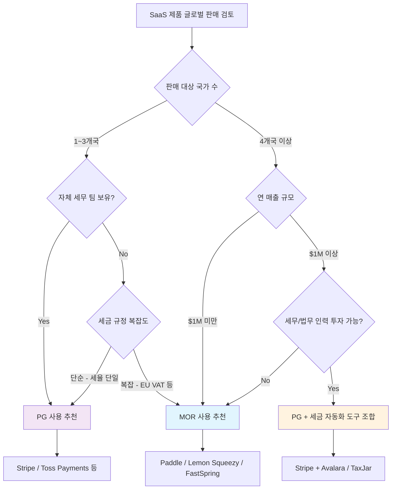

# PG vs MOR 비교

> PG(Payment Gateway)와 MOR(Merchant of Record)의 차이를 명확히 이해하고, 비즈니스 상황에 맞는 선택을 할 수 있도록 정리한다.
> 상위 문서: [MOR (Merchant of Record) 개요](./index.md) | 관련: [PG (Payment Gateway)](../pg-service/index.md)

## 핵심 차이점 비교표

| 구분 | PG (Payment Gateway) | MOR (Merchant of Record) |
|---|---|---|
| **법적 판매 주체** | **개발사 본인**이 법적 판매자 | **MOR (Merchant of Record)**가 법적 판매자 |
| **세금 처리** | 개발사가 직접 각국 세금 등록, 징수, 신고, 납부 | MOR이 전 세계 세금을 자동 처리 |
| **환불 처리** | 개발사가 환불 정책 수립 및 실행 | MOR이 환불 정책 관리 및 실행 대행 |
| **차지백 대응** | 개발사가 직접 카드사와 분쟁 대응 | MOR이 분쟁 대응 및 손실 흡수 |
| **규제 준수** | 개발사가 각국 규제 직접 준수 (PCI DSS, SCA 등) | MOR이 규제 준수 책임 |
| **가격 책정** | 자유로운 가격 책정 | MOR 정책 내에서 가격 책정 |
| **수수료** | 거래당 2.9% + 30¢ 수준 | 거래당 5% + 50¢ 수준 |
| **카드 명세서 표시** | 개발사 이름 또는 설정한 이름 | MOR (Merchant of Record) 이름 (예: PADDLE.COM) |
| **정산 주기** | 2~7 영업일 (거래별) | 1~15 영업일 (집계 후 정산) |
| **고객 데이터 소유** | 개발사가 전체 소유 | MOR 정책에 따라 제한될 수 있음 |
| **대표 서비스** | Stripe, Toss Payments, Braintree | Paddle, Lemon Squeezy, FastSpring |

## 상세 비교

### 법적 판매 주체

**PG 사용 시:**
개발사가 법적 판매자다. Stripe을 통해 결제를 받더라도, 고객과의 계약 당사자는 개발사이며, 모든 법적 의무(세금, 소비자 보호법 등)는 개발사가 진다.

**MOR 사용 시:**
MOR (Merchant of Record)가 법적 판매자다. Paddle이 고객에게 소프트웨어를 판매하고, 개발사에게 로열티(수수료 차감 후 정산금)를 지급하는 구조다. 법적 의무는 MOR이 진다.

### 세금 처리

**PG 사용 시:**
- 판매 대상 국가마다 세금 등록(VAT/GST 번호 취득) 필요
- 각국 세율 변경 추적 및 시스템 반영 필요
- 분기/월별 세금 신고서 직접 제출
- 세무 전문가 고용 또는 Avalara, TaxJar 같은 별도 서비스 필요

**MOR 사용 시:**
- 세금 등록, 징수, 신고, 납부 모두 MOR이 처리
- 세율 변경 자동 반영
- 개발사는 세금 관련 업무 불필요

### 환불 및 차지백

**PG 사용 시:**
- 환불 정책 수립 및 실행 직접 담당
- 차지백 발생 시 직접 증빙 제출 및 분쟁 대응
- 차지백 수수료(건당 $15~25) 개발사 부담
- 차지백 비율 관리 실패 시 결제 처리 계정 정지 위험

**MOR 사용 시:**
- MOR이 환불 및 차지백 전 과정 관리
- 차지백 수수료 MOR 부담 (서비스별 상이)
- 사기 탐지 및 예방 시스템 MOR 제공

### 적합한 비즈니스 유형

**PG가 적합한 경우:**
- 단일 국가 또는 소수 국가에서만 판매
- 자체 세무/법무 팀 보유
- 결제 플로우의 완전한 제어가 필요
- 마진이 얇아 수수료 절감이 중요
- 복잡한 결제 시나리오 (마켓플레이스, 분할 결제 등)

**MOR이 적합한 경우:**
- 글로벌 다수 국가에 판매
- 소규모 팀으로 세무 인력 없음
- SaaS 구독 모델 중심
- 빠른 글로벌 진출이 목표
- 세금/규제 리스크를 최소화하고 싶음

## 비용 비교 시나리오

### 월 매출 $10,000, 20개국 판매 기준

| 항목 | PG (Stripe) | MOR (Paddle) |
|---|---|---|
| 결제 수수료 | ~$320 (2.9% + 30¢) | ~$550 (5% + 50¢) |
| 세금 자동화 도구 | ~$100/월 (TaxJar 등) | 포함 |
| 세무사/회계사 | ~$500/월 (글로벌 세금) | 불필요 |
| VAT 등록 비용 | ~$200/월 (에이전트 비용) | 불필요 |
| 차지백 대응 | ~$50/월 (직접 처리 시간) | 포함 |
| **월 총비용** | **~$1,170** | **~$550** |

> [!NOTE]
> 위 수치는 추정치이며, 실제 비용은 거래량, 판매 국가, 차지백 비율 등에 따라 달라진다. 규모가 커질수록 PG + 자체 세금 처리의 비용 효율이 개선될 수 있다.

## 의사결정 플로우차트

## 하이브리드 접근

일부 기업은 **PG와 MOR을 병행**하기도 한다:

- **국내 판매:** PG 사용 (낮은 수수료, 높은 제어권)
- **글로벌 판매:** MOR 사용 (세금 자동 처리)
- **엔터프라이즈 계약:** 직접 인보이스 (PG로 결제 또는 계좌 이체)

이 경우 매출 관리와 회계 처리가 복잡해질 수 있으므로, 명확한 기준과 시스템 연동이 필요하다.

---

> 다음: [MOR 제품 비교](./products/index.md) | 관련: [PG (Payment Gateway) 개요](../pg-service/index.md)
