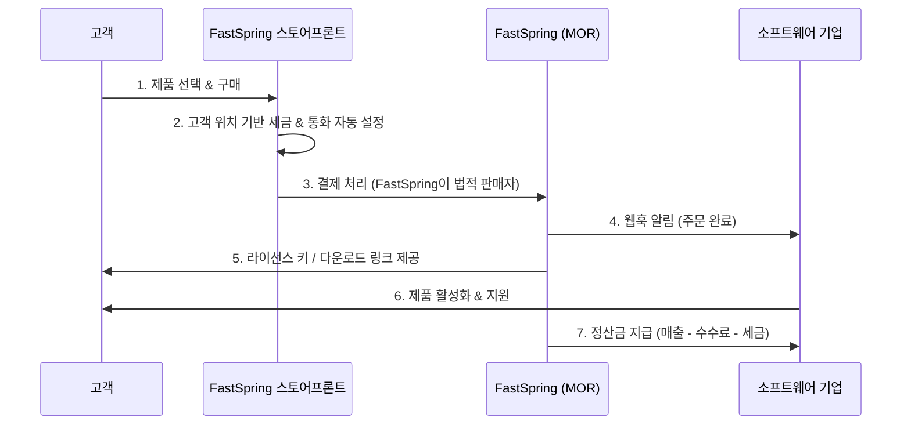

---
tags:
  - 결제
  - MOR
---
# FastSpring

> 상위 문서: [제품 비교 개요](./index.md) | [MOR (Merchant of Record) 개요](../index.md)

## 기본 정보

| 항목 | 내용 |
|---|---|
| **공식 사이트** | [fastspring.com](https://www.fastspring.com) |
| **본사** | 미국 캘리포니아주 산타바바라 |
| **설립** | 2005년 |
| **주요 고객** | 소프트웨어 기업, 게임 퍼블리셔, B2B SaaS |
| **법적 구조** | Reseller 모델 (완전한 MOR) |
| **지원 국가** | 200개국 이상 판매 |
| **주요 고객사** | Malwarebytes, Telestream, Movavi 등 |

## 핵심 특징

### 소프트웨어 판매 특화

FastSpring은 **20년 이상** 소프트웨어 판매에 특화된 MOR이다. SaaS 구독뿐 아니라 **전통적인 소프트웨어 라이선스** 판매(영구 라이선스, 볼륨 라이선스, 업그레이드 라이선스)에 강점이 있다.

### 엔터프라이즈 B2B 지원

- **견적서(Quote) 생성 및 관리:** B2B 영업에 필수적인 견적 프로세스 지원
- **PO(Purchase Order) 결제:** 엔터프라이즈 고객의 구매 주문서 기반 결제
- **Net 30/60/90 결제 조건:** B2B 표준 결제 조건 지원
- **볼륨 할인 자동화:** 수량 기반 단가 자동 계산
- **전담 계정 매니저:** 일정 규모 이상 고객에게 전담 지원

### 글로벌 세금 자동 처리

Paddle, Lemon Squeezy와 마찬가지로 완전한 MOR로서:
- 전 세계 VAT/GST/Sales Tax 자동 계산 및 징수
- 세금 신고 및 납부 대행
- 세금 영수증 자동 발행
- B2B 역과세(Reverse Charge) 처리

### 고급 가격 책정

- **지역별 가격 차등:** PPP 기반 또는 수동 설정
- **다중 통화 가격 고정:** 환율 변동에 관계없이 고정 가격 설정 가능
- **번들 상품:** 여러 제품을 묶어 할인 판매
- **업그레이드/크로스셀:** 기존 고객에게 상위 제품 또는 관련 제품 제안

## 동작 방식

## 가격 모델

| 항목 | 내용 |
|---|---|
| **수수료 구조** | **비공개** (개별 협의) |
| **일반적 범위** | 5.9%~8.9% + 건당 수수료 (추정치, 공식 미공개) |
| **월 고정비** | 플랜에 따라 상이 |
| **세금 처리** | 수수료에 포함 |
| **차지백** | MOR 부담 |
| **정산 주기** | 월 1~2회 |
| **최소 계약** | 없음 (볼륨에 따라 커스텀 계약) |

> [!NOTE]
> FastSpring은 가격을 공개하지 않으며, 비즈니스 규모와 유형에 따라 개별 견적을 제공한다. 이는 엔터프라이즈 지향적 특성을 반영한다. 일반적으로 Paddle이나 Lemon Squeezy보다 기본 수수료율이 높다고 알려져 있다.

## 장단점

| 장점 | 단점 |
|---|---|
| 소프트웨어 판매에 20년 경험 | 가격 비공개 (협의 필요) |
| B2B 엔터프라이즈 기능 풍부 | 모던한 UX/DX에서 Paddle, LS 대비 부족 |
| 전통적 라이선스 모델 완벽 지원 | 온보딩이 Paddle/LS보다 복잡 |
| 견적서, PO 결제, Net 조건 지원 | API 문서화 품질이 경쟁사 대비 낮음 |
| 전담 계정 매니저 | 인디 개발자/소규모 팀에는 과분한 기능 |
| 안정적이고 검증된 플랫폼 | 체크아웃 UI가 다소 구식 |
| 번들, 업그레이드, 크로스셀 기능 | 커뮤니티/생태계가 작음 |

## FastSpring vs Paddle: 어떤 상황에서 선택하나

| 상황 | 추천 |
|---|---|
| 순수 SaaS 구독 모델 | Paddle |
| 소프트웨어 라이선스(영구) + 구독 혼합 | **FastSpring** |
| 인디 개발자 / 소규모 팀 | Paddle 또는 Lemon Squeezy |
| B2B 엔터프라이즈 중심 | **FastSpring** |
| 투명한 가격 선호 | Paddle |
| 견적서, PO 결제 필수 | **FastSpring** |
| API-first 개발 | Paddle |
| 게임/데스크톱 소프트웨어 판매 | **FastSpring** |

## 스토어프론트 기능

FastSpring의 고유 기능 중 하나는 **호스팅 스토어프론트**다.

- **풀 스토어프론트:** FastSpring이 호스팅하는 완전한 온라인 상점
- **팝업 스토어프론트:** 기존 웹사이트에 임베드하는 결제 팝업
- **웹 스토어프론트 빌더:** 드래그 앤 드롭으로 상점 페이지 구성
- **커스텀 도메인:** 자체 도메인으로 스토어프론트 운영 가능

이는 자체 웹사이트가 없거나 간단한 소프트웨어 판매 페이지만 필요한 기업에 유용하다.

## 개발자 경험

### 연동 방식

1. **스토어프론트 빌더:** 코드 없이 상점 구성 (비개발자 친화)
2. **팝업 위젯:** 웹사이트에 JavaScript 스니펫 추가
3. **API 연동:** REST API를 통한 전체 프로그래밍 방식 제어

### 주요 API 기능

- 주문(Order) 관리
- 구독(Subscription) 관리
- 제품(Product) 및 가격 관리
- 쿠폰 및 할인 관리
- 보고서 및 분석

### 웹훅 이벤트

- `order.completed` - 주문 완료
- `subscription.activated` - 구독 활성화
- `subscription.deactivated` - 구독 비활성화
- `return.created` - 환불 발생

---

> 비교: [Paddle](./paddle.md) | [Lemon Squeezy](./lemon-squeezy.md) | [제품 비교 개요](./index.md)
