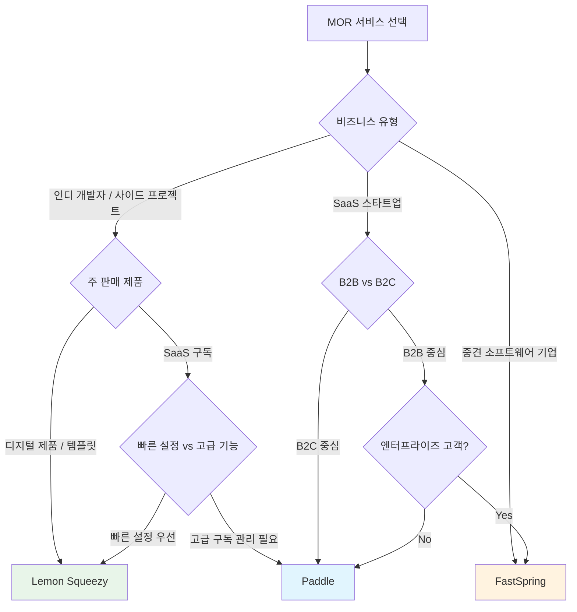

# MOR 서비스 - 대표 제품 비교 개요

> 주요 MOR 서비스를 비교하고, 비즈니스 유형에 맞는 선택 가이드를 제공한다.
> 상위 문서: [MOR 서비스 개요](../index.md)

## 주요 MOR 서비스 비교표

| 제품명 | 본사 | 주요 시장 | 핵심 특징 | 가격 모델 |
|---|---|---|---|---|
| **[Paddle](./paddle.md)** | 영국 런던 | SaaS B2B/B2C | 완전한 MOR, Paddle Billing, 세금 자동화, 가격 최적화 | 5% + 50¢/건 |
| **[Lemon Squeezy](./lemon-squeezy.md)** | 미국 (Stripe 산하) | 인디/소규모 SaaS, 디지털 제품 | 간결한 UX, 빠른 설정, 디지털 제품 전용 기능 | 5% + 50¢/건 |
| **[FastSpring](./fastspring.md)** | 미국 캘리포니아 | 소프트웨어 판매, B2B 엔터프라이즈 | 소프트웨어 라이선스 관리, 엔터프라이즈 가격 책정 | 비공개 (협의) |

## 기타 주목할 서비스

| 제품명 | 특징 | 비고 |
|---|---|---|
| **Gumroad** | 크리에이터/디지털 제품 판매 | MOR 기능 일부 제공, 10% 수수료 |
| **Stripe Billing** | 구독 관리 + 세금 자동화 | MOR이 아님 (PG). Stripe Tax 추가 시 세금 계산 가능하나 납부는 직접 |
| **Shopify** | 이커머스 플랫폼 | Shopify Payments를 MOR로 사용 가능 (물리 상품 중심) |
| **Digital River** | 엔터프라이즈 MOR | 대기업 대상, 높은 커스터마이징 |

> [!NOTE]
> Stripe는 MOR이 아니다. Stripe Tax는 세금 계산을 도와주지만, 세금 신고와 납부는 개발사가 직접 해야 한다. Stripe + Lemon Squeezy 조합으로 MOR 역할을 완성할 수 있다.

## 상세 기능 비교

| 기능 | Paddle | Lemon Squeezy | FastSpring |
|---|---|---|---|
| **완전한 MOR** | O | O | O |
| **글로벌 세금 자동 처리** | O | O | O |
| **차지백 대응** | O (MOR 부담) | O (MOR 부담) | O (MOR 부담) |
| **구독 관리** | O (고급) | O (기본~중급) | O (고급) |
| **체크아웃 커스터마이징** | 중간 | 높음 | 중간 |
| **API 품질** | 우수 | 우수 | 보통 |
| **웹훅 지원** | O | O | O |
| **무료 체험/프리미엄** | O | O | O |
| **다국어 체크아웃** | O (40+ 언어) | O (제한적) | O (20+ 언어) |
| **현지 결제 수단** | O (광범위) | O (Stripe 기반) | O (광범위) |
| **셀프서비스 포털** | O | X (2025 기준) | O |
| **B2B 인보이싱** | O | 제한적 | O |
| **최소 매출 요건** | 없음 | 없음 | 비공개 |

## 비즈니스 유형별 선택 가이드

### 추천 요약

| 비즈니스 상황 | 추천 서비스 | 이유 |
|---|---|---|
| 인디 개발자, 첫 SaaS 출시 | **Lemon Squeezy** | 가장 빠른 설정, 직관적 UI, 낮은 진입 장벽 |
| 성장 중인 SaaS (ARR $100K~$5M) | **Paddle** | 고급 구독 관리, 가격 최적화, 강력한 API |
| 소프트웨어 라이선스 판매, B2B | **FastSpring** | 라이선스 키 관리, 엔터프라이즈 가격, 전담 매니저 |
| 디지털 다운로드/템플릿 판매 | **Lemon Squeezy** | 디지털 제품 전용 기능, 심플한 가격 |
| 대규모 B2B SaaS (ARR $5M+) | **Paddle** 또는 **FastSpring** | 볼륨 할인, 커스텀 계약, 전담 지원 |

## 마이그레이션 고려사항

MOR 서비스 간 전환 또는 PG에서 MOR로 전환 시 주의할 점:

- **기존 구독 이전:** 고객 결제 수단 재등록 필요 여부 확인
- **세금 기록:** 기존 세금 신고 기록과의 연속성
- **웹훅/API 마이그레이션:** 기존 연동 코드 수정 범위
- **고객 커뮤니케이션:** 카드 명세서 표시명 변경 안내
- **정산 공백기:** 전환 기간 중 정산 지연 가능성

---

> 상세: [Paddle](./paddle.md) | [Lemon Squeezy](./lemon-squeezy.md) | [FastSpring](./fastspring.md)
