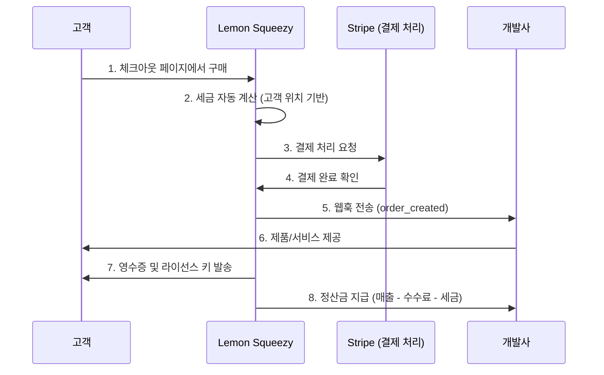

# Lemon Squeezy

> 상위 문서: [제품 비교 개요](./index.md) | [MOR 서비스 개요](../index.md)

## 기본 정보

| 항목 | 내용 |
|---|---|
| **공식 사이트** | [lemonsqueezy.com](https://www.lemonsqueezy.com) |
| **본사** | 미국 |
| **설립** | 2021년 |
| **인수** | 2024년 Stripe에 인수 |
| **주요 고객** | 인디 개발자, 소규모 SaaS, 디지털 제품 판매자 |
| **법적 구조** | Reseller 모델 (완전한 MOR) |
| **결제 인프라** | Stripe 기반 |

## 핵심 특징

### 인디 개발자 친화적

Lemon Squeezy는 **"모든 개발자를 위한 MOR"** 을 표방하며 탄생했다. 복잡한 설정 없이 몇 분 만에 글로벌 판매를 시작할 수 있는 **극도로 간결한 온보딩**이 최대 강점이다.

### 디지털 제품 판매 특화

SaaS 구독뿐 아니라, 다음과 같은 디지털 제품 판매에 강점이 있다:
- **디지털 다운로드:** PDF, 템플릿, 소스 코드, 폰트
- **소프트웨어 라이선스 키:** 자동 생성 및 검증
- **이메일 목록 연동:** 구매자를 뉴스레터 구독자로 자동 추가
- **아필리에이트 프로그램:** 내장 레퍼럴/아필리에이트 시스템

### 간결한 가격 구조

하나의 수수료율(5% + 50¢)로 모든 것이 포함된다. 월 고정비 없이, 판매가 발생할 때만 비용이 든다. 매출 $0 일 때 비용도 $0이므로 사이드 프로젝트에 이상적이다.

### 완전한 MOR 역할

- 전 세계 세금(VAT/GST/Sales Tax) 자동 처리
- Lemon Squeezy가 법적 판매자로서 세금 신고 및 납부
- 차지백 대응 MOR 부담
- 사기 탐지 및 방지

## 동작 방식

## 가격 모델

| 항목 | 내용 |
|---|---|
| **기본 수수료** | 거래 금액의 **5%** + **50¢**/건 |
| **월 고정비** | 없음 |
| **세금 처리** | 수수료에 포함 |
| **차지백 수수료** | MOR 부담 |
| **통화 변환** | 수수료에 포함 |
| **정산 주기** | 매주 또는 격주 |
| **최소 정산 금액** | $50 |

### Paddle과의 수수료 비교

기본 수수료율은 동일(5% + 50¢)하지만, 소액 결제가 많은 경우 건당 50¢의 고정 수수료가 비율적으로 커질 수 있다. $5 상품 판매 시 실효 수수료율은 약 15%가 된다.

## 장단점

| 장점 | 단점 |
|---|---|
| 가장 빠른 설정 (수 분 내 판매 시작) | 고급 구독 관리 기능 부족 (Paddle 대비) |
| 아름다운 기본 체크아웃 UI | B2B 인보이싱 기능 제한적 |
| 디지털 다운로드 + 라이선스 키 내장 | 셀프서비스 고객 포털 미지원 (2025 기준) |
| 내장 아필리에이트 시스템 | 엔터프라이즈 기능 부족 |
| Stripe 인프라 기반 안정성 | 정산 주기가 Stripe 직접 사용보다 김 |
| 활발한 인디 개발자 커뮤니티 | API 기능이 Paddle보다 제한적 |
| 이메일 마케팅 연동 | 대규모 트래픽에서의 검증 사례 적음 |

## 2024년 Stripe 인수 이후 변화

2024년 Stripe가 Lemon Squeezy를 인수하면서, MOR 생태계에 주요 변화가 생겼다.

### 인수의 의미

- **Stripe의 MOR 진출:** Stripe는 기존에 PG(결제 처리) 서비스만 제공했으나, Lemon Squeezy 인수를 통해 MOR 영역에 진입
- **인프라 통합 가능성:** Stripe의 결제 인프라 + Lemon Squeezy의 MOR 기능이 더 깊이 통합될 전망
- **경쟁 구도 변화:** Paddle의 가장 강력한 경쟁자가 Stripe 자본력을 갖추게 됨

### 2025년 기준 변화

- 서비스 자체는 독립적으로 운영 중
- Stripe 결제 인프라와의 통합이 점진적으로 강화
- 가격 모델(5% + 50¢)은 유지
- Stripe 사용자를 위한 원활한 마이그레이션 경로 제공 가능성

### 향후 전망

- Stripe 생태계(Stripe Connect, Stripe Tax 등)와의 통합 심화 예상
- 더 많은 결제 수단과 국가 지원 확대 가능
- Stripe의 엔터프라이즈 고객 기반을 활용한 B2B MOR 서비스 확장 가능성
- 장기적으로 Stripe 내 MOR 기능으로 흡수될 가능성도 존재

> [!NOTE]
> Stripe 인수 이후에도 Lemon Squeezy는 독립 브랜드로 운영되고 있다. 하지만 장기적인 제품 로드맵은 Stripe의 전략에 영향을 받을 수 있으므로, 새로운 프로젝트에서 Lemon Squeezy를 선택할 때는 이 점을 고려해야 한다.

## 개발자 경험

### 체크아웃 연동 방식

1. **호스팅 체크아웃:** Lemon Squeezy가 제공하는 URL로 리다이렉트
2. **오버레이 체크아웃:** 웹사이트 내에서 팝업 형태로 체크아웃 표시
3. **API 기반:** REST API를 통한 프로그래밍 방식 연동

### 주요 웹훅 이벤트

- `order_created` - 주문 생성
- `subscription_created` - 구독 생성
- `subscription_updated` - 구독 변경
- `subscription_cancelled` - 구독 해지
- `license_key_created` - 라이선스 키 생성

### SDK 및 라이브러리

- JavaScript/TypeScript SDK (공식)
- PHP, Python, Ruby 등은 커뮤니티 라이브러리
- Next.js, Nuxt.js 등 프레임워크 가이드 제공

---

> 비교: [Paddle](./paddle.md) | [FastSpring](./fastspring.md) | [제품 비교 개요](./index.md)
