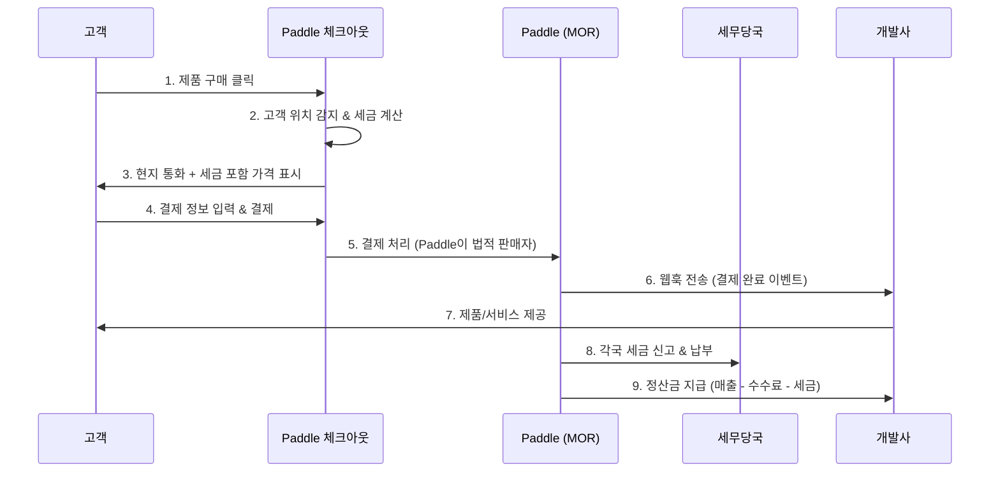

---
tags:
  - 결제
  - MOR
---
# Paddle

> 상위 문서: [제품 비교 개요](./index.md) | [MOR (Merchant of Record) 개요](../index.md)

## 기본 정보

| 항목 | 내용 |
|---|---|
| **공식 사이트** | [paddle.com](https://www.paddle.com) |
| **본사** | 영국 런던 |
| **설립** | 2012년 |
| **주요 고객** | SaaS 기업 (B2B/B2C) |
| **법적 구조** | Reseller 모델 (완전한 MOR) |
| **지원 국가** | 200개국 이상 판매, 30개국 이상 결제 수단 |
| **주요 고객사** | Notion, Framer, 1Password (과거), Coda 등 |

## 핵심 특징

### 완전한 MOR (Merchant of Record)

Paddle은 **Reseller 모델**을 사용하는 대표적인 MOR이다. Paddle이 법적 판매자가 되어 세금 징수, 신고, 납부를 전부 처리한다. 개발사는 제품 개발과 마케팅에만 집중할 수 있다.

### 글로벌 세금 자동 처리

- **200개국 이상**의 VAT, GST, Sales Tax 자동 계산 및 징수
- 각국 세무당국에 직접 세금 신고 및 납부
- 세율 변경 시 자동 업데이트
- 고객에게 법적으로 유효한 세금 영수증 자동 발행
- B2B 거래 시 VAT 역과세(Reverse Charge) 자동 처리

### 고급 구독 관리 (Paddle Billing)

- 월간/연간 플랜 전환 시 자동 비례 정산(Proration)
- 스마트 재시도(Smart Retry): 결제 실패 시 최적 시점에 재시도
- 결제 수단 자동 업데이트(Account Updater)
- 일시 중지(Pause), 해지(Cancel), 재개(Resume) 관리
- 쿠폰, 할인, 크레딧 시스템

### 가격 최적화

- **Paddle ProfitWell Metrics:** 구독 지표 대시보드 (무료)
- **Price Intelligently:** AI 기반 가격 최적화 도구
- PPP(Purchasing Power Parity) 기반 지역별 가격 차등
- A/B 테스트를 통한 가격 실험

## 동작 방식

## 가격 모델

| 항목 | 내용 |
|---|---|
| **기본 수수료** | 거래 금액의 **5%** + **50¢**/건 |
| **추가 결제 수단 수수료** | 없음 (기본 수수료에 포함) |
| **볼륨 할인** | 연 매출 기준 협의 가능 |
| **월 고정비** | 없음 |
| **숨은 비용** | 없음 (세금, 차지백, 통화 변환 모두 포함) |
| **정산 주기** | 월 1~2회 (설정에 따라) |
| **정산 통화** | USD, EUR, GBP 등 선택 가능 |

> [!NOTE]
> 5% + 50¢가 Stripe(2.9% + 30¢)보다 비싸 보이지만, Paddle의 수수료에는 세금 처리, 차지백 대응, 통화 변환, 사기 방지가 **모두 포함**되어 있다. 별도 서비스를 추가하면 PG 비용이 MOR과 비슷하거나 더 높아질 수 있다.

## 장단점

| 장점 | 단점 |
|---|---|
| 세금 처리를 완전히 위임 가능 | PG 대비 높은 기본 수수료 (5%) |
| 차지백 리스크 MOR 부담 | 카드 명세서에 "PADDLE.COM" 표시 |
| 강력한 구독 관리 기능 | 체크아웃 커스터마이징 제한적 |
| ProfitWell Metrics 무료 제공 | 정산 주기가 PG보다 길 수 있음 |
| 200개국 판매 즉시 가능 | 일부 산업/제품 유형 제한 |
| API/웹훅이 잘 설계됨 | 복잡한 B2B 계약(커스텀 인보이스)은 제한적 |
| PPP 가격 차등 기본 제공 | 고객 데이터 접근이 PG보다 제한적 |

## Paddle Billing vs Paddle Classic

Paddle은 2023년에 기존 시스템(Paddle Classic)을 완전히 새로운 아키텍처(Paddle Billing)로 대체했다.

| 구분 | Paddle Classic | Paddle Billing |
|---|---|---|
| **상태** | 레거시 (신규 가입 불가) | 현재 메인 제품 |
| **아키텍처** | 모놀리식 | API-first, 현대적 |
| **가격 모델** | 제품/플랜 기반 | 가격(Price) + 제품(Product) 분리 |
| **구독 유연성** | 제한적 | 높음 (다중 제품 구독, 비례 정산) |
| **웹훅** | v1 (레거시 포맷) | v2 (표준화된 이벤트 포맷) |
| **체크아웃** | Paddle.js overlay | Paddle.js inline/overlay 선택 |
| **API** | REST (일부 비일관) | REST (일관된 설계) |

> [!IMPORTANT]
> 새로 Paddle을 도입한다면 반드시 **Paddle Billing**을 사용해야 한다. Paddle Classic은 2025년 기준 신규 가입이 불가능하며, 기존 사용자에게도 마이그레이션을 권장하고 있다.

## 개발자 경험

### API 연동 기본 흐름

1. **Paddle 대시보드**에서 제품(Product)과 가격(Price) 생성
2. 웹사이트에 **Paddle.js** 스크립트 추가
3. 체크아웃 오픈 시 `Paddle.Checkout.open()` 호출
4. 결제 완료 후 **웹훅**으로 이벤트 수신
5. 웹훅 이벤트에 따라 서비스 프로비저닝

### 주요 웹훅 이벤트

- `subscription.created` - 구독 생성
- `subscription.updated` - 구독 변경 (플랜, 수량 등)
- `subscription.canceled` - 구독 해지
- `transaction.completed` - 결제 완료
- `transaction.payment_failed` - 결제 실패

### SDK 지원

- Node.js SDK (공식)
- Python SDK (공식)
- PHP, Go 등은 커뮤니티 SDK

---

> 비교: [Lemon Squeezy](./lemon-squeezy.md) | [FastSpring](./fastspring.md) | [제품 비교 개요](./index.md)
