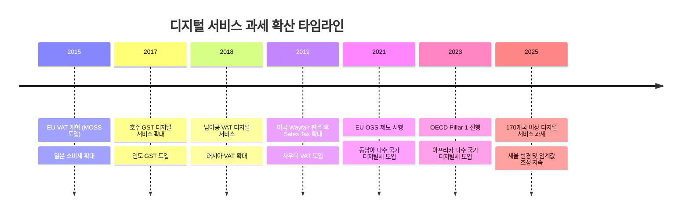
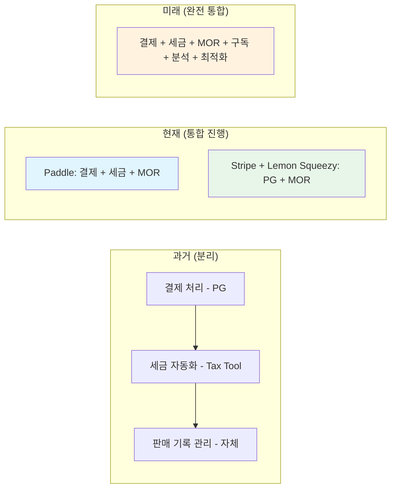

---
tags:
  - 결제
  - MOR
---
# MOR (Merchant of Record) - 트렌드 및 전망

> MOR 시장의 현재 동향과 미래 전망을 정리한다.
> 상위 문서: [MOR (Merchant of Record) 개요](./index.md)

## MOR 시장 성장세

### 시장 배경

디지털 서비스의 글로벌 판매가 급증하면서, MOR (Merchant of Record) 시장도 빠르게 성장하고 있다. 특히 다음 요인들이 성장을 견인한다:

- **SaaS 시장 확대:** 전 세계 SaaS 시장은 2025년 기준 약 $3,000억 규모로, 연 15% 이상 성장 중
- **크로스보더 이커머스 증가:** 디지털 제품의 국경 간 거래 비중 지속 확대
- **1인 개발자/소규모 팀 증가:** 인디 해커, 마이크로 SaaS 창업자가 글로벌 판매에 대한 수요 급증
- **규제 복잡성 증가:** 각국의 디지털 세금 규정이 복잡해지면서 자체 처리의 부담 가중

### 주요 MOR 사업자 동향

| 사업자 | 최근 동향 |
|---|---|
| **Paddle** | 2023년 Paddle Billing 출시, ProfitWell 인수 통합, ARR 기반 가격 최적화 도구 강화 |
| **Lemon Squeezy** | 2024년 Stripe에 인수, 인디 개발자 커뮤니티 중심 성장 |
| **FastSpring** | 엔터프라이즈 B2B 시장에 집중, 소프트웨어 라이선스 관리 기능 강화 |
| **Stripe** | Lemon Squeezy 인수로 MOR 영역 진출, Stripe Tax 기능 확대 |

---

## SaaS 글로벌 판매의 세금 복잡성 증가

### 디지털 서비스 과세 확산

2025년 기준, **170개 이상의 국가**가 디지털 서비스에 대한 간접세(VAT/GST/Sales Tax)를 부과하고 있으며, 이 숫자는 매년 증가하고 있다.

### 복잡성의 구체적 사례

- **EU:** 27개 회원국, 각기 다른 VAT 세율(17%~27%), B2B/B2C 구분 처리, OSS 신고 의무
- **미국:** 50개 주 + 수천 개의 지역 세금 관할권, Nexus 규칙, 면세 제품 카테고리
- **인도:** 18% GST + 이퀄라이제이션 레비(Equalization Levy) 2% 추가
- **브라질:** ICMS, ISS, PIS/COFINS 등 복수의 세금 체계

이 복잡성은 MOR (Merchant of Record)의 가치를 더욱 부각시킨다.

---

## MOR vs 자체 세금 처리 트렌드

### 자체 처리의 현실적 비용

규모가 작은 기업일수록 자체 세금 처리의 단위 비용이 높다:

| 연 매출 | MOR 수수료 (5%) | 자체 처리 추정 비용 | 권장 |
|---|---|---|---|
| $10K | $500 | $3,000~5,000/년 | **MOR** |
| $100K | $5,000 | $10,000~20,000/년 | **MOR** |
| $1M | $50,000 | $30,000~60,000/년 | **비교 분석 필요** |
| $10M | $500,000 | $100,000~200,000/년 | **자체 처리 + 도구** |

> [!NOTE]
> 자체 처리 비용에는 세무 전문가 인건비, 세금 자동화 도구 비용, 각국 세금 등록 비용, 감사 대응 비용이 포함된다. 실제 비용은 판매 국가 수와 거래 복잡도에 따라 크게 달라진다.

### 하이브리드 모델의 부상

대규모 SaaS 기업들 사이에서 **하이브리드 모델**이 확산되고 있다:
- **국내 + 주요 시장:** PG + 자체 세금 처리 (비용 효율)
- **나머지 글로벌 시장:** MOR 사용 (복잡성 회피)
- **엔터프라이즈 계약:** 직접 인보이스 + PG

---

## EU DAC7, OECD 디지털세 영향

### EU DAC7 (2023년 시행)

**DAC7(Directive on Administrative Cooperation 7)** 은 EU의 플랫폼 사업자 보고 의무 지침이다.

- 디지털 플랫폼 운영자가 판매자 정보와 거래 내역을 세무당국에 보고해야 함
- MOR (Merchant of Record)는 **보고 의무를 자동으로 이행**해주므로, 개발사의 부담이 줄어듦
- 비MOR 방식(PG만 사용)일 경우 개발사가 직접 보고 의무를 져야 함

### OECD Pillar 1 & 2

**Pillar 1:** 대규모 다국적 기업의 과세권을 소비 발생 국가에 재배분
- 현재 연 매출 EUR 200억 이상, 이익률 10% 이상 기업 대상
- 장기적으로 임계값이 낮아질 가능성
- MOR을 통한 판매 시, 매출 귀속 국가 판단이 MOR에 의해 자동 처리

**Pillar 2:** 글로벌 최저 법인세율 15% 도입
- 2024년부터 주요국에서 시행 시작
- 직접적으로 MOR에 영향을 주지는 않으나, 기업의 글로벌 세무 전략에 영향

### 각국 디지털 서비스세(DST)

OECD 합의가 지연되면서, 여러 국가가 **독자적인 디지털 서비스세**를 도입하고 있다:

| 국가 | 세율 | 적용 기준 |
|---|---|---|
| 프랑스 | 3% | 디지털 서비스 매출 EUR 750M+ |
| 영국 | 2% | 디지털 서비스 매출 GBP 500M+ |
| 이탈리아 | 3% | 디지털 서비스 매출 EUR 750M+ |
| 인도 | 2% | 이퀄라이제이션 레비 |
| 캐나다 | 3% | 2024년 도입 |

이러한 추가 세금은 주로 대규모 기업 대상이나, 규정의 확산 자체가 세금 환경의 복잡성을 보여준다.

---

## AI 기반 세금 자동화

### 현재 상태

MOR (Merchant of Record)와 세금 자동화 도구에 AI/ML 기술이 도입되고 있다:

- **고객 위치 정확도 향상:** IP, 결제 정보, 행동 데이터를 종합하여 고객 위치 판단 정확도 개선
- **세율 변경 예측:** 각국의 세법 변경을 자동 추적하고 시스템에 반영
- **사기 탐지 고도화:** 결제 패턴 분석을 통한 사기 거래 탐지율 향상
- **차지백 예측:** 차지백 가능성이 높은 거래를 사전에 식별
- **가격 최적화:** 지역별 최적 가격 자동 추천 (Paddle의 Price Intelligently)

### 향후 전망

- **실시간 규제 모니터링:** AI가 전 세계 세법 변경을 실시간 추적 및 자동 반영
- **자동 세금 분류:** 제품/서비스 유형에 따른 세금 분류(Tax Category) 자동 판단
- **인텔리전트 가격 책정:** 시장 데이터, 경쟁사 가격, 구매력을 종합한 AI 기반 동적 가격 책정
- **규정 준수 자동 감사:** 세금 신고 오류를 AI가 사전에 탐지하고 수정 제안

---

## MOR + 결제 인프라 통합 트렌드

### 수직 통합 가속화

MOR (Merchant of Record)와 결제 인프라의 경계가 점점 흐려지고 있다:

### 주요 통합 사례

| 통합 방향 | 사례 | 의미 |
|---|---|---|
| PG → MOR | Stripe의 Lemon Squeezy 인수 | PG 사업자가 MOR 영역으로 확장 |
| MOR → 분석 | Paddle의 ProfitWell 인수 | MOR에 구독 분석/최적화 기능 추가 |
| MOR → 가격 최적화 | Paddle Price Intelligently | MOR이 수익 최적화까지 담당 |
| 세금 도구 → 결제 | Avalara의 결제 연동 강화 | 세금 자동화 도구가 결제 플로우에 직접 관여 |

### 번들링(Bundling) 트렌드

MOR (Merchant of Record)가 제공하는 기능의 범위가 계속 확장되고 있다:

**현재 MOR 번들에 포함되는 기능:**
- 결제 처리
- 세금 계산, 징수, 신고, 납부
- 환불 및 차지백 관리
- 구독 관리
- 사기 방지
- 현지 결제 수단
- 다국어/다통화 체크아웃

**향후 MOR 번들에 추가될 기능:**
- 구독 분석 및 지표 대시보드
- AI 기반 가격 최적화
- 이탈 방지(Retention) 도구
- 아필리에이트/파트너 관리
- 세금 감사 자동 대응
- 규제 변경 알림 및 컨설팅

---

## 2025~2027 주요 전망 요약

| 전망 | 확신도 | 근거 |
|---|---|---|
| 디지털 서비스 과세 국가 수 지속 증가 | 높음 | OECD 권고, 각국 세수 확보 필요 |
| MOR 수수료율 하향 경쟁 | 중간 | Stripe 참여로 경쟁 심화, 규모의 경제 |
| PG-MOR 경계 약화 | 높음 | Stripe+LS 사례, Paddle의 기능 확장 |
| AI 기반 세금 자동화 고도화 | 높음 | 기술 성숙도 향상, 투자 증가 |
| 하이브리드(PG+MOR) 모델 확산 | 중간 | 대규모 SaaS 기업의 비용 최적화 수요 |
| 아시아-태평양 MOR 시장 성장 | 높음 | 동남아, 인도 디지털 서비스 시장 급성장 |

---

> 관련: [MOR (Merchant of Record) 개요](./index.md) | [PG vs MOR 비교](./pg-vs-mor.md) | [PG (Payment Gateway) 트렌드](../pg-service/trends.md)
