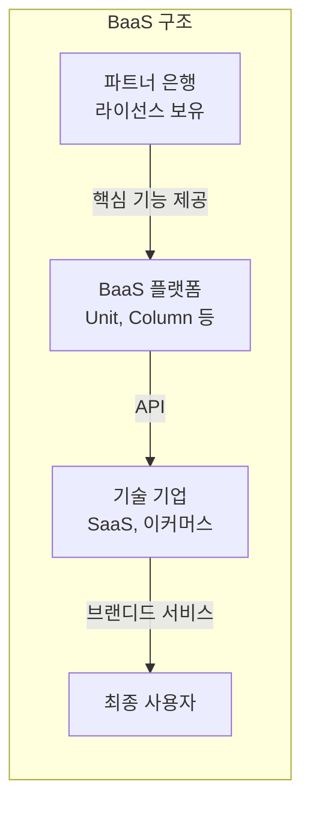
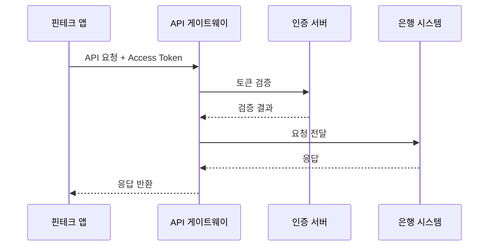

---
tags:
  - 금융
  - 오픈뱅킹
  - BaaS
---
# 오픈뱅킹 핵심 개념

## 오픈뱅킹 (Open Banking)

은행이 고객 동의 하에 계좌 정보와 결제 기능을 표준 API로 제3자에게 개방하는 체계이다.

오픈뱅킹의 핵심은 **데이터 이동권(Data Portability)**이다. 고객이 자신의 금융 데이터를 원하는 서비스에서 활용할 수 있도록 은행에 API 개방을 의무화한다. 이를 통해 핀테크 기업은 계좌 조회, 잔액 확인, 거래 내역 분석 등의 서비스를 은행 인프라 없이 구축할 수 있다. 규제 주도(Regulatory-driven) 방식과 시장 주도(Market-driven) 방식이 있으며, 유럽(PSD2)과 영국(CMA)은 규제 주도, 미국은 시장 주도로 발전해왔다.

!!! tip "핵심 포인트"
    - 고객 동의(Consent)가 모든 데이터 접근의 전제 조건
    - API 표준화가 생태계 활성화의 핵심
    - 보안(OAuth 2.0, mTLS)과 개방성의 균형이 중요

---

## BaaS (Banking as a Service)

비은행 기업이 은행의 핵심 기능(계좌, 카드, 대출, 송금)을 API로 호출하여 자사 플랫폼에 금융 서비스를 내장하는 모델이다.

BaaS는 오픈뱅킹보다 범위가 넓다. 오픈뱅킹이 기존 계좌 데이터의 접근에 초점을 둔다면, BaaS는 **새로운 금융 상품 생성과 운영**까지 포함한다. BaaS 제공자(Unit, Column, Synapse 등)는 파트너 은행의 라이선스 하에 API를 제공하고, 기술 기업은 이를 활용해 브랜디드 금융 서비스를 출시한다.

!!! warning "BaaS vs 오픈뱅킹 구분"
    | 구분 | 오픈뱅킹 | BaaS |
    |------|----------|------|
    | 초점 | 기존 데이터 접근 | 새로운 금융 상품 생성 |
    | 주체 | 은행이 API 개방 | BaaS 플랫폼이 중개 |
    | 규제 | 정부/규제 주도 | 시장 주도 |
    | 결과물 | 계좌 조회, PFM | 브랜디드 카드, 계좌, 대출 |

---

## PSD2 / PSD3

**PSD2(Payment Services Directive 2)**는 2018년 시행된 유럽 결제서비스지침으로, 은행에 API 개방을 법적으로 의무화한 최초의 규제이다. 두 가지 핵심 라이선스를 도입했다:

- **AISP(Account Information Service Provider)**: 고객 동의 하에 여러 은행 계좌 정보를 통합 조회
- **PISP(Payment Initiation Service Provider)**: 고객 동의 하에 은행 계좌에서 직접 결제를 개시

**PSD3**는 PSD2의 후속 규제로, API 성능 의무화, 오픈 파이낸스 확대, 사기 방지 강화 등을 포함하며 2025~2026년 시행 예정이다.

!!! info "AISP vs PISP"
    - **AISP**: 읽기 전용(Read-only), 계좌 정보 조회 -- 예: 가계부 앱, 신용 분석
    - **PISP**: 쓰기(Write), 결제 실행 -- 예: 오픈뱅킹 송금, 계좌 간 이체

---

## 스크린 스크래핑 vs API

| 구분 | 스크린 스크래핑 | 오픈 API |
|------|----------------|----------|
| 방식 | 웹 페이지 HTML 파싱 | 구조화된 JSON/XML 응답 |
| 인증 | 고객 ID/PW 직접 전달 | OAuth 2.0 토큰 |
| 안정성 | 웹 UI 변경 시 즉시 장애 | 버전 관리로 하위 호환 |
| 보안 | 자격증명 노출 위험 높음 | 토큰 기반, 범위 제한 |
| 규제 | PSD2/PSD3에서 금지 방향 | 규제 권장 표준 방식 |

스크린 스크래핑은 오픈뱅킹 API 이전 시대의 유산이다. Plaid, Yodlee 등 초기 핀테크 기업들이 이 방식으로 시작했으나, 보안 문제와 규제 압박으로 API 기반으로 전환하고 있다.

---

## 마이데이터

**마이데이터(MyData)**는 개인이 자신의 금융 데이터를 한곳에서 통합 관리하고, 원하는 서비스에 선택적으로 제공할 수 있는 제도이다. 한국은 2022년 1월 마이데이터 사업을 본격 시행했다.

핵심 원칙은 다음과 같다:

1. **데이터 주권**: 개인이 자기 데이터의 주인
2. **전송 요구권**: 금융기관에 다른 기관으로의 데이터 전송을 요구할 권리
3. **통합 조회**: 은행, 카드, 보험, 증권 등 전 금융권 데이터를 하나의 앱에서 조회

!!! example "마이데이터 활용 사례"
    - 자산 관리 앱: 모든 금융 자산을 한 화면에서 관리
    - 맞춤 금융 상품 추천: 개인 데이터 기반 최적 상품 제안
    - 신용 관리: 여러 기관의 신용 정보를 통합 분석

---

## 계좌 통합 (Account Aggregation)

여러 금융기관에 흩어진 계좌 정보를 하나의 인터페이스에서 통합 조회하는 서비스이다. 마이데이터의 핵심 기능이며, AISP의 대표적 활용 사례이다.

---

## API 게이트웨이

오픈뱅킹 API의 진입점으로, 인증/인가, 요청 라우팅, 속도 제한(Rate Limiting), 로깅, 모니터링 등을 담당한다. 한국 오픈뱅킹에서는 금융결제원이 중앙 게이트웨이 역할을 수행한다.

## 관련 문서

- [오픈뱅킹 개요](index.md)
- [제품 비교](products/index.md) -- Plaid, Unit 등 구현체 비교
- [트렌드](trends.md) -- PSD3, API 표준화 동향
- [임베디드 금융 개념](../embedded-finance/concepts.md) -- BaaS와 임베디드 금융의 관계
