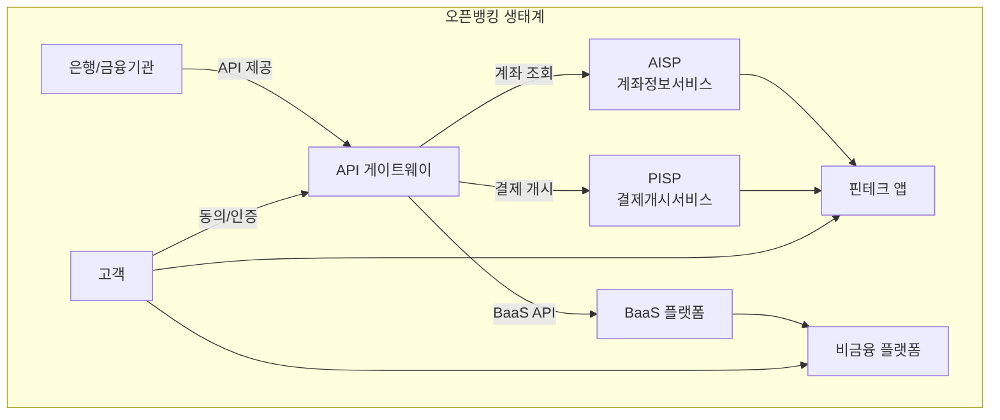

# 오픈뱅킹 / BaaS 개요

## 정의

**오픈뱅킹(Open Banking)**은 은행이 보유한 금융 데이터와 서비스를 표준화된 API를 통해 제3자(Third-party)에게 개방하는 금융 혁신 패러다임이다.

## 상세 설명

전통적으로 금융 데이터는 개별 은행의 폐쇄적 시스템 안에 갇혀 있었다. 고객이 자신의 계좌 정보를 다른 서비스에서 활용하려면 스크린 스크래핑(Screen Scraping)이라는 불안정한 방식에 의존해야 했다. 오픈뱅킹은 이 구조를 근본적으로 바꾼다. 은행이 RESTful API를 통해 계좌 정보, 거래 내역, 결제 기능을 안전하게 노출하면, 핀테크 기업과 비금융 플랫폼이 이를 활용해 혁신적인 서비스를 만들 수 있다.

**BaaS(Banking as a Service)**는 오픈뱅킹의 확장된 형태로, 은행의 핵심 기능(계좌 개설, 카드 발급, 대출, 송금 등)을 API로 제공하여 비은행 기업이 자사 플랫폼 안에서 금융 서비스를 직접 제공할 수 있게 한다. 오픈뱅킹이 데이터 접근에 초점을 둔다면, BaaS는 금융 기능 자체의 임베딩에 초점을 둔다.

유럽의 PSD2(Payment Services Directive 2)가 오픈뱅킹의 법적 기반을 마련했고, 한국은 금융결제원 주도의 오픈뱅킹 공동이용 시스템과 마이데이터 사업을 통해 독자적인 생태계를 구축했다. 현재 전 세계 80개국 이상이 오픈뱅킹 관련 규제를 도입하거나 검토 중이다.

## 핵심 포인트

!!! info "왜 중요한가"
    1. **고객 데이터 주권**: 금융 데이터의 소유권이 은행에서 고객으로 이동한다
    2. **혁신 가속화**: 핀테크가 은행 인프라 없이도 금융 서비스를 구축할 수 있다
    3. **경쟁 촉진**: 기존 은행의 독점적 지위가 약화되고 서비스 품질이 향상된다
    4. **비금융 기업의 금융 진출**: BaaS를 통해 이커머스, SaaS 등이 금융 서비스를 내장한다
    5. **글로벌 표준화**: PSD2, 한국 오픈뱅킹 등 각국이 규제 프레임워크를 정비 중이다

## 핵심 키워드

| 키워드 | 설명 |
|--------|------|
| **PSD2** | 유럽 결제서비스지침 2차, 오픈뱅킹의 법적 토대 |
| **오픈 API** | 은행 데이터/기능을 외부에 노출하는 표준 인터페이스 |
| **스크린 스크래핑** | API 이전 방식, 웹 화면 파싱으로 데이터 수집 |
| **BaaS** | Banking as a Service, 은행 기능의 API 제공 |
| **한국 오픈뱅킹** | 금융결제원 주관, 2019년 출범한 계좌 통합 서비스 |
| **마이데이터** | 본인 금융정보를 한곳에서 관리하는 개인 데이터 주권 서비스 |

## 관련 문서

- [핵심 개념](concepts.md) -- AISP, PISP, API 게이트웨이 등 상세 개념
- [제품 비교](products/index.md) -- Plaid, Unit, Column, 한국 오픈뱅킹 등 비교
- [트렌드](trends.md) -- PSD3, BaaS 시장 성장, API 표준화 동향
- [임베디드 금융](../embedded-finance/index.md) -- BaaS 기반 금융 내장 서비스
- [실시간 결제 인프라](../realtime-payment/index.md) -- 오픈뱅킹과 결제 인프라의 관계
