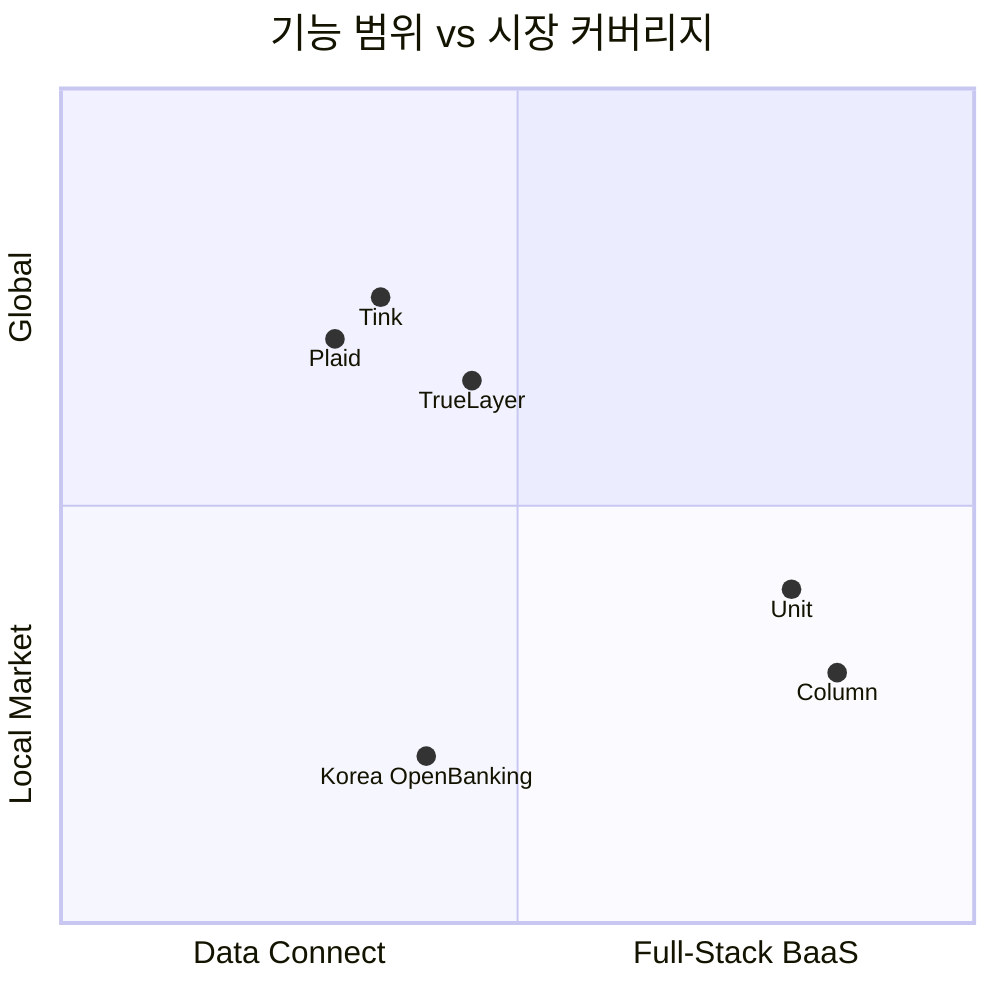

---
tags:
  - 금융
  - 오픈뱅킹
  - BaaS
search:
  boost: 1.5
---
# 오픈뱅킹 / BaaS 제품 비교

## 비교 요약

| 제품 | 유형 | 주요 시장 | 핵심 기능 | 가격 모델 | 타겟 |
|------|------|-----------|-----------|-----------|------|
| **[Plaid](plaid.md)** | 금융 데이터 연결 | 미국, 캐나다, 영국 | 계좌 연결, 잔액 조회, 거래 내역, 신원 확인 | API 호출 건당 과금 | 핀테크, 네오뱅크 |
| **[Unit](unit.md)** | BaaS 플랫폼 | 미국 | 계좌 개설, 카드 발급, ACH, Wire | 월정액 + 거래당 | 기술 기업, SaaS |
| **Column** | BaaS (은행 직접) | 미국 | 계좌, 대출, 카드 (은행이 직접 운영) | 커스텀 | 핀테크, 기업 |
| **[한국 오픈뱅킹](korea-openbanking.md)** | 공공 인프라 | 한국 | 계좌 조회, 이체, 출금 | 건당 수수료 (매우 저가) | 한국 핀테크 전체 |
| **Tink** | 금융 데이터 (유럽) | 유럽 18개국 | PSD2 기반 계좌 연결, 결제 개시 | API 호출 건당 | 유럽 핀테크 |
| **TrueLayer** | 금융 데이터 + 결제 | 영국, 유럽 | 오픈뱅킹 결제, 계좌 연결, VRP | 거래 건당 | 이커머스, 핀테크 |

## 개별 제품 강점 / 약점 / 차별화

### Plaid

- **강점**: 미국 금융 데이터 연결 1위, 1만 2천+ 금융기관 커버, 개발자 경험 우수
- **약점**: 미국 중심, BaaS 기능 없음, 스크래핑 의존도 잔존
- **차별화**: 금융 데이터 연결의 사실상 표준(de facto standard)

### Unit

- **강점**: 풀스택 BaaS, 빠른 시장 출시, 은행 파트너십 내장
- **약점**: 미국 한정, 파트너 은행 의존, 높은 초기 비용
- **차별화**: 기술 기업이 몇 주 만에 금융 서비스를 출시할 수 있는 턴키 플랫폼

### Column

- **강점**: 은행이 직접 운영하는 BaaS, 중개자 리스크 제거
- **약점**: 상대적으로 신규, 제한된 기능 범위
- **차별화**: 유일한 "은행이 곧 BaaS 플랫폼"인 모델

### 한국 오픈뱅킹

- **강점**: 전 금융기관 참여 의무, 초저가 수수료, 마이데이터 연계
- **약점**: 한국 한정, 기능 범위 제한(조회/이체 중심), API 스펙 경직
- **차별화**: 정부 주도 통합 인프라, 세계에서 가장 넓은 금융기관 커버리지

### Tink (Visa 인수)

- **강점**: 유럽 18개국 커버, PSD2 완전 준수, Visa 시너지
- **약점**: 유럽 외 시장 부재, BaaS 기능 미약
- **차별화**: 유럽 오픈뱅킹 데이터 연결의 선두주자

### TrueLayer

- **강점**: 오픈뱅킹 결제에 특화, VRP(Variable Recurring Payments) 지원
- **약점**: 영국/유럽 중심, 데이터 커버리지 Tink 대비 좁음
- **차별화**: 오픈뱅킹 기반 결제 전문, 카드 네트워크 우회

## 시나리오별 선택 가이드

!!! tip "어떤 제품을 선택해야 하나?"

    **"미국에서 핀테크 앱에 계좌 연결이 필요하다"**
    → **Plaid** -- 미국 금융 데이터 연결의 사실상 표준

    **"자사 플랫폼에 계좌/카드 서비스를 임베드하고 싶다"**
    → **Unit** 또는 **Column** -- BaaS 풀스택 솔루션

    **"유럽에서 오픈뱅킹 데이터를 활용하고 싶다"**
    → **Tink** -- 유럽 최대 커버리지, Visa 백업

    **"오픈뱅킹 결제로 카드 수수료를 줄이고 싶다"**
    → **TrueLayer** -- A2A 결제 특화

    **"한국에서 계좌 통합 서비스를 만들고 싶다"**
    → **한국 오픈뱅킹** -- 필수 인프라, 마이데이터와 결합

## 관련 문서

- [오픈뱅킹 개요](../index.md)
- [핵심 개념](../concepts.md)
- [트렌드](../trends.md)
- [임베디드 금융 제품 비교](../../embedded-finance/products/index.md)
