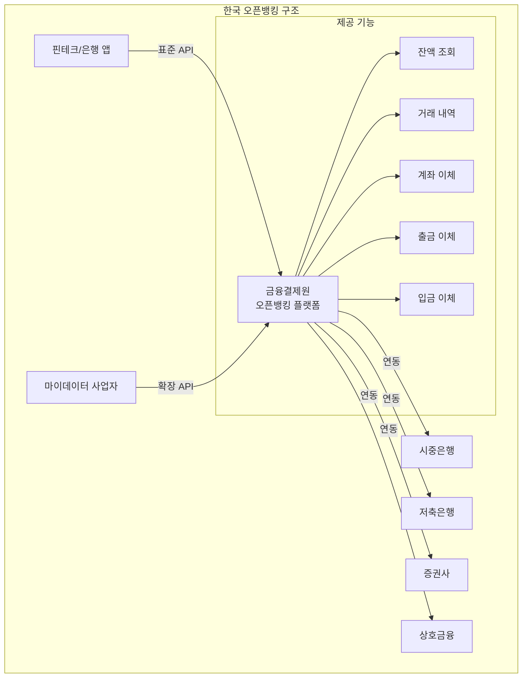

---
tags:
  - 금융
  - 오픈뱅킹
  - BaaS
---
# 한국 오픈뱅킹

## 기본 정보

| 항목 | 내용 |
|------|------|
| **출범** | 2019년 12월 (시범 2019년 10월) |
| **운영 주체** | 금융결제원 (KFTC) |
| **참가 기관** | 은행, 증권, 저축은행, 상호금융 등 130+ 기관 |
| **이용자** | 1억+ 등록 계좌 (2024년 기준) |
| **API 건수** | 일 평균 1억+ 건 |
| **수수료** | 건당 40~50원 (해외 대비 초저가) |

## 정의

한국 오픈뱅킹은 금융결제원이 운영하는 **공공 금융 API 인프라**로, 하나의 앱에서 모든 금융기관의 계좌를 조회하고 이체할 수 있는 통합 시스템이다.

## 상세 설명

한국 오픈뱅킹의 독특함은 **정부 주도의 강제적 참여**에 있다. 유럽의 PSD2가 규제 프레임워크만 제공하고 구현은 각 은행에 맡긴 반면, 한국은 금융결제원이 단일 API 플랫폼을 구축하고 모든 금융기관에 참여를 의무화했다. 이 덕분에 핀테크 기업은 금융결제원 API 하나만 연동하면 전 금융권에 접근할 수 있다.

2022년에는 마이데이터 사업이 본격 시행되어, 오픈뱅킹의 계좌 조회/이체 기능에 더해 카드 사용 내역, 보험 계약, 증권 포트폴리오 등 포괄적인 금융 데이터의 통합 조회가 가능해졌다. 이로써 한국은 세계에서 가장 포괄적인 오픈뱅킹 생태계를 구축한 국가 중 하나가 되었다.

## 참가기관 구조

!!! info "참가기관 유형"
    - **이용기관**: API를 호출하는 핀테크, 은행 (토스, 카카오뱅크, 네이버페이 등)
    - **등록기관**: 계좌를 보유하고 API에 응답하는 금융기관 (시중은행, 저축은행 등)
    - **센터**: 금융결제원 (API 게이트웨이, 인증, 정산 운영)

## 수수료 구조

| 서비스 | 수수료 | 비고 |
|--------|--------|------|
| 잔액 조회 | 무료 | - |
| 거래 내역 조회 | 무료 | - |
| 출금 이체 | 약 40원/건 | 이용기관 부담 |
| 입금 이체 | 약 50원/건 | 이용기관 부담 |

!!! tip "초저가 수수료의 의미"
    한국 오픈뱅킹의 건당 40~50원 수수료는 해외 오픈뱅킹 대비 10분의 1 수준이다. 이는 정부 주도 인프라이기에 가능하며, 핀테크 기업의 진입 장벽을 획기적으로 낮추었다.

## 마이데이터 연계

한국 오픈뱅킹의 확장판인 마이데이터는 다음을 추가로 제공한다:

- **카드**: 결제 내역, 포인트, 한도
- **보험**: 계약 정보, 보장 내역
- **증권**: 보유 종목, 수익률
- **통신/공공**: 통신료, 국민연금 등

이를 통해 자산관리 앱(뱅크샐러드, 토스 등)이 고객의 전체 금융 현황을 한 화면에서 보여줄 수 있다.

## 장점

- 전 금융기관 참여 의무화로 커버리지 100%
- 초저가 수수료로 핀테크 진입 장벽 최소화
- 단일 API 연동으로 전 금융권 접근
- 마이데이터와 결합하여 포괄적 데이터 생태계 구축
- 높은 이용자 수 (1억+ 등록 계좌)

## 단점

- 한국 시장 한정 (글로벌 확장 불가)
- API 기능이 조회/이체 중심으로 제한적 (BaaS 수준 미달)
- API 스펙 변경이 느리고 관료적
- 실시간 처리 한계 (배치 정산)
- 핀테크의 독자적 혁신 여지가 표준화로 제한

## 실무 적용

!!! example "한국 오픈뱅킹 활용 사례"
    - **토스**: 오픈뱅킹으로 모든 은행 계좌 통합 조회 및 간편 송금
    - **뱅크샐러드**: 마이데이터로 자산/지출/보험 통합 관리
    - **카카오페이**: 오픈뱅킹 이체로 간편결제 인프라 구축
    - **핀다**: 마이데이터 기반 맞춤 대출 비교 서비스

## 관련 문서

- [제품 비교](index.md)
- [오픈뱅킹 개요](../index.md)
- [핵심 개념 - 마이데이터](../concepts.md)
- [트렌드](../trends.md) -- 한국 오픈뱅킹의 향후 발전 방향
- [실시간 결제 인프라](../../realtime-payment/index.md) -- 한국 결제 시스템과의 관계
