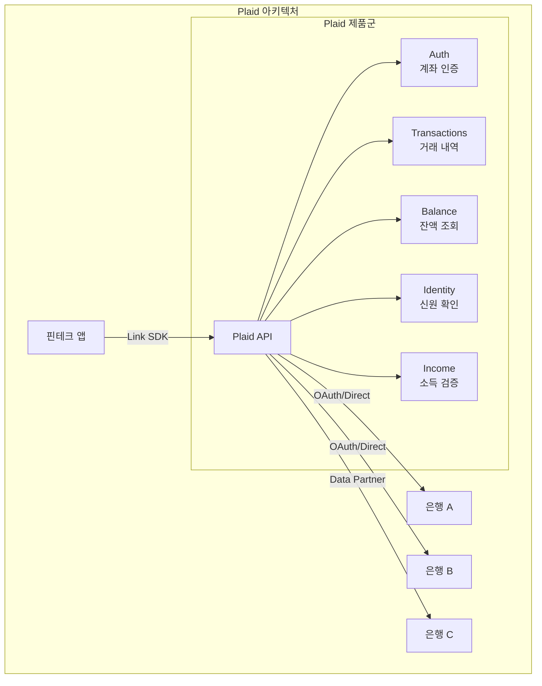

# Plaid

## 기본 정보

| 항목 | 내용 |
|------|------|
| **설립** | 2013년, 미국 샌프란시스코 |
| **유형** | 금융 데이터 연결 플랫폼 |
| **주요 시장** | 미국, 캐나다, 영국, 유럽 |
| **커버리지** | 12,000+ 금융기관 |
| **고객 수** | 8,000+ 핀테크/금융 앱 |
| **연결 계정** | 1억+ 은행 계좌 연결 |
| **주요 고객** | Venmo, Robinhood, Coinbase, SoFi |

## 정의

Plaid는 핀테크 애플리케이션과 사용자의 은행 계좌를 안전하게 연결하는 **금융 데이터 인프라 플랫폼**이다.

## 상세 설명

Plaid는 미국 핀테크 생태계의 핵심 인프라이다. 사용자가 핀테크 앱에서 은행 계좌를 연결할 때, 대부분 Plaid의 Link SDK를 통해 인증이 이루어진다. Plaid는 초기에 스크린 스크래핑 방식으로 시작했으나, 현재는 은행 직접 API 연결(OAuth), 데이터 파트너십, 토큰 기반 접근 등 다양한 방식을 혼합하여 사용한다.

2020년 Visa가 53억 달러에 인수를 시도했으나 미 법무부의 반독점 소송으로 무산되었으며, 이는 역설적으로 Plaid의 시장 지배력을 입증했다. 이후 독자적으로 성장하며 신원 확인(Identity Verification), 소득 검증(Income), 자산 보고(Assets) 등으로 영역을 확장했다.

## 핵심 특징

!!! info "Plaid의 5대 강점"
    1. **압도적 커버리지**: 미국 금융기관 12,000+ 연결, 사실상 표준
    2. **개발자 경험**: Link SDK로 몇 줄 코드로 계좌 연결 구현
    3. **데이터 정규화**: 은행마다 다른 데이터 포맷을 통일된 스키마로 변환
    4. **확장 제품군**: 계좌 연결 외 신원 확인, 소득 검증, 자산 보고 등
    5. **보안**: SOC 2 Type II, 데이터 암호화, 토큰화

## 가격

| 제품 | 가격 모델 | 대략적 단가 |
|------|-----------|-------------|
| Plaid Link (계좌 연결) | 연결 건당 | ~$0.30/연결 |
| Transactions | 연결 유지 + 호출당 | ~$0.10~0.25/호출 |
| Auth | 인증 건당 | ~$0.30/건 |
| Balance | 호출당 | ~$0.10/호출 |
| Identity Verification | 검증 건당 | ~$2.00+/건 |

!!! warning "가격 참고사항"
    Plaid의 가격은 공개되지 않으며, 볼륨에 따라 크게 달라진다. 위 단가는 시장 추정치이다. Production 접근에는 별도 신청이 필요하다.

## 장점

- 미국 시장 점유율 압도적 1위
- 풍부한 SDK(iOS, Android, React Native, Web)
- 거래 데이터 카테고리 자동 분류
- 지속적으로 직접 API 연결(OAuth) 비중 확대 중
- 개발 문서와 샌드박스 환경 우수

## 단점

- 미국 외 시장 커버리지 제한적
- 스크래핑 의존도 잔존 (일부 소규모 은행)
- 가격 비공개, 소규모 스타트업에 부담
- BaaS 기능 없음 (계좌 개설, 카드 발급 불가)
- 데이터 프라이버시 관련 소송 이력 (2022년 합의)

## 실무 적용

!!! example "Plaid 적용 시나리오"
    - **PFM(개인 자산 관리) 앱**: Transactions API로 사용자의 전체 금융 거래를 통합 조회
    - **대출 심사**: Income + Assets API로 소득과 자산을 자동 검증
    - **결제 앱**: Auth API로 은행 계좌를 인증하고 ACH 결제 연동
    - **투자 앱**: Balance API로 실시간 잔액 확인 후 투자금 이체

## 관련 문서

- [제품 비교](index.md)
- [오픈뱅킹 개요](../index.md)
- [핵심 개념 - 스크린 스크래핑 vs API](../concepts.md)
- [Unit (BaaS)](unit.md) -- Plaid와 상호보완적 역할
