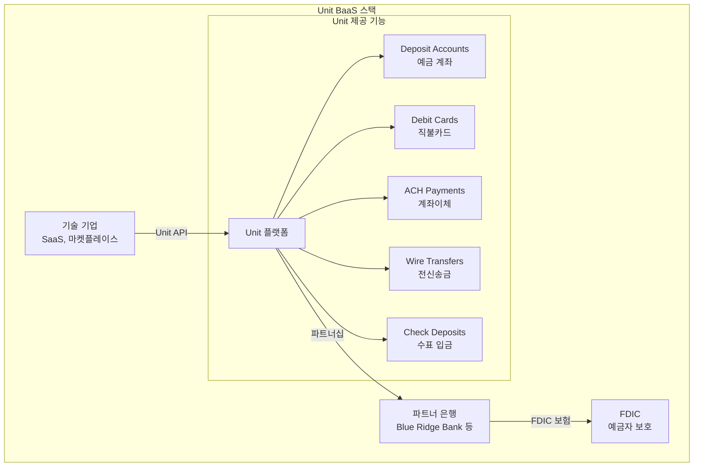

---
tags:
  - 금융
  - 오픈뱅킹
  - BaaS
---
# Unit

## 기본 정보

| 항목 | 내용 |
|------|------|
| **설립** | 2019년, 미국 |
| **유형** | BaaS(Banking as a Service) 플랫폼 |
| **주요 시장** | 미국 |
| **파트너 은행** | Blue Ridge Bank, Piermont Bank 등 |
| **주요 고객** | Roofstock, Relay, AngelList, Wyre |
| **누적 투자** | $190M+ (시리즈 C) |

## 정의

Unit은 기술 기업이 자사 플랫폼 안에서 FDIC 보험이 적용되는 은행 계좌, 직불카드, ACH 송금 등 금융 서비스를 제공할 수 있게 하는 **BaaS 플랫폼**이다.

## 상세 설명

Unit은 은행 파트너십의 복잡성을 추상화한다. 전통적으로 비금융 기업이 금융 서비스를 출시하려면 은행과 직접 계약하고, 규제 준수 체계를 구축하며, 핵심 뱅킹 시스템을 연동해야 했다. Unit은 이 모든 과정을 단일 API 플랫폼으로 통합한다. 파트너 은행의 라이선스와 인프라 위에 현대적인 API 레이어를 구축하여, 기술 기업이 수 주 만에 금융 서비스를 출시할 수 있도록 지원한다.

Unit의 핵심 차별화는 **은행 파트너십 관리의 추상화**에 있다. 개발자는 은행의 복잡한 내부 시스템을 이해할 필요 없이, Unit의 RESTful API와 대시보드를 통해 계좌 생성, 카드 발급, 자금 이동을 관리한다.

## 핵심 특징

!!! info "Unit의 5대 강점"
    1. **풀스택 BaaS**: 계좌, 카드, ACH, Wire 등 은행 기능 전체를 API로 제공
    2. **빠른 출시**: 수개월이 걸리던 금융 서비스 출시를 수 주로 단축
    3. **규제 준수 내장**: BSA/AML, KYC 등 컴플라이언스 프레임워크 포함
    4. **FDIC 보험**: 파트너 은행을 통한 최대 $250K 예금자 보호
    5. **화이트 라벨**: 기업 브랜드로 금융 서비스 제공 가능

## 은행 파트너십 모델

Unit의 아키텍처에서 **파트너 은행**은 핵심이다:

| 역할 | Unit | 파트너 은행 |
|------|------|------------|
| 기술 플랫폼 | O | X |
| 은행 라이선스 | X | O |
| FDIC 보험 | X | O |
| API 개발/유지 | O | X |
| KYC/AML 실행 | 공동 | 공동 |
| 규제 감독 대응 | 지원 | 최종 책임 |

!!! warning "파트너 은행 리스크"
    BaaS 모델의 구조적 리스크는 파트너 은행에 있다. 2023~2024년 Synapse 붕괴, Blue Ridge Bank 규제 조치 등 사례에서 보듯, 파트너 은행의 규제 문제가 BaaS 고객 전체에 영향을 미칠 수 있다. Unit은 다중 은행 파트너십으로 이 리스크를 분산하고 있다.

## 가격

| 항목 | 모델 |
|------|------|
| 플랫폼 이용료 | 월정액 (비공개, 볼륨 기반) |
| 계좌 개설 | 건당 과금 |
| 카드 발급 | 물리/가상 카드별 차등 |
| ACH 이체 | 건당 과금 |
| 인터체인지 수익 | 카드 사용 시 수익 공유 |

## 장점

- 진정한 풀스택 BaaS (계좌+카드+이체 통합)
- 현대적 API 설계, 풍부한 웹훅 지원
- 다중 파트너 은행으로 리스크 분산
- 임베디드 금융의 핵심 인프라 역할
- 실시간 거래 모니터링 대시보드

## 단점

- 미국 한정 (글로벌 확장 미지원)
- 파트너 은행 규제 리스크 상존
- 높은 최소 비용 (초기 스타트업에 부담)
- 대출 상품 지원 제한적
- 밀폐된 가격 구조

## 관련 문서

- [제품 비교](index.md)
- [오픈뱅킹 개요](../index.md)
- [BaaS 개념](../concepts.md)
- [Plaid](plaid.md) -- 데이터 연결(상호보완)
- [Unit - 임베디드 금융 관점](../../embedded-finance/products/unit.md)
