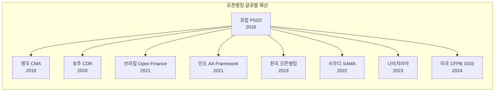

---
tags:
  - 금융
  - 오픈뱅킹
  - BaaS
---
# 오픈뱅킹 / BaaS 트렌드

## PSD3와 오픈 파이낸스

**PSD3(Payment Services Directive 3)**는 PSD2의 한계를 보완하는 차세대 유럽 규제로, 2025~2026년 시행 예정이다.

PSD2의 핵심 문제는 API 품질과 성능의 편차가 컸다는 점이다. 은행마다 API 구현 수준이 달랐고, 핀테크가 안정적으로 데이터를 가져오기 어려운 경우가 많았다. PSD3는 이를 해결하기 위해 API 성능 기준을 의무화하고, 은행의 API 가용성과 응답 시간에 대한 명확한 SLA를 요구한다.

더 나아가 **FIDA(Financial Data Access Regulation)**를 통해 오픈뱅킹을 **오픈 파이낸스**로 확장한다. 기존의 결제 계좌 데이터에 더해 보험, 투자, 연금 등 전체 금융 데이터의 개방을 추진한다.

!!! info "PSD3 주요 변경사항"
    - API 성능/가용성 SLA 의무화
    - 스크린 스크래핑 완전 금지
    - 강력한 고객 인증(SCA) 개선
    - 사기 방지 책임 범위 확대
    - 오픈 파이낸스(FIDA)와 연계

---

## 글로벌 확산

오픈뱅킹은 유럽과 영국에서 시작되어 전 세계로 확산 중이다.

미국은 오랫동안 시장 주도 방식이었으나, 2024년 CFPB의 Section 1033 규칙 최종안이 발표되면서 규제 기반 오픈뱅킹으로 전환하고 있다. 이는 Plaid 등 기존 시장 플레이어에게 기회이자 도전이다.

---

## BaaS 시장 성장과 구조조정

BaaS 시장은 2023~2024년 격동기를 거쳤다. Synapse의 파산, 여러 파트너 은행의 규제 조치(Consent Orders), 그리고 고객 자금 동결 사태 등이 연이어 발생했다.

!!! warning "BaaS 구조조정의 교훈"
    1. **파트너 은행 리스크**: 중개자(BaaS 플랫폼)가 파산하면 고객 자금이 위험
    2. **규제 강화**: OCC, FDIC 등이 BaaS 파트너십에 대한 감독 강화
    3. **다중 은행 전략**: 단일 파트너 은행 의존은 치명적 리스크
    4. **자금 분리 의무**: 고객 자금과 플랫폼 자금의 명확한 분리 필수

이러한 구조조정을 거치며 시장은 성숙해지고 있다. Column(은행이 직접 BaaS 운영), Unit(다중 파트너 은행) 등 보다 안전한 모델이 부상하고 있다.

---

## 슈퍼앱과 금융 통합

아시아 시장에서 두드러지는 슈퍼앱 모델은 오픈뱅킹과 BaaS의 교차점이다. 토스, 카카오페이, GrabPay, GoPay 등은 결제에서 시작해 금융 전반으로 확장하며, 오픈뱅킹 인프라를 적극 활용한다.

- **토스**: 한국 오픈뱅킹 + 마이데이터로 종합 금융 플랫폼 구축
- **Grab Financial**: 동남아 슈퍼앱에서 대출, 보험, 투자까지 확장
- **카카오페이**: 메신저 생태계에 금융 서비스 임베딩

---

## API 표준화

오픈뱅킹의 핵심 과제 중 하나는 API 표준의 파편화이다.

| 지역 | 표준 | 특징 |
|------|------|------|
| 영국 | OBIE Standard | 가장 상세한 기술 스펙 |
| 유럽 | Berlin Group NextGenPSD2 | 유럽 전역 통용 |
| 호주 | CDR Standards | 금융 외 에너지/통신까지 확장 |
| 한국 | 금융결제원 표준 | 단일 중앙 플랫폼 |
| 미국 | FDX (Financial Data Exchange) | 업계 자율 표준 |

글로벌 API 표준의 통합은 크로스보더 오픈뱅킹의 전제조건이다. FDX, Berlin Group, OBIE 등이 상호 운용성 협력을 진행 중이다.

---

## 향후 전망

!!! tip "2025-2027 주요 전망"
    1. **미국 오픈뱅킹 규제 본격화**: CFPB 1033 시행으로 미국 시장 구조 변화
    2. **BaaS 2.0**: 구조조정 후 더 안전하고 규제 준수적인 모델 부상
    3. **오픈 파이낸스**: 은행 데이터를 넘어 보험, 투자, 연금까지 확장
    4. **AI + 오픈뱅킹**: 통합 금융 데이터 기반 AI 자산관리/신용평가
    5. **크로스보더**: 국가 간 오픈뱅킹 API 상호 운용 시도 증가

## 관련 문서

- [오픈뱅킹 개요](index.md)
- [핵심 개념](concepts.md)
- [제품 비교](products/index.md)
- [임베디드 금융 트렌드](../embedded-finance/trends.md)
- [BNPL 트렌드](../bnpl/trends.md) -- 핀테크 규제 동향 연계
