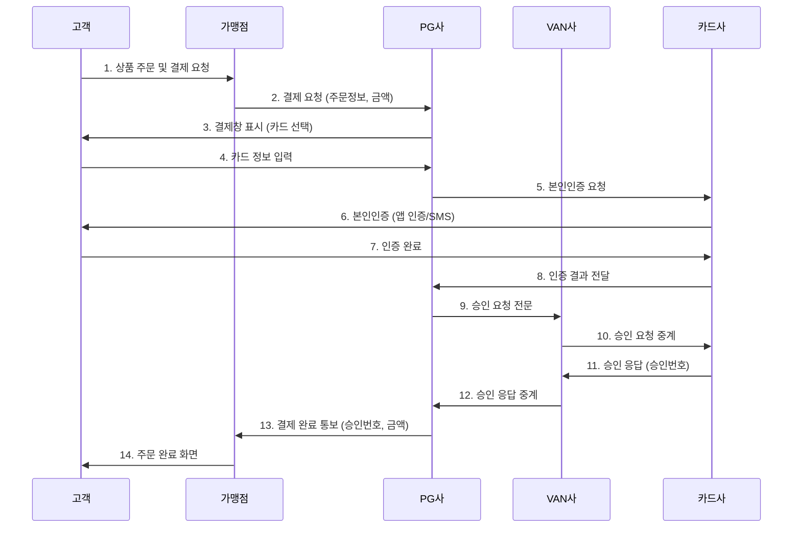
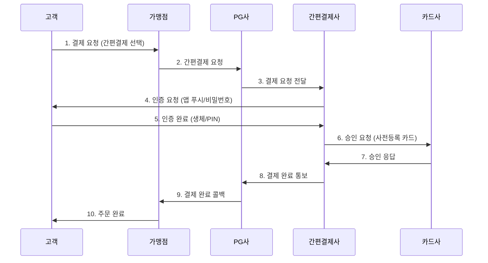
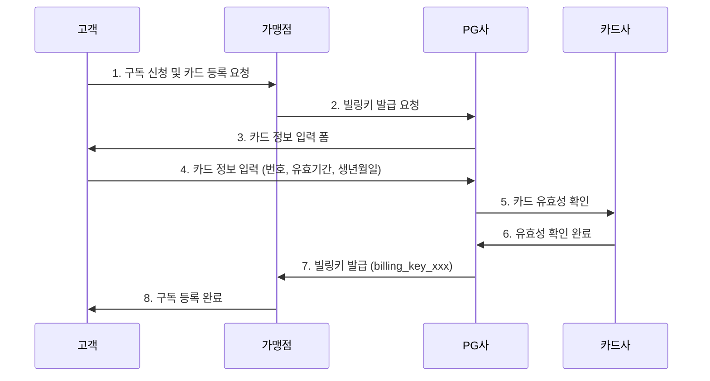
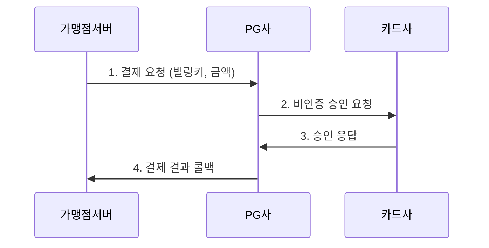
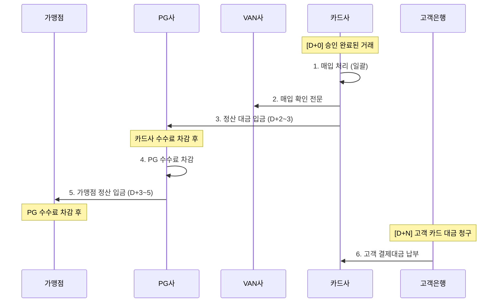
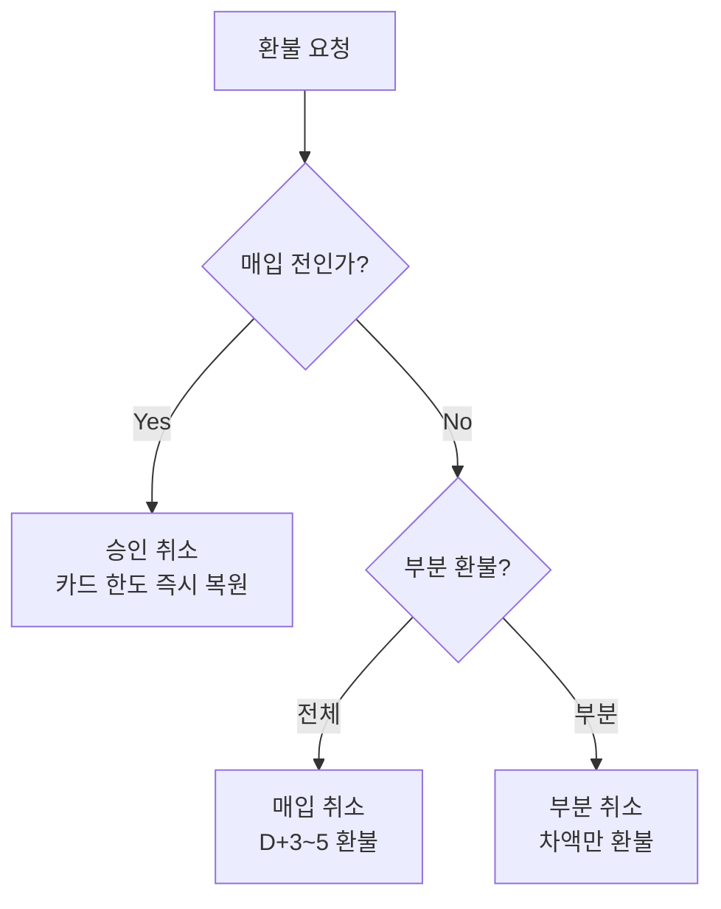

# PG 서비스 - 결제 플로우

> 온라인 결제의 전체 흐름을 다이어그램과 함께 단계별로 설명한다. 카드 결제, 간편결제, 정산 플로우를 다룬다.

[< PG 서비스 개요로 돌아가기](index.md) | [핵심 개념](concepts.md)

---

## 1. 카드 결제 플로우 (인증결제)

한국 온라인 카드 결제의 표준 흐름이다. 고객 → 가맹점 → PG → VAN → 카드사 순서로 승인 요청이 전달되고, 역순으로 응답이 돌아온다.



### 단계별 상세

| 단계 | 설명 | 주요 데이터 |
|------|------|-------------|
| 1~2 | 고객이 상품을 선택하고 결제를 시작하면, 가맹점 서버가 PG사 API를 호출한다 | 주문번호, 금액, 상품명, 가맹점 ID |
| 3~4 | PG사가 제공하는 결제창(SDK/팝업)에서 고객이 카드를 선택하고 정보를 입력한다 | 카드번호, 유효기간, 할부개월수 |
| 5~7 | 30만원 이상 거래 시 카드사 앱 또는 SMS로 본인인증을 수행한다 | 인증 토큰, 인증 결과 |
| 8~9 | 인증 성공 후 PG사가 VAN을 통해 카드사에 승인 요청 전문을 전송한다 | 가맹점번호, 카드번호(암호화), 금액, 할부 |
| 10~12 | VAN사가 전문을 중계하고, 카드사가 한도·유효성을 확인 후 승인한다 | 승인번호, 승인일시, 매입예정일 |
| 13~14 | PG사가 가맹점에 승인 결과를 콜백하고, 가맹점이 주문을 확정한다 | 거래 ID, 승인번호, 결제 상태 |

!!! tip "승인과 매입의 차이"
    **승인(Authorization)**: 카드 한도에서 금액을 홀딩하는 것. 실제 돈이 이동하지는 않는다.
    **매입(Capture)**: 승인된 거래를 확정하여 실제 정산을 진행하는 것. 대부분의 PG는 승인과 동시에 자동 매입(Auto-Capture)한다. 일부 서비스는 승인 후 별도 매입 요청이 필요하다(Pre-Auth 방식).

---

## 2. 간편결제 플로우

카드 정보를 사전 등록한 간편결제(토스페이, 네이버페이, 카카오페이 등)의 흐름이다. 기존 인증결제 대비 단계가 간소화된다.



### 간편결제의 특징

- **간소화된 인증**: 카드사 앱 인증 대신 간편결제 자체 인증(PIN, 생체)으로 대체
- **빠른 결제**: 일반 카드 결제 대비 2~3단계 감소
- **VAN 우회 가능**: 간편결제사가 자체 VAN 라이선스를 보유한 경우 직접 카드사와 통신
- **다양한 결제수단**: 카드뿐 아니라 계좌이체, 포인트 등도 통합

!!! note "PG를 거치지 않는 간편결제"
    네이버페이, 카카오페이 등 대형 간편결제사는 자체 PG 라이선스를 보유하여, 가맹점이 PG 없이 직접 연동하기도 한다. 하지만 여러 결제수단을 통합 관리하려면 PG를 경유하는 것이 일반적이다.

---

## 3. 비인증결제(정기결제) 플로우

구독 서비스 등에서 빌링키를 이용한 자동 결제 흐름이다. 최초 1회만 카드를 등록하고, 이후에는 고객 개입 없이 결제가 진행된다.

### 3-1. 빌링키 발급



### 3-2. 빌링키 결제 (매 결제 주기)



!!! warning "빌링키 결제 시 주의사항"
    - 카드 만료·분실 시 빌링키가 무효화되므로, 결제 실패 시 고객에게 카드 재등록을 안내해야 한다
    - 결제 실패 시 재시도 로직이 필요하다 (보통 3회, 간격을 두고)
    - 구독 해지 시 빌링키를 반드시 폐기해야 한다

---

## 4. 정산 플로우

결제 승인 이후 실제 돈이 가맹점에 도달하기까지의 흐름이다.



### 정산 타임라인

| 시점 | 이벤트 | 비고 |
|------|--------|------|
| D+0 | 결제 승인 | 카드 한도에서 금액 홀딩 |
| D+1 | 매입 처리 | 카드사가 거래를 확정 |
| D+2~3 | 카드사 → PG 정산 | 카드사 수수료(약 1.5~2.5%) 차감 |
| D+3~5 | PG → 가맹점 정산 | PG 수수료(약 0.5~1.0%) 추가 차감 |
| D+25~55 | 고객 결제대금 납부 | 카드 결제일에 따라 다름 |

### 수수료 구조

```
고객 결제 금액: 100,000원
├── 카드사 수수료 (약 2.0%): -2,000원
├── VAN 수수료 (건당 약 20원): -20원
├── PG 수수료 (약 0.5~1.0%): -700원
└── 가맹점 수령액: 약 97,280원
```

!!! tip "수수료 절감 전략"
    - **거래량 기반 협상**: 월 거래액이 높을수록 PG·카드사 수수료 할인 가능
    - **직접 매입**: PG가 VAN을 거치지 않고 카드사와 직접 연결하면 VAN 수수료 절감
    - **간편결제 활용**: 일부 간편결제는 VAN 수수료가 면제되는 구조

---

## 5. 환불(취소) 플로우

결제 취소와 환불은 시점에 따라 처리 방식이 다르다.



| 구분 | 승인 취소 | 매입 후 환불 |
|------|-----------|-------------|
| 시점 | 매입 전 (당일) | 매입 후 |
| 처리 속도 | 즉시 (한도 복원) | 3~5 영업일 |
| 카드사 수수료 | 미발생 | 발생 (차감 후 환불) |
| 가맹점 부담 | 없음 | 환불 수수료 가능 |

---

## 다음 단계

- [핵심 개념](concepts.md)에서 각 용어의 상세 정의 확인
- [제품 비교](products/index.md)에서 PG별 수수료·정산 주기 비교
- [트렌드](trends.md)에서 실시간 정산, BNPL 등 결제 흐름의 변화 확인
