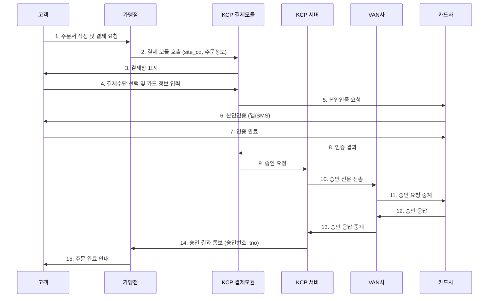

---
tags:
  - 결제
  - PG
---
# NHN KCP

> 20년 이상의 역사를 가진 한국 대표 PG. 다양한 결제수단과 안정적인 인프라로 엔터프라이즈 시장에서 강점을 보인다.

[< 제품 비교 개요로 돌아가기](index.md)

---

## 기본 정보

| 항목 | 내용 |
|------|------|
| **회사명** | NHN한국사이버결제 주식회사 |
| **설립** | 1998년 |
| **본사** | 대한민국 서울 |
| **주요 시장** | 한국 |
| **모회사** | NHN (네이버 분사 기업) |
| **웹사이트** | [kcp.co.kr](https://www.kcp.co.kr) |
| **상장** | 코스닥 상장 |

---

## 핵심 특징

### 1. 다양한 결제수단

한국에서 사용 가능한 거의 모든 결제수단을 지원한다.

| 결제수단 | 상세 |
|----------|------|
| 신용카드/체크카드 | 전 카드사 지원 (일시불, 할부) |
| 계좌이체 | 주요 은행 실시간 이체 |
| 가상계좌 | 무통장 입금 자동 확인 |
| 휴대폰 결제 | SKT, KT, LG U+ |
| 간편결제 | 토스페이, 네이버페이, 카카오페이, 삼성페이 등 |
| 상품권 | 문화상품권, 도서상품권, 게임상품권 |
| 포인트 | 카드사 포인트, 통신사 포인트 |
| 해외카드 | Visa, Mastercard, JCB, AMEX |
| 에스크로 | 구매 확인 후 대금 지급 |

### 2. 엔터프라이즈급 안정성

- **20년+ 운영 경험**: 1998년 설립 이후 대규모 트래픽 처리 노하우 축적
- **높은 가용성**: 이중화된 결제 인프라, 99.9%+ 업타임
- **대형 가맹점 레퍼런스**: 대기업, 공공기관, 대형 쇼핑몰 다수 운영
- **커스터마이징**: 가맹점 요구에 맞춘 맞춤형 결제 솔루션 제공

### 3. 오랜 역사와 신뢰성

- 한국 전자결제 초창기부터 시장을 개척한 PG 중 하나
- 금융감독원 인가 전자금융업자로서 강력한 규제 준수
- NHN 그룹의 기술력과 자본력 뒷받침

### 4. 통합 결제 솔루션

| 솔루션 | 설명 |
|--------|------|
| **온라인 결제** | 웹/앱 결제 연동 |
| **오프라인 결제** | POS 단말기, 무인키오스크 |
| **정기결제** | 빌링키 기반 자동 결제 |
| **해외결제** | 해외 카드 결제 수납 |
| **에스크로** | 안전거래 서비스 |
| **현금영수증** | 자동 발행 |
| **세금계산서** | 전자 세금계산서 연동 |

---

## 동작 방식

### 표준 온라인 결제

**핵심 포인트**:

- **site_cd**: KCP에서 가맹점에 부여하는 고유 식별 코드
- **tno**: KCP의 거래 고유번호 (Transaction Number). 취소·조회 시 사용
- **결제 모듈**: JavaScript 기반 결제창 모듈. 과거 ActiveX 기반에서 현재는 웹 표준으로 전환

### 연동 방식 비교

| 방식 | 설명 | 적합 대상 |
|------|------|-----------|
| **표준 결제창** | KCP 제공 팝업/리다이렉트 결제창 | 대부분의 가맹점 |
| **API 직접 연동** | REST API로 서버 대 서버 결제 | 자체 결제 UI가 필요한 서비스 |
| **빌링 API** | 정기결제용 빌링키 발급·결제 API | 구독 서비스 |
| **배치 결제** | 대량 결제 일괄 처리 | 대량 정산, B2B |

---

## 가격 모델

### 표준 수수료 (2025년 기준)

| 결제 수단 | 수수료율 |
|-----------|----------|
| 신용카드 | 약 2.8~3.5% (거래 규모별 협의) |
| 체크카드 | 약 2.3~3.0% |
| 계좌이체 | 건당 약 300~500원 |
| 가상계좌 | 건당 약 300원 |
| 휴대폰 결제 | 약 5~7% |
| 상품권 | 약 5~8% |

### 정산 주기

| 정산 옵션 | 설명 |
|-----------|------|
| **D+3 정산** | 영업일 기준 3일 후 (기본) |
| **D+5 정산** | 일부 결제수단 |
| **빠른 정산** | 별도 협의 (추가 수수료) |

### 가격 특징

- **볼륨 디스카운트**: 월 거래액 기준 수수료율 단계적 인하
- **맞춤 견적**: 대형 가맹점은 영업 담당자를 통한 별도 협의
- **초기 비용**: 가입비 무료, 일부 부가 서비스 월정액 가능

!!! note "수수료 협상 팁"
    KCP는 거래 규모에 따라 수수료 협상 여지가 크다. 월 거래액 5,000만 원 이상이면 적극적으로 협의하는 것이 좋다. 경쟁사 견적을 함께 제시하면 더 유리한 조건을 받을 수 있다.

---

## 장단점

| 장점 | 단점 |
|------|------|
| 한국 결제수단 가장 폭넓게 지원 | API 설계가 Stripe/토스페이먼츠 대비 레거시 |
| 20년+ 검증된 안정성 | 개발 문서 품질이 최신 PG 대비 부족 |
| 대형 가맹점·공공기관 레퍼런스 풍부 | 샌드박스/테스트 환경 제한적 |
| 오프라인 + 온라인 통합 솔루션 | 정산 주기가 D+3~5로 느린 편 |
| 거래 규모별 유연한 수수료 협상 | 가맹 심사에 시간 소요 (수일~수주) |
| 에스크로, 상품권 등 특수 결제수단 | 모바일 결제 UX가 최신 PG 대비 경직 |
| NHN 그룹 기술력 뒷받침 | 해외 결제 기능 제한적 |
| 전담 기술지원 (엔터프라이즈) | — |

---

## 주요 고객사

| 분야 | 고객사 |
|------|--------|
| 대형 커머스 | 11번가, 인터파크, GS Shop |
| 여행/항공 | 대한항공, 하나투어, 여기어때 |
| 공공기관 | 다수 정부·공공 프로젝트 |
| 게임 | NHN 게임 (페이코 연동) |
| 교육 | 대형 온라인 교육 플랫폼 |
| 보험/금융 | 보험사 온라인 청약 |

---

## KCP vs 토스페이먼츠 vs Stripe 핵심 비교

| 항목 | NHN KCP | Toss Payments | Stripe |
|------|---------|---------------|--------|
| 주요 강점 | 안정성, 결제수단 다양성 | DX, 빠른 정산 | 글로벌, API 설계 |
| 연동 난이도 | 중간~높음 | 낮음 | 낮음 |
| 정산 주기 | D+3~5 | D+1 | D+2~7 (국가별 상이) |
| 한국 간편결제 | 대부분 지원 | 전체 통합 | 미지원 |
| 해외 결제 | 제한적 | 제한적 | 네이티브 |
| 오프라인 | 지원 | 미흡 | 한국 미지원 |
| 적합 대상 | 대기업, 공공 | 스타트업, 중소 | 글로벌 서비스 |

---

## 다음 단계

- [Toss Payments](toss-payments.md)와 비교하여 스타트업/중소기업 적합성 확인
- [Stripe](stripe.md)과 비교하여 글로벌 서비스 연동 검토
- [결제 플로우](../payment-flow.md)에서 KCP의 결제 모듈 방식과 API 방식 차이 이해
