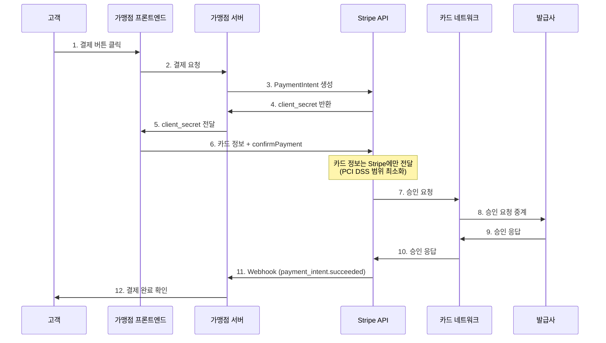

# Stripe

> 글로벌 PG 시장의 대표 주자. API-first 철학과 최고 수준의 개발자 경험으로 유명하다.

[< 제품 비교 개요로 돌아가기](index.md)

---

## 기본 정보

| 항목 | 내용 |
|------|------|
| **회사명** | Stripe, Inc. |
| **설립** | 2010년 (Patrick & John Collison) |
| **본사** | 미국 샌프란시스코, 아일랜드 더블린 (이중 본사) |
| **주요 시장** | 46개국 이상, 135개 이상 통화 지원 |
| **기업가치** | 약 $65B (2025년 기준) |
| **웹사이트** | [stripe.com](https://stripe.com) |

---

## 핵심 특징

### 1. API-First 설계

Stripe는 결제 인프라를 RESTful API로 제공하는 선구자다. 모든 기능이 API로 접근 가능하며, 코드 몇 줄로 결제를 연동할 수 있다.

```
# Stripe 결제 생성 (개념적 예시)
POST /v1/payment_intents
{
  "amount": 2000,
  "currency": "usd",
  "payment_method": "pm_card_visa"
}
```

### 2. 개발자 경험 (DX)

- **문서화**: 업계 최고 수준의 API 문서, 인터랙티브 가이드
- **SDK**: 15개 이상 언어/프레임워크 공식 SDK
- **샌드박스**: 테스트 모드에서 실제와 동일한 환경 제공
- **Stripe CLI**: 로컬에서 웹훅 테스트, 이벤트 시뮬레이션
- **Dashboard**: 거래 모니터링, 분석, 환불 관리 통합 UI

### 3. 풀스택 결제 인프라

단순 PG를 넘어 금융 인프라 플랫폼을 지향한다.

| 제품 | 설명 |
|------|------|
| **Payments** | 온라인 결제 핵심 (카드, 지역 결제수단) |
| **Billing** | 구독·정기결제 관리 |
| **Connect** | 마켓플레이스·플랫폼 결제 (판매자 온보딩, 분배 정산) |
| **Terminal** | 오프라인 POS 결제 |
| **Radar** | AI 기반 사기 탐지 |
| **Atlas** | 미국 법인 설립 서비스 |
| **Treasury** | BaaS (Banking as a Service) |
| **Identity** | 본인 확인 서비스 |
| **Revenue Recognition** | 수익 인식 자동화 |
| **Tax** | 세금 자동 계산·신고 |

### 4. 글로벌 커버리지

- 135개 이상 통화, 46개국 이상에서 사업자 등록 가능
- 현지 결제수단 지원: iDEAL(네덜란드), Bancontact(벨기에), Alipay(중국) 등
- 자동 환율 변환, 다중 통화 정산

---

## 동작 방식



**핵심 포인트**:

- **PaymentIntent**: Stripe의 결제 라이프사이클 객체. 생성 → 확인 → 성공/실패의 상태를 추적
- **client_secret**: 프론트엔드에서 결제를 확정할 때 사용하는 일회성 키
- **Webhook**: 결제 결과를 서버에 비동기 통보. 프론트엔드 응답에만 의존하지 않도록 하는 안전장치

---

## 가격 모델

### 표준 요금 (2025년 기준)

| 항목 | 요금 |
|------|------|
| 온라인 카드 결제 (미국) | 2.9% + 30¢ |
| 온라인 카드 결제 (유럽 EEA) | 1.5% + 25¢ (유럽 카드) |
| 국제 카드 추가 수수료 | +1.5% |
| 환율 변환 | +1% |
| Billing (구독) | 0.5~0.8% 추가 |
| Connect (마켓플레이스) | 0.25~2% 추가 |
| Radar (사기 탐지) | 기본 무료, 고급 $0.07/건 |
| Payout (정산 출금) | 미국 무료, 해외 건당 요금 |

!!! note "한국 시장 요금"
    Stripe Korea의 요금은 별도 문의가 필요하며, 일반적으로 한국 카드 결제 기준 3.4~3.6% 수준이다. 국내 PG 대비 높은 편이나, 해외 결제가 포함된 경우 경쟁력이 있다.

### 가격 특징

- **숨겨진 비용 없음**: 월 고정비, 설정비, 해지 위약금 없음
- **종량제(Pay-as-you-go)**: 거래 발생 시에만 과금
- **볼륨 할인**: 대형 가맹점은 맞춤 요금 협의 가능

---

## 장단점

| 장점 | 단점 |
|------|------|
| 업계 최고 수준의 API 설계와 문서 | 한국 시장에서 수수료가 상대적으로 높음 |
| 빠른 연동 (수 시간~수일) | 한국 간편결제(토스페이, 네이버페이) 미지원 |
| 풀스택 금융 인프라 (결제 → 뱅킹 → 세금) | 한국어 고객 지원 제한적 |
| 글로벌 46개국+ 지원 | VAN 기반 한국 결제 인프라와 구조 차이 |
| AI 기반 사기 탐지 (Radar) 기본 내장 | 현금영수증·세금계산서 등 한국 세무 연동 부족 |
| 마켓플레이스/플랫폼 결제 (Connect) 강점 | 대면 결제 (Terminal) 한국 미지원 |
| 실시간 분석 Dashboard | — |
| 끊임없는 제품 혁신 (연 수백 개 기능 출시) | — |

---

## 주요 고객사

| 분야 | 고객사 |
|------|--------|
| 테크/SaaS | Amazon, Google, Shopify, Slack, Zoom |
| 커머스 | Instacart, Deliveroo, Grab |
| 모빌리티 | Lyft, Lime |
| 금융 | Revolut, Klarna |
| 한국 | 토스(해외결제), 배달의민족(해외), 다수 글로벌 SaaS |

---

## 다음 단계

- [Toss Payments](toss-payments.md)와 비교하여 한국 시장 적합성 판단
- [NHN KCP](nhn-kcp.md)와 비교하여 엔터프라이즈 요구사항 확인
- [결제 플로우](../payment-flow.md)에서 Stripe의 PaymentIntent 방식이 한국 PG 흐름과 어떻게 다른지 비교
