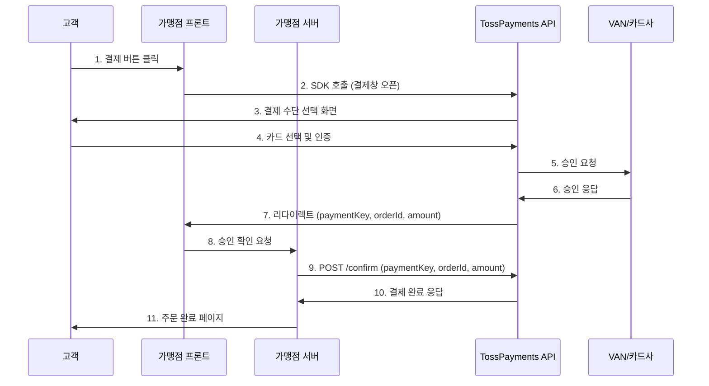
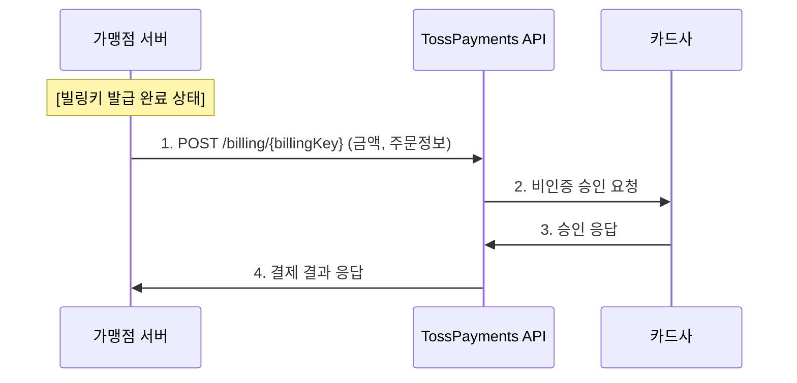

---
tags:
  - 결제
  - PG
---
# Toss Payments

> 토스(Toss) 생태계 기반의 한국 시장 최적화 PG. 개발자 친화적 API와 빠른 정산으로 주목받고 있다.

[< 제품 비교 개요로 돌아가기](index.md)

---

## 기본 정보

| 항목 | 내용 |
|------|------|
| **회사명** | 주식회사 토스페이먼츠 (비바리퍼블리카 자회사) |
| **설립** | 2019년 (토스 PG 사업 분사) |
| **본사** | 대한민국 서울 |
| **주요 시장** | 한국 |
| **모회사** | 비바리퍼블리카 (토스) |
| **웹사이트** | [tosspayments.com](https://www.tosspayments.com) |

---

## 핵심 특징

### 1. 간편결제 통합 연동

토스페이먼츠의 가장 큰 강점은 **하나의 API로 주요 간편결제를 모두 연동**할 수 있다는 점이다.

| 지원 간편결제 | 비고 |
|--------------|------|
| 토스페이 | 자사 서비스, 최적화된 연동 |
| 네이버페이 | 주문형/결제형 |
| 카카오페이 | — |
| 삼성페이 | 온라인 결제 |
| 페이코 | — |
| SSG페이 | — |
| L.Pay | — |

### 2. 토스 생태계 시너지

- **토스페이**: 토스 앱의 4,000만+ 사용자 기반 간편결제
- **토스 비즈니스**: 사업자 대시보드, 매출 분석, 세무 연동
- **토스뱅크**: 정산 계좌 연계 시 즉시 정산 가능
- **토스 브랜드페이**: 가맹점 자체 브랜드의 간편결제 구축 지원

### 3. 한국 시장 최적화

- **VAN 자체 보유**: VAN 수수료 절감, 승인 속도 향상
- **한국형 결제수단 완벽 지원**: 신용카드, 계좌이체, 가상계좌, 휴대폰 결제, 상품권, 문화상품권
- **세무 연동**: 현금영수증, 세금계산서 자동 발행
- **한국어 지원**: 문서, 고객센터, 기술 지원 모두 한국어

### 4. 개발자 경험

Stripe에서 영감을 받아 한국 PG 중 가장 우수한 개발자 경험을 제공한다.

- **RESTful API**: JSON 기반, 직관적 엔드포인트 설계
- **SDK**: JavaScript, React Native, Flutter, Android, iOS
- **테스트 환경**: 샌드박스 모드, 테스트 카드번호 제공
- **웹훅**: 결제 상태 변경 시 비동기 알림
- **API 문서**: 인터랙티브 API 레퍼런스, 코드 예시 풍부

!!! tip "연동 난이도 비교"
    토스페이먼츠는 한국 PG 중에서 Stripe과 가장 유사한 연동 경험을 제공한다.
    기존 PG(이니시스, KCP 등)가 ActiveX/플러그인 기반이었던 것에 비해,
    토스페이먼츠는 JavaScript SDK만으로 결제창을 띄울 수 있다.

---

## 동작 방식

### 일반 결제 (카드/간편결제)

**핵심 포인트**:

- **2단계 결제(Two-step Payment)**: 고객 인증(4~6) 후, 가맹점 서버에서 최종 확인(9)을 해야 결제가 완료된다. 이 구조 덕분에 가맹점이 금액 검증 등 비즈니스 로직을 삽입할 수 있다.
- **paymentKey**: 토스페이먼츠가 발급하는 결제 고유 식별자
- **서버 확인 필수**: `/confirm` API를 호출하지 않으면 결제가 확정되지 않는다 (보안)

### 빌링키 결제 (정기결제)

---

## 가격 모델

### 표준 수수료 (2025년 기준)

| 결제 수단 | 수수료율 |
|-----------|----------|
| 신용카드 | 약 3.0~3.5% (초기), 협의 가능 |
| 체크카드 | 약 2.5~3.0% |
| 계좌이체 | 건당 약 300~400원 |
| 가상계좌 | 건당 약 300원 |
| 간편결제 (토스페이) | 카드 수수료와 동일 |
| 휴대폰 결제 | 약 5~7% |

### 정산 주기

| 정산 옵션 | 설명 |
|-----------|------|
| **D+1 정산** | 영업일 기준 다음 날 입금 (기본) |
| **즉시 정산** | 토스뱅크 연계 시 실시간 입금 (별도 수수료) |
| **주간 정산** | 주 1회 일괄 정산 |

!!! note "수수료 절감"
    월 거래액이 높아질수록 수수료율을 낮출 수 있다. 월 1억 원 이상 거래 시 별도 협의가 가능하며, 카드 수수료 2.5% 이하까지도 가능하다.

### 가격 특징

- **초기 비용 없음**: 가입비, 설정비 없음
- **월 고정비 없음**: 거래 발생 시에만 과금
- **투명한 요금**: 대시보드에서 수수료 내역 실시간 확인

---

## 장단점

| 장점 | 단점 |
|------|------|
| 한국 PG 중 최고 수준의 개발자 경험 | 해외 결제 지원 제한적 |
| 간편결제 원스톱 통합 연동 | 대형 엔터프라이즈 레퍼런스가 KCP/이니시스 대비 적음 |
| D+1 정산 (업계 최단 수준) | 복잡한 커스터마이징 시 한계 (표준화 우선) |
| 자체 VAN으로 승인 속도 및 비용 효율적 | 오프라인 결제 솔루션 미흡 |
| 토스 생태계 시너지 (토스페이, 토스뱅크) | 토스 생태계 의존도 높음 |
| 직관적인 대시보드·매출 분석 | — |
| 빠른 가맹 심사 (온라인 신청) | — |
| 현금영수증·세금계산서 자동 처리 | — |

---

## 주요 고객사

| 분야 | 고객사 |
|------|--------|
| 커머스 | 무신사, 29CM, 오늘의집 |
| SaaS/서비스 | 클래스101, 탈잉, 숨고 |
| 콘텐츠 | 리디북스, 밀리의서재 |
| F&B | 배달의민족 (일부), 요기요 |
| 스타트업 | 다수의 초기 스타트업 |

---

## 다음 단계

- [Stripe](stripe.md)과 비교하여 글로벌 확장 시 고려사항 확인
- [NHN KCP](nhn-kcp.md)와 비교하여 엔터프라이즈 요구사항 비교
- [결제 플로우](../payment-flow.md)에서 토스페이먼츠의 2단계 결제 흐름 상세 이해
