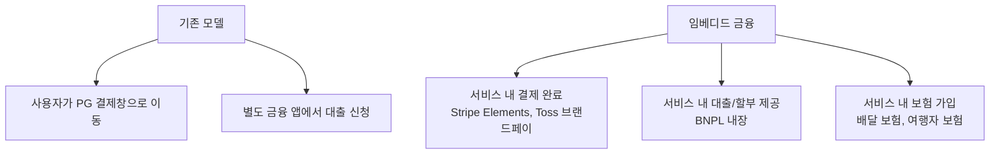
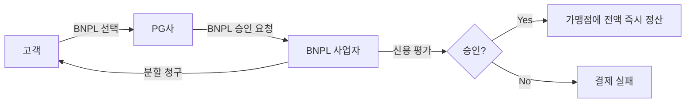
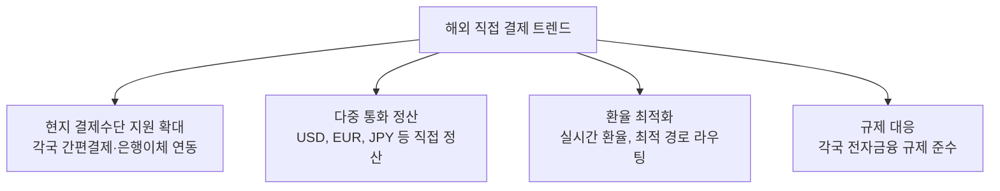
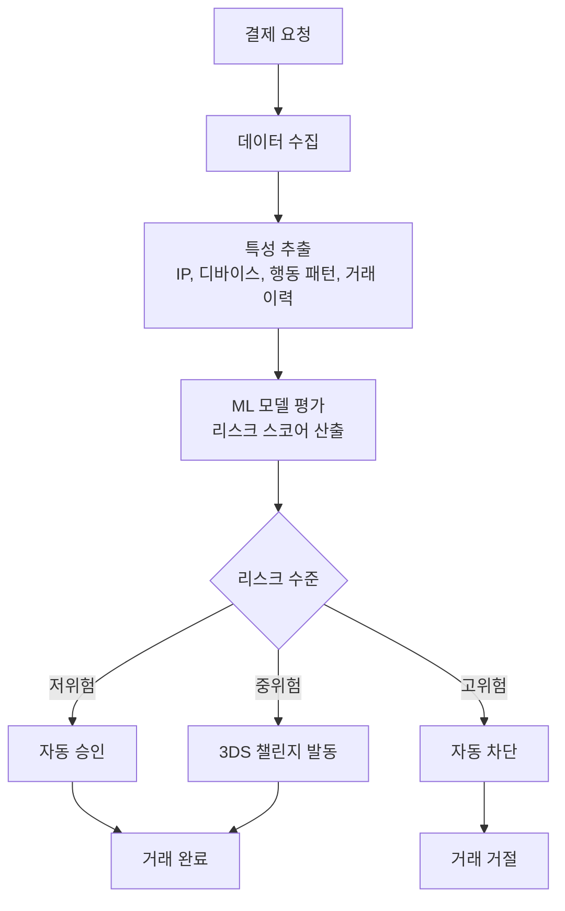
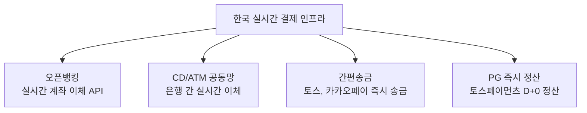
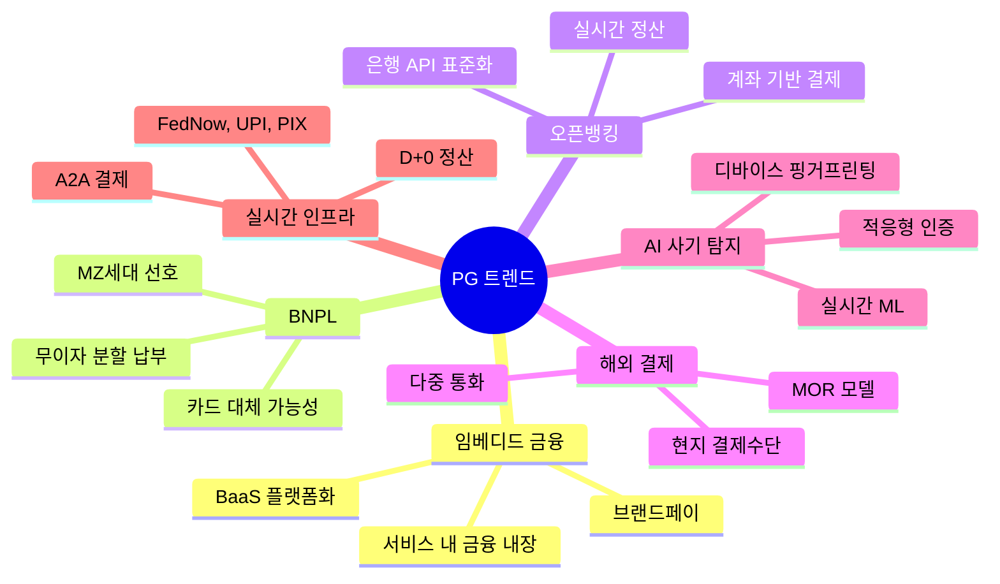

# PG 서비스 - 트렌드 및 전망

> 결제 산업의 최신 트렌드와 PG 서비스의 미래 방향을 다룬다. 2025년 기준 주요 변화와 전망을 정리한다.

[< PG 서비스 개요로 돌아가기](index.md)

---

## 1. 임베디드 금융 (Embedded Finance)

### 정의

비금융 기업이 자사 서비스 안에 결제·대출·보험 등 금융 기능을 직접 내장하는 것을 말한다. 사용자가 별도의 금융 앱으로 이동하지 않고 서비스 내에서 금융 행위를 완료한다.

### 현황과 영향

- **Stripe의 전략**: Stripe Connect, Treasury, Issuing을 통해 플랫폼이 자체 금융 서비스를 구축할 수 있게 지원. Shopify Balance가 대표적인 예시.
- **한국 시장**: 토스페이먼츠의 "브랜드페이"가 가맹점 자체 간편결제를 구축해주는 임베디드 결제의 사례다.
- **시장 규모**: 2025년 글로벌 임베디드 금융 시장은 약 $1,380억 규모로 추정되며, 2030년까지 연평균 25%+ 성장 전망.

!!! tip "PG 관점의 시사점"
    PG는 단순 결제 중계를 넘어 **BaaS(Banking as a Service)** 플랫폼으로 진화하고 있다. 가맹점에 결제뿐 아니라 계좌, 카드 발급, 대출 연계까지 제공하는 것이 차세대 PG의 모습이다.

---

## 2. BNPL (Buy Now Pay Later)

### 정의

소비자가 상품을 먼저 받고, 대금을 무이자 분할 납부하는 후불결제 서비스다. 기존 신용카드 할부와 유사하지만, 카드 없이도 이용 가능하고 가입이 간편하다.

### 글로벌 BNPL 주요 사업자

| 사업자 | 본사 | 특징 |
|--------|------|------|
| Klarna | 스웨덴 | 유럽 최대 BNPL, Stripe 연동 |
| Afterpay (Block) | 호주 | 4회 분할, 미국·호주 강세 |
| Affirm | 미국 | 장기 할부(최대 60개월), Amazon 연동 |

### 한국 시장 동향

- **네이버페이 후불결제**: 네이버페이로 결제 후 다음 달 일시불
- **카카오페이 후불**: 카카오페이 신용 기반 후불 결제
- **토스 후불결제**: 토스 앱 내 후불결제 서비스
- **카드사 BNPL**: 삼성카드, 현대카드 등이 자체 BNPL 상품 출시

### PG와의 관계

!!! note "PG 관점의 핵심"
    BNPL이 결제수단의 하나로 PG에 통합되고 있다. 가맹점은 PG 결제창에서 BNPL을 하나의 결제 옵션으로 노출하고, PG가 BNPL 사업자와의 연동을 처리한다. 가맹점은 전액을 즉시 정산받고, 분할 리스크는 BNPL 사업자가 부담한다.

---

## 3. 오픈뱅킹 연계

### 정의

금융위원회 주도의 **오픈뱅킹** 시스템은 모든 은행의 계좌 조회·이체 API를 표준화하여 핀테크·PG사가 통합 접근할 수 있게 한 인프라다.

### PG에 미치는 영향

| 영역 | 기존 | 오픈뱅킹 적용 후 |
|------|------|-------------------|
| 계좌이체 결제 | 은행별 개별 연동 | 표준 API로 전 은행 통합 |
| 출금 이체 | 은행별 협약 필요 | 표준 API로 즉시 출금 |
| 잔액 확인 | 불가 | 실시간 잔액 조회 가능 |
| 정산 | 은행별 배치 처리 | 실시간 정산 가능 |

### 활용 사례

- **실시간 계좌 인증**: 1원 인증 없이 계좌 소유주 즉시 확인
- **정산 자동화**: 오픈뱅킹 API로 가맹점 계좌에 즉시 정산 입금
- **충전식 결제**: 고객 계좌에서 PG 선불 잔액으로 즉시 충전
- **구독 결제**: 계좌 기반 자동 출금 (카드 없는 정기결제)

!!! tip "마이데이터와의 시너지"
    마이데이터(본인신용정보관리업)와 오픈뱅킹이 결합되면, PG가 고객의 금융 데이터를 기반으로 맞춤형 결제 옵션(한도, 할부, BNPL 적격 여부)을 제안할 수 있다.

---

## 4. 해외 직접 결제 (Cross-border Payment) 트렌드

### 현황

한국 소비자의 해외 직구(직접 구매)와 한국 셀러의 글로벌 판매가 모두 증가하면서, 국경 간 결제의 중요성이 커지고 있다.

### 주요 변화

| 트렌드 | 설명 | 대표 사업자 |
|--------|------|-------------|
| 로컬 결제수단 통합 | 각국의 간편결제·은행이체를 하나의 API로 제공 | Stripe (135+ 통화), Adyen |
| 다중 통화 정산 | 여러 통화로 직접 정산, 환전 최소화 | Stripe, Payoneer |
| 결제 라우팅 최적화 | AI가 최적의 매입사·경로를 선택하여 승인율 극대화 | Stripe Adaptive Acceptance |
| 현지 법인 없이 결제 수납 | [MOR 모델](../mor-service/index.md)로 현지 세금·규제 대행 | Paddle, Lemon Squeezy |

!!! note "PG vs MOR"
    해외 결제에서 PG는 결제 중계만 담당하고, 세금·환불·규제는 가맹점이 처리해야 한다. 반면 [MOR(Merchant of Record)](../mor-service/index.md)는 이 모든 것을 대행한다. SaaS 글로벌 판매 시 MOR이 더 적합할 수 있다.

---

## 5. AI 기반 사기 탐지 (Fraud Detection)

### 현황

온라인 결제 사기는 매년 증가하고 있으며, 2025년 글로벌 온라인 결제 사기 피해액은 약 $490억에 달할 것으로 추정된다. PG사들은 AI/ML을 활용한 실시간 사기 탐지를 핵심 경쟁력으로 삼고 있다.

### AI 사기 탐지 동작 원리

### PG별 사기 탐지 솔루션

| PG | 솔루션 | 특징 |
|----|--------|------|
| Stripe | **Radar** | 수십억 건 거래 데이터 기반 ML, 커스텀 룰 엔진, 기본 무료 |
| Adyen | **RevenueProtect** | 리스크 프로파일링, 쇼퍼 인사이트 |
| 토스페이먼츠 | 자체 FDS | 한국 결제 패턴 특화, 이상거래 모니터링 |
| PayPal | 자체 ML | 양면(구매자+판매자) 데이터 기반 |

### 핵심 기술 요소

- **디바이스 핑거프린팅**: 브라우저·기기 정보로 사용자 식별
- **행동 분석**: 마우스 움직임, 타이핑 패턴, 세션 행동 분석
- **네트워크 분석**: 같은 카드·IP·기기를 사용하는 거래 그룹 탐지
- **적응형 인증**: 리스크에 따라 3DS 챌린지를 동적으로 적용하여 정상 거래의 마찰을 최소화

!!! tip "가맹점 관점"
    AI 사기 탐지가 PG에 내장되면서, 가맹점은 별도의 FDS(Fraud Detection System)를 구축하지 않아도 된다. Stripe Radar처럼 기본 무료로 제공되는 경우, PG 선택의 중요한 기준이 된다.

---

## 6. 실시간 결제 인프라

### 현황

기존 카드 결제의 D+2~5 정산 주기를 극복하고, 실시간(Real-time) 또는 당일 정산을 가능하게 하는 인프라가 확산되고 있다.

### 글로벌 실시간 결제 시스템

| 시스템 | 국가 | 특징 |
|--------|------|------|
| FedNow | 미국 | 2023년 출시, 24/7 즉시 이체 |
| UPI | 인도 | 월 100억 건+, 세계 최대 실시간 결제 |
| PIX | 브라질 | 2020년 출시, 3년 만에 국민 70% 이용 |
| SEPA Instant | EU | 유로존 36개국 즉시 이체 |

### 한국의 실시간 결제

### PG에 미치는 영향

| 변화 | 설명 |
|------|------|
| **D+0 정산** | 결제 당일 가맹점에 정산. 토스페이먼츠가 토스뱅크 연계로 제공 |
| **계좌 기반 즉시 결제** | 카드 네트워크를 거치지 않고 계좌 간 직접 이체로 결제. 수수료 대폭 절감 |
| **A2A 결제** | Account-to-Account 결제가 카드를 대체할 가능성. 유럽에서 PSD2와 함께 부상 |
| **실시간 정산 경쟁** | 정산 속도가 PG 선택의 핵심 기준으로 부상 |

!!! note "카드 네트워크의 미래"
    인도의 UPI, 브라질의 PIX처럼 계좌 기반 실시간 결제가 활성화되면, 장기적으로 카드 네트워크(Visa, Mastercard)의 점유율이 줄어들 수 있다. 한국에서도 오픈뱅킹 기반 결제가 확산되면 VAN·카드사 수수료를 우회하는 결제 모델이 가능해진다.

---

## 트렌드 요약

---

## 다음 단계

- [핵심 개념](concepts.md)에서 이 트렌드들이 기존 결제 구조와 어떻게 연결되는지 확인
- [결제 플로우](payment-flow.md)에서 현재의 결제 흐름과 미래의 변화를 비교
- [제품 비교](products/index.md)에서 각 PG가 이 트렌드에 어떻게 대응하고 있는지 확인
- [MOR 서비스](../mor-service/index.md)에서 해외 결제 트렌드의 대안적 접근 확인
