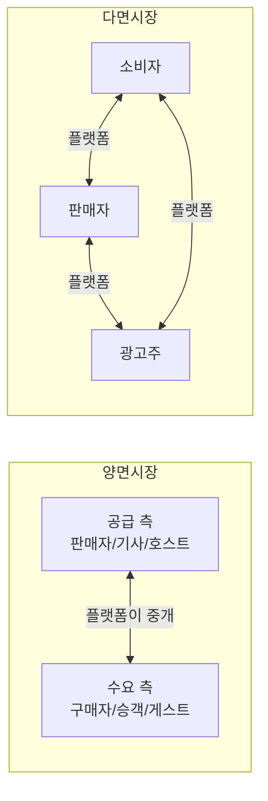
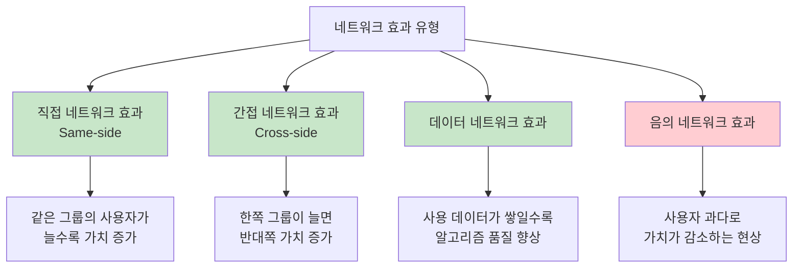
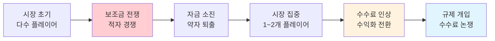

# 플랫폼 이코노미 - 핵심 개념

> 플랫폼 비즈니스를 이해하기 위한 필수 개념과 프레임워크를 정리한다. 양면시장부터 규제까지, 플랫폼의 작동 원리를 다룬다.

[< 플랫폼 이코노미 개요로 돌아가기](index.md)

---

## 양면시장 / 다면시장 (Multi-sided Market)

### 정의

**양면시장(Two-sided Market)** 은 플랫폼이 두 개의 서로 다른 이용자 그룹을 연결하는 시장 구조다. 한쪽 그룹의 참여가 다른 쪽 그룹의 가치를 높이는 **간접 네트워크 효과**가 핵심 특성이다. 3개 이상의 그룹이 참여하면 **다면시장(Multi-sided Market)** 이라 한다.

### 구조

### 실제 예시

| 플랫폼 | 측면 1 | 측면 2 | 측면 3 (있는 경우) |
|--------|--------|--------|---------------------|
| [배달의민족](products/baemin.md) | 음식점 | 소비자 | 라이더 (3면) |
| [Uber](products/uber.md) | 드라이버 | 승객 | — |
| [Airbnb](products/airbnb.md) | 호스트 | 게스트 | — |
| Amazon Marketplace | 셀러 | 구매자 | 광고주 (3면) |
| YouTube | 크리에이터 | 시청자 | 광고주 (3면) |

!!! tip "치킨-에그 문제 (Cold Start Problem)"
    양면시장의 최대 난제는 **"닭이 먼저냐 달걀이 먼저냐"** 다. 판매자가 없으면 소비자가 오지 않고, 소비자가 없으면 판매자가 오지 않는다. 이를 해결하는 전략: (1) 한쪽에 보조금 지급, (2) 단일 플레이어 모드로 시작(Yelp: 리뷰만 먼저), (3) 좁은 시장에서 밀도 확보(Uber: 샌프란시스코 한 도시에서 시작).

---

## 네트워크 효과 (Network Effects)

### 정의

사용자가 증가할수록 서비스의 가치가 증가하는 현상이다. 플랫폼 비즈니스의 **핵심 경쟁 우위**이자 **진입 장벽**이다.

### 유형

| 유형 | 설명 | 예시 |
|------|------|------|
| **직접 네트워크 효과** | 같은 유형의 사용자가 늘수록 가치 증가 | 전화(사용자↑ = 통화 상대↑), 당근마켓(이웃↑ = 거래 상대↑) |
| **간접 네트워크 효과** | 한쪽 사용자가 늘면 반대쪽 가치 증가 | [배민](products/baemin.md)(음식점↑ = 소비자 선택지↑), [Uber](products/uber.md)(기사↑ = 대기시간↓) |
| **데이터 네트워크 효과** | 사용 데이터 축적 → 알고리즘 개선 → 서비스 품질 향상 | Google 검색, Netflix 추천, Uber 수요 예측 |
| **음의 네트워크 효과** | 사용자 과다로 혼잡·스팸·품질 저하 발생 | SNS 스팸, 마켓플레이스 저품질 셀러 범람 |

!!! warning "네트워크 효과의 강도는 제각각"
    모든 네트워크 효과가 같은 강도는 아니다. **로컬 네트워크 효과**(배달, 라이드셰어링)는 지역 밀도에 의존하므로, 전국적 규모의 경쟁자도 특정 지역에서는 약할 수 있다. 당근마켓이 "동네" 단위로 강력한 네트워크 효과를 가지는 이유다.

---

## 테이크레이트 (Take Rate)

### 정의

플랫폼이 총 거래액(GMV, Gross Merchandise Value)에서 가져가는 수수료 비율이다. 플랫폼의 수익성과 참여자 생태계 건강도를 동시에 나타내는 핵심 지표다.

**계산**: `테이크레이트 = 플랫폼 매출 / GMV × 100%`

### 플랫폼별 테이크레이트

| 플랫폼 | 테이크레이트 | 구성 |
|--------|-------------|------|
| Apple App Store | 15~30% | 앱 판매·인앱 결제 수수료 |
| [Airbnb](products/airbnb.md) | ~14% | 호스트 3% + 게스트 ~11% |
| [Uber](products/uber.md) | 20~30% | 라이드 수수료 |
| [배달의민족](products/baemin.md) | 6.8~12% | 중개 수수료 + 광고 |
| Amazon Marketplace | 8~15% | 카테고리별 상이 + FBA 수수료 |
| 당근마켓 | 0% (중고거래) | 광고·비즈프로필이 수익원 |

!!! note "테이크레이트와 플랫폼 파워"
    테이크레이트를 높일 수 있는 능력 = 플랫폼 파워다. Apple이 30%를 수취할 수 있는 이유는 iOS 생태계의 **독점적 유통 채널** 때문이다. 반면 당근마켓은 중고거래에서 수수료를 0%로 유지하면서 **광고**로 수익화한다. 테이크레이트가 높으면 수익성은 좋지만, 참여자 이탈 리스크가 높아진다.

---

## 멀티호밍 (Multi-homing)

### 정의

이용자가 동시에 여러 경쟁 플랫폼을 사용하는 현상이다. 멀티호밍이 쉬우면 플랫폼의 전환 비용이 낮고, 경쟁이 치열해진다.

### 분석

| 멀티호밍 수준 | 특성 | 예시 |
|---------------|------|------|
| **높음** | 전환 비용 낮음, 가격 경쟁 치열 | 배달 앱(배민+쿠팡이츠+요기요), 라이드셰어링 |
| **중간** | 일부 전환 비용 존재 | 이커머스(쿠팡+네이버쇼핑), 숙박(Airbnb+Booking) |
| **낮음** | 높은 전환 비용, 플랫폼 락인 | iOS vs Android (생태계 종속), Amazon FBA (물류 종속) |

**플랫폼의 멀티호밍 방어 전략**:

- **슈퍼앱 전략**: 다양한 서비스를 하나의 앱에 통합하여 이탈 동기를 줄인다
- **구독 락인**: 쿠팡 로켓와우, Amazon Prime처럼 멤버십으로 충성도 확보
- **데이터 축적**: 사용 이력이 쌓일수록 맞춤 추천이 정확해져 전환 비용 증가
- **독점 공급**: 플랫폼 전용 콘텐츠·셀러를 확보

---

## 치킨게임 / 보조금 전략 (Subsidy War)

### 정의

시장 지배력 확보를 위해 적자를 감수하면서 공급자·소비자에게 보조금(할인, 쿠폰, 수수료 면제)을 제공하는 경쟁 전략이다. 한쪽이 포기할 때까지 지속되는 소모전이다.

### 전형적 사이클

### 대표 사례

| 사례 | 상황 | 결과 |
|------|------|------|
| **한국 배달 시장** | 배민 vs 요기요 vs 쿠팡이츠 — 무료 배달, 할인 쿠폰 경쟁 | 배민 1위, 쿠팡이츠 추격, 요기요 매각 |
| **글로벌 라이드셰어** | [Uber](products/uber.md) vs Lyft vs Didi — 기사·승객 양쪽 보조금 | 지역별 승자 결정, Uber 수익 전환 |
| **이커머스** | 쿠팡 vs 네이버 vs SSG — 무료 배송, 로켓 배송 | 쿠팡 1위, 연간 수조 원 적자 후 흑자 전환 |

!!! warning "보조금 전략의 리스크"
    보조금으로 확보한 사용자는 충성도가 낮다. 보조금이 사라지면 다른 플랫폼으로 이동(멀티호밍)할 수 있다. 성공적인 보조금 전략은 시장 점유율 확보 후 **전환 비용**을 만들어내는 것까지 포함해야 한다.

---

## 플랫폼 거버넌스

### 정의

플랫폼이 참여자(공급자, 소비자)의 행동을 관리하고, 품질을 유지하며, 분쟁을 해결하기 위해 설정하는 규칙과 메커니즘이다.

### 핵심 요소

| 요소 | 설명 | 예시 |
|------|------|------|
| **참여 자격** | 공급자의 진입 기준 | Airbnb 호스트 신원 인증, Amazon 셀러 심사 |
| **품질 관리** | 품질 유지 메커니즘 | 별점·리뷰, 배민 위생 등급, Uber 기사 평점 |
| **가격 규칙** | 가격 결정 방식 | Uber 다이나믹 프라이싱, 배민 배달료 산정 |
| **분쟁 해결** | 갈등 처리 절차 | Airbnb 중재 센터, eBay 구매자 보호 |
| **데이터 접근** | 참여자의 데이터 접근 범위 | 셀러 분석 도구, 기사 수입 리포트 |

---

## 승자독식 vs 공존

### 정의

네트워크 효과가 강한 시장에서 하나의 플랫폼이 시장을 독점하는 것을 **승자독식(Winner-Take-All)**, 여러 플랫폼이 공존하는 것을 **승자독대(Winner-Take-Most)** 또는 **공존** 이라 한다.

### 승자독식 조건

| 조건 | 승자독식 가능성 높음 | 공존 가능성 높음 |
|------|---------------------|-----------------|
| 네트워크 효과 강도 | 강한 직접+간접 효과 | 약한 또는 로컬 효과 |
| 멀티호밍 비용 | 높음 | 낮음 |
| 차별화 가능성 | 낮음 (동질적 서비스) | 높음 (차별화 가능) |
| 규제 환경 | 규제 약함 | 규제 강함 (독점 방지) |

### 실제 사례

- **승자독식**: Google 검색 (90%+), iOS/Android 모바일 OS (듀오폴리)
- **공존**: 한국 배달 시장 (배민 + 쿠팡이츠), 글로벌 숙박 (Airbnb + Booking.com), 이커머스 (쿠팡 + 네이버)

---

## 플랫폼 규제

### 배경

플랫폼의 시장 지배력이 커지면서, 각국 정부가 공정 경쟁, 소비자 보호, 데이터 프라이버시를 위한 규제를 도입하고 있다.

### 주요 규제

| 규제 | 지역 | 핵심 내용 |
|------|------|-----------|
| **DMA (Digital Markets Act)** | EU | 게이트키퍼 플랫폼의 자사 우대 금지, 상호운용성 의무 |
| **DSA (Digital Services Act)** | EU | 불법 콘텐츠 관리 의무, 알고리즘 투명성 |
| **온라인플랫폼법** | 한국 | 중개거래 투명성, 수수료 고지 의무, 분쟁 조정 |
| **전기통신사업법** | 한국 | 앱 마켓 결제 강제 금지 (인앱결제 규제) |
| **반독점법 강화** | 미국 | 빅테크 반독점 소송 (Google, Apple, Amazon, Meta) |

!!! note "한국 온라인플랫폼법의 영향"
    2024년 시행된 온라인플랫폼법은 플랫폼의 수수료 변경 사전 고지, 불공정 계약 금지, 분쟁 조정 절차를 의무화했다. [배달의민족](products/baemin.md)의 수수료 논쟁이 이 법의 주요 배경 중 하나였다.

---

## 다음 단계

- [제품 비교](products/index.md)에서 실제 플랫폼이 이 개념을 어떻게 적용하는지 확인
- [트렌드](trends.md)에서 플랫폼 규제 강화와 AI 매칭의 최신 동향 확인
- [SaaS 핵심 개념](../saas-business/concepts.md)과 비교하여 구독 모델과 플랫폼 모델의 차이 이해
