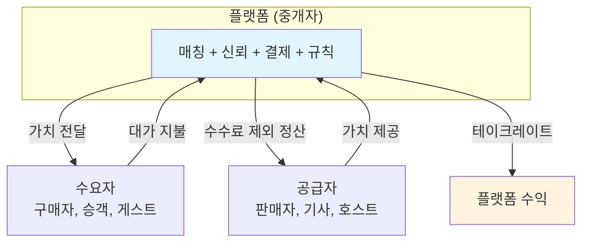

---
tags:
  - 비즈니스모델
  - 플랫폼
search:
  boost: 2
---
# 플랫폼 이코노미 개요

**플랫폼 이코노미(Platform Economy)** 란 두 개 이상의 이용자 그룹(생산자와 소비자)을 연결하여 가치 교환을 중개하고, 네트워크 효과를 통해 성장하는 비즈니스 모델이다. 플랫폼 자체는 제품이나 서비스를 직접 생산하지 않으며, 참여자 간의 상호작용을 촉진하고 수수료(테이크레이트)를 수취한다.

---

## 왜 알아야 하는가

- **시가총액 상위 기업의 대부분이 플랫폼**: Apple, Google, Amazon, Meta, 삼성(앱 스토어) 등 세계 최대 기업이 플랫폼 모델이다.
- **네트워크 효과 이해**: 플랫폼은 사용자가 늘어날수록 가치가 증가하는 네트워크 효과로 성장한다. 이 역학을 이해해야 제품 전략을 수립할 수 있다.
- **규제 환경 변화**: EU의 DMA/DSA, 한국의 온라인플랫폼법 등 플랫폼 규제가 전 세계적으로 강화되고 있다.
- **수수료 구조와 비즈니스 모델**: 테이크레이트, 광고, 구독 등 플랫폼의 수익 모델이 참여자 생태계와 서비스 설계에 직접 영향을 미친다.

---

## 핵심 키워드

| 키워드 | 설명 |
|--------|------|
| **양면시장** | 두 개의 이용자 그룹(예: 소비자와 판매자)이 플랫폼을 통해 상호작용하는 시장 구조 |
| **네트워크 효과** | 사용자가 증가할수록 서비스의 가치가 증가하는 현상 |
| **테이크레이트** | 플랫폼이 거래액에서 가져가는 수수료 비율 |
| **치킨게임** | 시장 지배력을 확보하기 위해 적자를 감수하며 보조금·할인을 제공하는 경쟁 |
| **멀티호밍** | 이용자가 동시에 여러 경쟁 플랫폼을 사용하는 현상 |
| **플랫폼 규제** | 플랫폼의 시장 지배력 남용을 방지하기 위한 법적·제도적 장치 |

---

## 플랫폼 비즈니스의 핵심 구조

---

!!! tip "학습 순서"
    ① [핵심 개념](concepts.md) → ② [제품/사례 비교](products/index.md) → ③ [트렌드](trends.md)

## 하위 문서

| 문서 | 내용 |
|------|------|
| [핵심 개념](concepts.md) | 양면시장, 네트워크 효과, 테이크레이트, 멀티호밍, 치킨게임, 거버넌스, 규제 상세 |
| [제품 비교](products/index.md) | 배달의민족, Uber, Airbnb, 쿠팡, Amazon Marketplace, 당근마켓 비교 |
| [트렌드 및 전망](trends.md) | 플랫폼 규제 강화, AI 매칭, 슈퍼앱, 크리에이터 이코노미, Web3 등 |

---

## 관련 도메인

- [SaaS 비즈니스 모델](../saas-business/index.md) — SaaS 중 마켓플레이스 성격의 제품(Shopify, HubSpot App Marketplace)은 플랫폼 역학이 함께 적용된다. PLG와 네트워크 효과의 교차점을 이해하는 데 유용하다.
- [PG (Payment Gateway)](../pg-service/index.md) — 플랫폼의 결제·정산 인프라. 마켓플레이스에서 판매자 정산(분배 정산)은 PG의 핵심 기능 중 하나다. Stripe Connect가 대표적이다.
- [MOR (Merchant of Record)](../mor-service/index.md) — 글로벌 플랫폼이 각국 세금·규제를 처리할 때 MOR 모델을 활용하는 경우가 있다.
