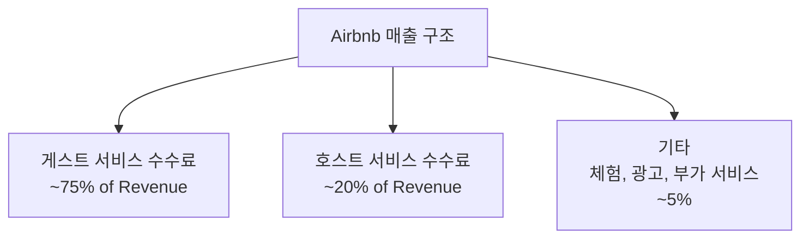
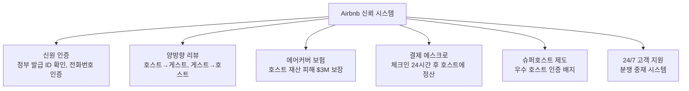
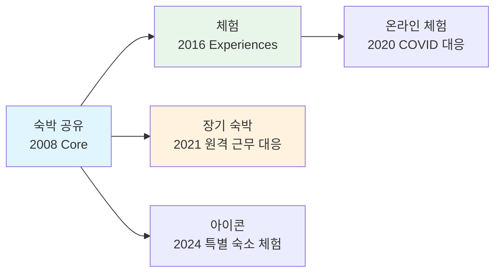

# Airbnb

> 숙박 공유의 대명사. 양면 신뢰 구축, 호스트 수수료 모델, 체험(Experiences) 확장까지 플랫폼의 신뢰 메커니즘과 카테고리 확장을 대표하는 사례다.

[< 제품 비교 개요로 돌아가기](index.md)

---

## 기본 정보

| 항목 | 내용 |
|------|------|
| **회사명** | Airbnb, Inc. |
| **설립** | 2008년 (Brian Chesky, Joe Gebbia, Nathan Blecharczyk) |
| **본사** | 미국 샌프란시스코 |
| **시가총액** | 약 $80B (2025년 기준) |
| **서비스 지역** | 220개국+, 10만 개 이상 도시 |
| **리스팅 수** | 800만+ 숙소 |
| **연 매출** | $10B+ (2024년 기준) |
| **웹사이트** | [airbnb.com](https://www.airbnb.com) |

---

## 비즈니스 모델

### 수수료 구조

Airbnb는 **호스트와 게스트 양쪽에서 수수료를 수취**하는 양면 수수료 모델을 운영한다.

| 대상 | 수수료 | 구조 |
|------|--------|------|
| **호스트** | ~3% | 예약 금액의 약 3% (서비스 수수료) |
| **게스트** | ~11% | 예약 금액의 약 6~12% (서비스 수수료) |
| **종합 테이크레이트** | ~14% | 호스트 + 게스트 합산 |

!!! note "수수료 모델의 전략적 선택"
    Airbnb는 **공급자(호스트)의 수수료를 낮추고, 수요자(게스트)에 더 많은 비용을 부과**하는 전략을 택했다. 이는 호스트의 참여 장벽을 낮추어 공급을 확보하는 데 유리하다. 반면 [Uber](uber.md)는 기사에게 20~30%를 부과하는 공급자 부담 모델이다. 플랫폼의 공급 확보 난이도에 따라 수수료 분배가 달라진다.

### 수익 구조

---

## 양면 신뢰 구축

Airbnb 비즈니스의 핵심은 **"낯선 사람의 집에서 자는 것"에 대한 신뢰를 구축**하는 것이다.

### 신뢰 메커니즘

### 양방향 리뷰의 중요성

| 리뷰 방향 | 역할 | 효과 |
|-----------|------|------|
| **게스트 → 호스트** | 숙소 품질·정확성 평가 | 게스트의 숙소 선택 기준 |
| **호스트 → 게스트** | 게스트 매너·규칙 준수 평가 | 호스트의 예약 승인 판단 기준 |

!!! tip "에스크로 결제의 전략적 의미"
    Airbnb는 게스트의 결제금을 즉시 호스트에 보내지 않고, **체크인 24시간 후에 정산**한다. 이는 (1) 노쇼·사기 방지, (2) 환불 처리 용이성, (3) 플랫폼의 자금 운용 이점을 제공한다. 이 에스크로 기간의 자금(Float)이 Airbnb에 상당한 이자 수익을 가져다준다.

---

## 호스트 수수료 모델 상세

Airbnb는 두 가지 수수료 모델을 제공한다.

| 모델 | 호스트 수수료 | 게스트 수수료 | 적용 대상 |
|------|-------------|-------------|-----------|
| **Split-fee (기본)** | ~3% | ~6~12% | 대부분의 호스트 |
| **Host-only fee** | 14~16% | 0% | 직접 가격 설정 원하는 호스트 |

**Host-only fee의 배경**: 일부 시장(특히 Booking.com과 경쟁이 치열한 유럽)에서 호스트가 게스트에게 수수료를 전가하지 않고 "총 가격"을 표시하길 원하는 경우 사용한다.

---

## 체험(Experiences) 확장

### 정의

2016년 Airbnb는 숙박을 넘어 **현지인이 제공하는 체험 활동** 마켓플레이스를 시작했다.

### 카테고리 확장 전략

**전략적 의미**:

- **TAM 확장**: 숙박($800B) → 숙박+체험+여행($3.4T) 시장으로 확장
- **이용 빈도 증가**: 여행(연 1~2회) → 체험(월 1~2회)으로 이용 빈도 향상 가능
- **호스트 수익 다양화**: 숙소 없이도 체험만으로 Airbnb 호스트가 될 수 있음
- **코로나 대응**: 2020년 온라인 체험으로 여행 불가 시기에도 매출 유지

---

## 성장 전략

### 초기 성장: 공급 확보

| 전략 | 내용 |
|------|------|
| **에어매트리스 시작** | 창업자가 자신의 아파트에 에어매트리스를 놓고 시작 |
| **Craigslist 해킹** | Craigslist 숙소 게시자에 Airbnb 등록을 유도하는 이메일 전략 |
| **전문 사진 촬영** | 호스트 숙소에 무료 전문 사진 촬영 제공 → 전환율 2.5배 증가 |
| **밀도 집중** | 뉴욕, 파리 등 관광 핫스팟에 먼저 공급 밀도 확보 |

### 현재 성장 동력

- **장기 숙박**: 28일 이상 숙박이 전체 예약의 ~18%. 원격 근무 트렌드와 맞물림
- **글로벌 확장**: 220개국+ 커버리지로 "어디든 숙소가 있다"는 글로벌 네트워크 효과
- **브랜드 마케팅**: 2021년부터 퍼포먼스 마케팅을 줄이고 브랜드 캠페인에 집중 → 마케팅 효율 개선

---

## 핵심 지표 (2024년 기준)

| 지표 | 수치 |
|------|------|
| 연 매출 | $10B+ |
| Gross Booking Value | $75B+ |
| 테이크레이트 | ~14% |
| 숙소 리스팅 | 800만+ |
| 연간 숙박일 | 4억+ Nights |
| EBITDA 마진 | ~35% |
| Free Cash Flow | $3.8B+ |

---

## 장단점

| 장점 | 단점 |
|------|------|
| 220개국+ 글로벌 네트워크 효과 | 규제 리스크 (단기임대 규제, 도시별 제한) |
| 양방향 신뢰 시스템이 강력한 진입 장벽 | 호텔과의 경쟁 심화 |
| ~35% EBITDA 마진의 높은 수익성 | 숙소 품질 일관성 부족 |
| 체험·장기숙박으로 TAM 확장 | 안전 사고·사기 리스크 |
| 에스크로 플로트의 금융 수익 | 호스트의 Booking.com 등 멀티호밍 |
| 브랜드 마케팅 전환으로 효율 개선 | — |

---

## 다음 단계

- [Uber](uber.md)와 비교하여 글로벌 플랫폼의 수수료 전략과 수익성 패턴 비교
- [배달의민족](baemin.md)과 비교하여 양면시장의 신뢰 구축 방식 차이 확인
- [핵심 개념](../concepts.md)에서 양면시장, 테이크레이트, 멀티호밍 정의 확인
- [트렌드](../trends.md)에서 플랫폼 규제와 숙박 시장 변화 방향 확인
