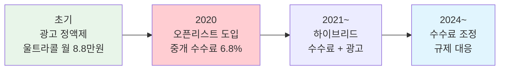
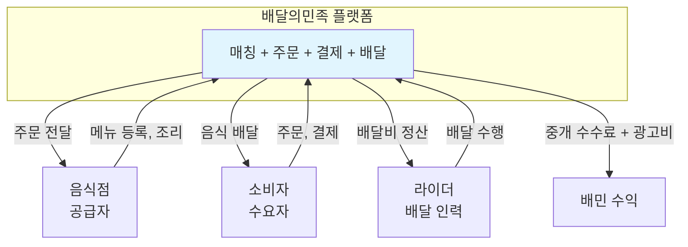

---
tags:
  - 비즈니스모델
  - 플랫폼
---
# 배달의민족

> 한국 음식 배달 시장 1위 플랫폼. 수수료 모델 전환, 광고 기반 수익화, 우아한형제들에서 DH(Delivery Hero)로의 인수 등 플랫폼 비즈니스의 주요 이슈를 모두 경험한 사례다.

[< 제품 비교 개요로 돌아가기](index.md)

---

## 기본 정보

| 항목 | 내용 |
|------|------|
| **서비스명** | 배달의민족 (배민) |
| **운영사** | 우아한형제들 (Woowa Brothers) |
| **설립** | 2010년 (김봉진) |
| **본사** | 한국 서울 |
| **인수** | 2019년 Delivery Hero가 약 4조 원에 인수 |
| **시장 점유율** | 한국 배달 앱 1위 (~60%, 2024년 기준) |
| **월간 이용자** | MAU 2,000만+ |
| **웹사이트** | [baemin.com](https://www.baemin.com) |

---

## 비즈니스 모델

### 수수료 구조 변천사

배달의민족의 수수료 모델은 한국 플랫폼 규제 논쟁의 중심에 있었다.

### 현재 수익 구조

| 수익원 | 구조 | 비중 (추정) |
|--------|------|-------------|
| **중개 수수료** | 배민1(자체배달) 6.8%, 배민배달 중개료 | ~40% |
| **광고** | 울트라콜(정액), 오픈리스트(노출 과금) | ~40% |
| **배달비** | 소비자 배달비 + 배달대행 마진 | ~15% |
| **기타** | B마트(직매입), 선물하기, 구독 | ~5% |

### 양면시장 구조

!!! note "3면 시장 (Three-sided Market)"
    배달의민족은 음식점, 소비자, 라이더의 **3면 시장**이다. 라이더 공급이 부족하면 배달 시간이 길어지고 소비자가 이탈하며, 음식점도 주문이 줄어든다. 세 면의 균형을 유지하는 것이 운영의 핵심이다.

---

## 수수료 논쟁

### 배경

2020년 "오픈리스트" 도입 시 중개 수수료 6.8%가 부과되면서, 소상공인 단체의 강한 반발이 발생했다.

### 쟁점

| 배민 측 주장 | 소상공인 측 주장 |
|-------------|-----------------|
| 기존 울트라콜보다 소규모 음식점에 유리 | 매출의 6.8%는 과도한 부담 |
| 광고비 경쟁 완화 (노출 공정성) | 사실상 수수료 인상 효과 |
| 배달 인프라 투자 비용 필요 | 플랫폼 독점력 남용 |
| 글로벌 대비 낮은 수수료율 | 소상공인 영업이익률 대비 높은 비중 |

### 시사점

이 논쟁은 한국 **온라인플랫폼법** 제정의 주요 배경이 되었으며, 플랫폼의 테이크레이트 설정이 규제·여론·정치적 이슈와 직결됨을 보여주는 대표 사례다.

---

## 광고 모델 전환

배달의민족은 수수료 인상의 부담을 줄이기 위해 **광고 기반 수익화**를 강화했다.

| 광고 상품 | 구조 | 특징 |
|-----------|------|------|
| **울트라콜** | 월 정액 8.8만원 | 특정 지역에 상단 노출 |
| **오픈리스트** | 주문 건당 6.8% | 노출량 기반 자동 배분 |
| **배민1 광고** | CPM/CPC 과금 | 자체 배달 주문 상단 노출 |
| **디스플레이 광고** | 브랜드 배너 | 대형 프랜차이즈 대상 |

!!! tip "광고 모델의 전략적 의미"
    광고 모델은 거래 수수료 대비 소상공인의 체감 부담이 낮다. "선택적으로 광고비를 지출"하는 구조이기 때문이다. 그러나 실질적으로 광고 없이는 노출이 어려워 "사실상 필수 비용"이라는 비판도 존재한다. 이 구조는 당근마켓의 광고 모델과도 유사하다.

---

## DH(Delivery Hero) 인수

**사건**: 2019년 12월 독일 Delivery Hero가 우아한형제들을 약 4조 원에 인수.

**인수 후 변화**:

| 항목 | 인수 전 | 인수 후 |
|------|---------|---------|
| 의사결정 | 창업자 주도 | DH 글로벌 전략과 조율 |
| 수익성 압박 | 성장 우선 | 수익성 전환 요구 |
| 글로벌 시너지 | 국내 집중 | DH 아시아 전략의 핵심 축 |
| 경쟁 대응 | 쿠팡이츠 대응에 집중 | 글로벌 효율화 + 국내 방어 |

---

## 핵심 지표 (추정)

| 지표 | 수치 (추정) | 비고 |
|------|-------------|------|
| GMV | 연 25조 원+ | 주문 금액 기준 |
| MAU | 2,000만+ | 2024년 기준 |
| 일 주문 건수 | 300만 건+ | — |
| 테이크레이트 | 10~12% | 수수료 + 광고 + 배달비 마진 |
| 시장 점유율 | ~60% | 한국 배달 앱 기준 |

---

## 장단점

| 장점 | 단점 |
|------|------|
| 한국 배달 시장 압도적 1위 | 수수료 논쟁으로 브랜드 이미지 손상 |
| 자체 배달 인프라(배민1) 구축 | DH 수익성 압박으로 전략적 자율성 제한 |
| 강력한 브랜드 인지도 | 쿠팡이츠의 공격적 추격 |
| B마트 등 버티컬 확장 | 라이더 처우·안전 이슈 |
| 광고 + 수수료 하이브리드 수익 모델 | 규제 리스크 (온라인플랫폼법) |

---

## 다음 단계

- [Uber](uber.md)와 비교하여 로컬 vs 글로벌 플랫폼의 수수료·성장 전략 차이 확인
- [Airbnb](airbnb.md)와 비교하여 양면 신뢰 구축 방식의 차이 분석
- [핵심 개념](../concepts.md)에서 양면시장, 테이크레이트, 치킨게임 정의 확인
- [트렌드](../trends.md)에서 플랫폼 규제 강화가 배달의민족에 미치는 영향 확인
