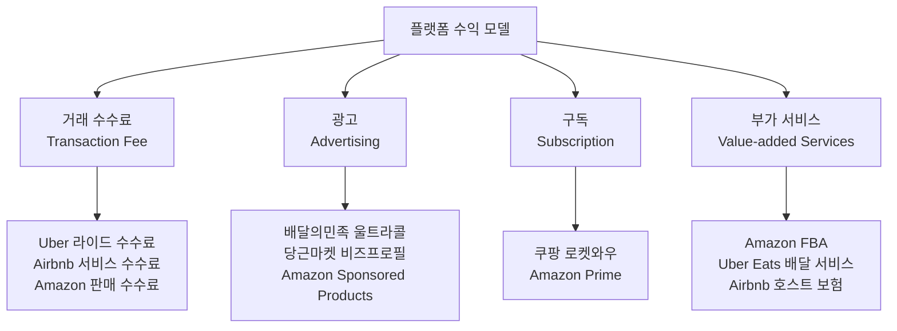

---
tags:
  - 비즈니스모델
  - 플랫폼
search:
  boost: 1.5
---
# 플랫폼 이코노미 - 대표 제품 비교 개요

> 주요 플랫폼 비즈니스를 수수료 구조, 네트워크 효과, 차별화 전략 관점에서 비교한다.

[< 플랫폼 이코노미 개요로 돌아가기](../index.md)

---

## 주요 플랫폼 비교표

| 플랫폼 | 카테고리 | 수수료 구조 | 네트워크 효과 유형 | 테이크레이트 | 차별화 |
|--------|----------|-------------|---------------------|-------------|--------|
| [배달의민족](baemin.md) | 음식 배달 | 중개 수수료 + 광고 | 간접(음식점↔소비자) + 로컬 | 6.8~12% | 한국 1위, 자체 배달 인프라, 광고 모델 |
| [Uber](uber.md) | 모빌리티 | 라이드 수수료 + 서지 프라이싱 | 간접(기사↔승객) + 로컬 | 20~30% | 글로벌 커버리지, 다이나믹 프라이싱, 슈퍼앱 |
| [Airbnb](airbnb.md) | 숙박 공유 | 호스트+게스트 분할 수수료 | 간접(호스트↔게스트) + 글로벌 | ~14% | 양면 신뢰, 체험 확장, 글로벌 브랜드 |
| 쿠팡 | 이커머스 | 카테고리별 판매 수수료 | 간접(셀러↔구매자) + 물류 | 10~15% | 로켓배송 물류 인프라, 로켓와우 구독 |
| Amazon Marketplace | 이커머스 | 판매 수수료 + FBA 수수료 | 간접 + 데이터 | 8~15% + FBA | FBA 물류, Prime 구독, 광고 플랫폼 |
| 당근마켓 | 중고·지역 커뮤니티 | 중고거래 0%, 광고 과금 | 직접(이웃↔이웃) + 로컬 | ~0% (광고 수익) | 동네 단위 커뮤니티, 매너 시스템 |

---

## 수수료 구조 비교

### 테이크레이트 비교

| 플랫폼 | 테이크레이트 | 공급자 부담 | 소비자 부담 |
|--------|-------------|-------------|-------------|
| [배달의민족](baemin.md) | 6.8~12% | 중개 수수료 + 광고비 | 배달비 |
| [Uber](uber.md) | 20~30% | 수수료 차감 후 정산 | 서지 프라이싱 |
| [Airbnb](airbnb.md) | ~14% | 호스트 수수료 3% | 게스트 수수료 ~11% |
| 쿠팡 마켓플레이스 | 10~15% | 카테고리별 수수료 | 로켓와우 ₩4,990/월 |
| Amazon Marketplace | 8~15% + α | 판매 수수료 + FBA | Prime $14.99/월 |
| 당근마켓 | 0% | 광고비 (선택) | 없음 |

---

## 네트워크 효과 비교

| 플랫폼 | 직접 효과 | 간접 효과 | 데이터 효과 | 범위 |
|--------|-----------|-----------|-------------|------|
| [배달의민족](baemin.md) | 약함 | 강함 (음식점↔소비자) | 중간 (추천) | 로컬 |
| [Uber](uber.md) | 약함 | 강함 (기사↔승객) | 강함 (경로·수요 예측) | 로컬+글로벌 |
| [Airbnb](airbnb.md) | 약함 | 강함 (호스트↔게스트) | 강함 (가격·리뷰) | 글로벌 |
| 쿠팡 | 약함 | 강함 (셀러↔구매자) | 강함 (추천·물류) | 전국 |
| Amazon | 약함 | 강함 | 매우 강함 | 글로벌 |
| 당근마켓 | 강함 (이웃 간) | 중간 | 중간 | 하이퍼로컬 |

---

## 상황별 선택 가이드

### 로컬 서비스 플랫폼 구축 시

!!! note "참고: 배달의민족, 당근마켓"
    로컬 네트워크 효과가 핵심이다. [배달의민족](baemin.md)은 배달 반경 내 음식점 밀도, 당근마켓은 동네 단위 이웃 밀도가 서비스 품질을 결정한다. 도시 단위로 밀도를 확보한 후 확장하는 전략이 유효하다.

### 글로벌 마켓플레이스 구축 시

!!! note "참고: Airbnb, Amazon Marketplace"
    글로벌 네트워크 효과를 활용해야 한다. [Airbnb](airbnb.md)는 "어디서든 숙박"이라는 글로벌 네트워크가 핵심이며, Amazon은 FBA 물류 인프라가 글로벌 셀러를 끌어들인다. 신뢰 시스템(리뷰, 보증)이 국경을 넘는 거래에서 필수다.

### 수익화 전략 설계 시

!!! note "수수료 vs 광고 vs 구독"
    - **수수료 중심**: Uber, Airbnb — 거래가 발생해야 매출 발생. GMV 성장이 핵심
    - **광고 중심**: 배민 울트라콜, 당근마켓 비즈프로필 — 거래 수수료 부담 없이 수익화
    - **구독 중심**: 쿠팡 로켓와우, Amazon Prime — 안정적 반복 매출 + 락인 효과

---

## 제품 상세 문서

| 제품 | 상세 문서 |
|------|-----------|
| 배달의민족 | [배달의민족 상세](baemin.md) |
| Uber | [Uber 상세](uber.md) |
| Airbnb | [Airbnb 상세](airbnb.md) |

---

## 다음 단계

- 각 제품의 상세 문서에서 비즈니스 모델, 성장 전략, 규제 이슈를 깊이 분석
- [핵심 개념](../concepts.md)에서 비교에 사용된 개념(테이크레이트, 네트워크 효과 등)의 정의 확인
- [트렌드](../trends.md)에서 이 플랫폼들이 향후 어떤 방향으로 진화할지 확인
