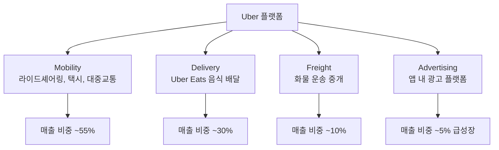
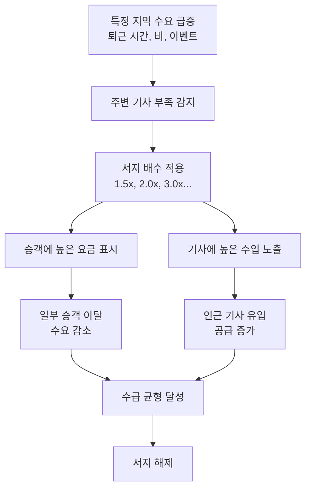
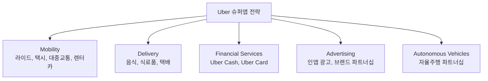

# Uber

> 글로벌 모빌리티 플랫폼의 대명사. 다이나믹 프라이싱, 슈퍼앱 전략, 수익성 전환까지 플랫폼 이코노미의 핵심 역학을 모두 보여주는 사례다.

[< 제품 비교 개요로 돌아가기](index.md)

---

## 기본 정보

| 항목 | 내용 |
|------|------|
| **회사명** | Uber Technologies, Inc. |
| **설립** | 2009년 (Travis Kalanick, Garrett Camp) |
| **본사** | 미국 샌프란시스코 |
| **기업가치** | 시가총액 약 $170B (2025년 기준) |
| **서비스 지역** | 70개국+, 10,000개 이상 도시 |
| **분기 매출** | $11B+ (2024 Q4) |
| **웹사이트** | [uber.com](https://www.uber.com) |

---

## 비즈니스 모델

### 사업 구조

### 수수료 구조

| 항목 | 구조 |
|------|------|
| **Mobility 테이크레이트** | 20~30% (지역·서비스별 상이) |
| **Delivery 테이크레이트** | 15~25% (레스토랑 수수료 + 배달비) |
| **과금 대상** | 기사(수수료 차감) + 승객(서지 프라이싱, 서비스비) |
| **수익 공식** | Gross Bookings × Take Rate = Revenue |

---

## 다이나믹 프라이싱 (Surge Pricing)

### 정의

수요와 공급의 실시간 균형에 따라 가격을 동적으로 조절하는 메커니즘이다. Uber의 가장 혁신적이면서도 논쟁적인 비즈니스 메커니즘이다.

### 작동 원리

**전략적 의미**:

| 관점 | 효과 |
|------|------|
| **경제학** | 가격 메커니즘을 통한 실시간 수급 조절 |
| **기사** | 수요 높은 시간·지역으로 이동 유인 |
| **승객** | 높은 가격이 부담이지만 대기 시간은 단축 |
| **규제** | "가격 폭리" 논란, 일부 도시에서 상한선 규제 |

!!! warning "다이나믹 프라이싱의 윤리적 논쟁"
    자연재해, 테러 등 비상시에도 서지가 발동하여 "재난에 편승한 가격 인상"이라는 비판을 받았다. Uber는 이후 비상 상황 시 서지 상한선을 적용하는 정책을 도입했다.

---

## 슈퍼앱 전략

Uber는 단순 라이드셰어링을 넘어 **모빌리티 + 배달 + 금융**을 통합하는 슈퍼앱을 지향한다.

**슈퍼앱의 네트워크 효과**:

- **공유 기사 풀**: Mobility 기사가 Eats 배달도 수행 → 유휴 시간 최소화
- **공유 사용자 기반**: Mobility 사용자가 Eats 사용자로 전환 (교차 판매)
- **공유 데이터**: 이동 패턴 데이터가 배달 경로 최적화에 활용

---

## 수익성 전환

### 적자에서 흑자로

Uber는 설립 후 10년 이상 적자를 기록했으나, 2022년부터 본격적 수익성 전환에 성공했다.

| 연도 | 상태 | 주요 변화 |
|------|------|-----------|
| 2009~2019 | 대규모 적자 | 보조금 전쟁, 글로벌 확장, R&D |
| 2019 | IPO | NYSE 상장, 기업가치 $82B |
| 2020 | 코로나 타격 | Mobility 급감, Eats 급성장 |
| 2021 | 적자 축소 | 비핵심 사업 매각 (ATG 자율주행) |
| 2022 | 흑자 전환 | EBITDA 흑자, 효율화 |
| 2023~2025 | 지속 흑자 | 광고 사업 성장, Take Rate 개선 |

### 수익성 개선 전략

| 전략 | 내용 |
|------|------|
| **비핵심 사업 매각** | 자율주행(ATG→Aurora), 항공(Uber Elevate→Joby) |
| **테이크레이트 인상** | 서비스 수수료 추가, 기사 인센티브 최적화 |
| **광고 사업 확대** | Uber Advertising을 독립 사업 부문으로 성장 |
| **비용 효율화** | 인력 구조 조정, 마케팅 비용 최적화 |
| **교차 판매** | Mobility ↔ Eats 간 사용자 교차 활용 |

!!! tip "플랫폼의 수익성 전환 패턴"
    Uber의 경로는 플랫폼 비즈니스의 전형적 패턴이다: (1) 보조금으로 시장 확보 → (2) 경쟁자 퇴출 또는 시장 안정 → (3) 테이크레이트 인상 → (4) 광고 등 부가 수익 → (5) 흑자 전환. [배달의민족](baemin.md)도 유사한 경로를 밟고 있다.

---

## 글로벌 전략과 퇴출

Uber는 모든 시장에서 성공한 것은 아니다. 로컬 경쟁자에 밀려 여러 시장에서 퇴출되었다.

| 시장 | 로컬 경쟁자 | 결과 |
|------|-------------|------|
| 중국 | Didi Chuxing | 2016년 Didi에 사업부 매각 |
| 동남아 | Grab | 2018년 Grab에 사업부 매각 |
| 러시아 | Yandex Taxi | 2018년 합작사 설립 후 지분 매각 |
| 한국 | 카카오T | 규제 이슈로 철수 |
| 인도 | Ola | 경쟁 중 (Uber 잔류) |

이는 로컬 네트워크 효과와 규제 환경이 글로벌 플랫폼의 진입을 어렵게 만드는 대표적 사례다.

---

## 핵심 지표 (2024년 기준)

| 지표 | 수치 |
|------|------|
| Gross Bookings | 분기 $40B+ |
| Revenue | 분기 $11B+ |
| Adjusted EBITDA | 분기 $1.8B+ |
| Monthly Active Users | 161M+ |
| 일일 평균 라이드 | 28M+ trips |
| 기사/배달원 | 7.4M+ (분기 활동 기준) |

---

## 장단점

| 장점 | 단점 |
|------|------|
| 글로벌 70개국+ 최대 모빌리티 네트워크 | 규제 리스크 (기사 분류, 가격 규제) |
| 다이나믹 프라이싱으로 효율적 수급 조절 | 기사(Gig Worker) 처우 논쟁 |
| Mobility + Eats 슈퍼앱 시너지 | 로컬 경쟁자에 취약 (네트워크 효과의 지역성) |
| 수익성 전환 달성 | 자율주행 시대의 불확실성 |
| 광고 사업 급성장 | 높은 테이크레이트에 대한 기사·레스토랑 반발 |

---

## 다음 단계

- [배달의민족](baemin.md)과 비교하여 한국 로컬 플랫폼과 글로벌 플랫폼의 전략 차이 확인
- [Airbnb](airbnb.md)와 비교하여 글로벌 플랫폼의 네트워크 효과 유형 차이 분석
- [핵심 개념](../concepts.md)에서 네트워크 효과, 다이나믹 프라이싱, 치킨게임 정의 확인
- [트렌드](../trends.md)에서 슈퍼앱, AI 매칭, 자율주행이 플랫폼에 미치는 영향 확인
