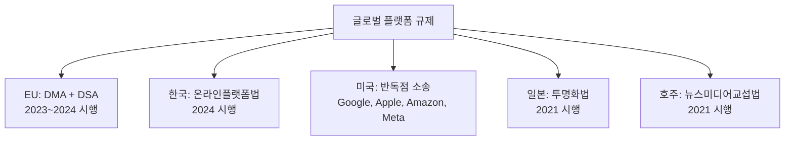
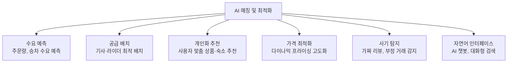
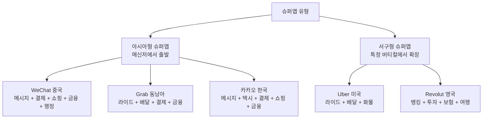
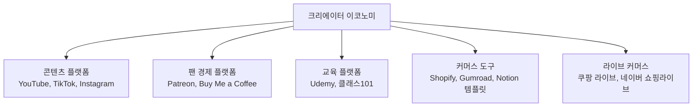
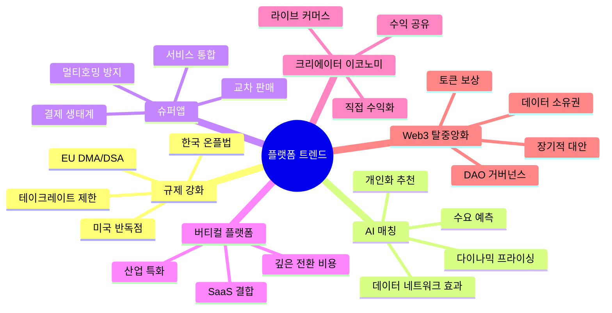

# 플랫폼 이코노미 - 트렌드 및 전망

> 플랫폼 비즈니스의 최신 트렌드와 미래 방향을 다룬다. 2025~2026년 기준 주요 변화와 전망을 정리한다.

[< 플랫폼 이코노미 개요로 돌아가기](index.md)

---

## 1. 플랫폼 규제 강화 (DMA/DSA, 한국 온플법)

### 정의

전 세계적으로 대형 플랫폼의 시장 지배력 남용을 방지하고, 공정 경쟁과 소비자 보호를 강화하는 규제가 빠르게 확산되고 있다.

### 주요 규제 현황

### EU DMA (Digital Markets Act)

| 항목 | 내용 |
|------|------|
| **대상** | 게이트키퍼 플랫폼 (Apple, Google, Amazon, Meta, Microsoft, ByteDance) |
| **자사 우대 금지** | 검색 결과에서 자사 제품 우대 불가 |
| **사이드로딩 허용** | iOS에서 대안 앱스토어 허용 의무 |
| **데이터 이동성** | 사용자 데이터의 경쟁 서비스 이전 보장 |
| **상호운용성** | 메신저 간 메시지 호환 의무 (예: WhatsApp ↔ iMessage) |
| **과징금** | 글로벌 매출의 최대 10%, 반복 위반 시 20% |

### 한국 온라인플랫폼법

| 항목 | 내용 |
|------|------|
| **수수료 투명성** | 수수료 변경 30일 전 사전 고지 |
| **불공정 행위 금지** | 일방적 계약 변경, 부당한 거래 거절 금지 |
| **분쟁 조정** | 플랫폼-입점업체 분쟁 조정 절차 의무화 |
| **데이터 접근** | 입점업체의 거래 데이터 접근권 보장 |

!!! warning "규제가 플랫폼에 미치는 영향"
    규제 강화는 플랫폼의 **테이크레이트 인상 여력**을 제한하고, **운영 비용**을 증가시킨다. 그러나 동시에 시장 안정성을 높이고, 장기적으로 플랫폼에 대한 사회적 신뢰를 강화하는 효과도 있다. [배달의민족](products/baemin.md)의 수수료 논쟁이 규제의 직접적 배경이었다.

---

## 2. AI 매칭 및 최적화

### 정의

플랫폼의 핵심 기능인 공급-수요 매칭에 AI/ML을 적용하여 효율성과 사용자 경험을 극대화하는 트렌드다.

### AI 적용 영역

### 플랫폼별 AI 활용

| 플랫폼 | AI 활용 | 효과 |
|--------|---------|------|
| [Uber](products/uber.md) | 수요 예측 + 다이나믹 프라이싱 + 경로 최적화 | 대기 시간 30% 단축, 기사 수입 최적화 |
| [Airbnb](products/airbnb.md) | 스마트 프라이싱 + 숙소 추천 + 리뷰 분석 | 호스트 예약률 향상, 게스트 만족도 개선 |
| [배달의민족](products/baemin.md) | 배달 경로 최적화 + 예상 도착 시간 예측 | 배달 시간 단축, 라이더 효율 향상 |
| Amazon | 상품 추천 + 수요 예측 + 물류 최적화 | 매출의 35%가 추천 알고리즘에서 발생 |

!!! tip "AI가 네트워크 효과를 강화한다"
    데이터 네트워크 효과에 의해 사용량이 늘수록 AI 모델이 개선되고, 더 나은 매칭이 더 많은 사용자를 유치한다. 이 **"데이터 → AI → 가치 → 사용자 → 데이터"** 선순환이 후발 플랫폼의 추격을 어렵게 만든다.

---

## 3. 슈퍼앱 (Super App)

### 정의

하나의 앱에서 다양한 서비스(커뮤니케이션, 결제, 쇼핑, 교통, 금융 등)를 통합 제공하는 올인원 플랫폼이다.

### 글로벌 슈퍼앱 현황

**슈퍼앱의 전략적 가치**:

| 효과 | 설명 |
|------|------|
| **멀티호밍 방지** | 여러 서비스를 하나의 앱에서 해결하므로 이탈 동기 감소 |
| **교차 판매** | 한 서비스의 사용자를 다른 서비스로 자연스럽게 유도 |
| **데이터 통합** | 다양한 서비스의 사용 데이터로 정밀한 사용자 프로필 구축 |
| **결제 생태계** | 자체 결제 시스템으로 금융 수수료 내재화 |

---

## 4. 버티컬 플랫폼 (Vertical Platform)

### 정의

특정 산업·카테고리에 특화된 플랫폼이다. 범용 플랫폼(Amazon, 쿠팡)과 달리 특정 영역의 깊은 니즈를 해결한다.

### 대표 사례

| 버티컬 | 플랫폼 | 특화 영역 |
|--------|--------|-----------|
| **부동산** | 직방, Zillow | 매물 검색, 가상 투어 |
| **채용** | 원티드, LinkedIn | 인재 매칭, 스카우트 |
| **의료** | 닥터나우, Doctolib | 비대면 진료, 예약 |
| **법률** | 로톡, LegalZoom | 법률 상담 매칭 |
| **인테리어** | 오늘의집, Houzz | 인테리어 콘텐츠 + 시공 매칭 |
| **반려동물** | 핏펫, Rover | 펫 케어 서비스 매칭 |

**버티컬 플랫폼의 장점**:

- **높은 전환 비용**: 산업 특화 데이터·워크플로우가 축적되면 이탈이 어렵다
- **낮은 멀티호밍**: 범용 플랫폼과 달리 직접 비교 대상이 적다
- **규제 대응**: 산업별 규제(의료법, 부동산 중개법 등)를 기본 내장
- **SaaS 결합**: 오늘의집(커머스+콘텐츠), 원티드(채용+HR SaaS)처럼 SaaS를 결합한 수익 모델

!!! note "SaaS와 버티컬 플랫폼의 교차점"
    버티컬 플랫폼은 점점 [SaaS 비즈니스 모델](../saas-business/index.md)을 결합하는 추세다. 오늘의집이 인테리어 시공업체에 SaaS를 제공하고, 원티드가 채용 관리 SaaS를 제공하는 것이 대표적이다. 이는 [SaaS 트렌드의 "버티컬 SaaS"](../saas-business/trends.md)와 맞닿아 있다.

---

## 5. 크리에이터 이코노미 (Creator Economy)

### 정의

개인 크리에이터가 콘텐츠·상품·서비스를 직접 생산하고, 플랫폼을 통해 팬·구독자에게 판매하여 수익을 창출하는 경제 구조다.

### 크리에이터 이코노미 구조

### 플랫폼의 크리에이터 전략

| 전략 | 설명 | 예시 |
|------|------|------|
| **수익 공유** | 광고·구독 매출의 일부를 크리에이터에 분배 | YouTube(55%), TikTok Creator Fund |
| **직접 수익화 도구** | 팬으로부터 직접 결제 받는 도구 제공 | Super Chat, 후원, 멤버십 |
| **쇼핑 연동** | 콘텐츠에서 바로 구매 연결 | Instagram Shop, TikTok Shop |
| **크리에이터 펀드** | 플랫폼이 직접 보조금 지급 | TikTok Creator Fund, Shorts Fund |

---

## 6. 탈중앙화 플랫폼 (Web3)

### 정의

블록체인 기반으로 중앙 운영자 없이 참여자가 직접 거버넌스와 수익을 공유하는 플랫폼 모델이다.

### 기존 플랫폼 vs Web3 플랫폼

| 항목 | 기존 플랫폼 | Web3 플랫폼 |
|------|-------------|-------------|
| 소유권 | 기업이 플랫폼 소유 | 토큰 보유자가 공동 소유 |
| 거버넌스 | 기업이 규칙 결정 | DAO(탈중앙조직)가 투표로 결정 |
| 수익 분배 | 플랫폼이 테이크레이트 수취 | 참여자에 토큰 보상 분배 |
| 데이터 | 플랫폼이 소유·독점 | 사용자가 자기 데이터 소유 |
| 이식성 | 플랫폼 종속 (락인) | 프로토콜 간 이동 가능 |

### 대표 사례

| 프로젝트 | 대체 대상 | 구조 |
|----------|-----------|------|
| Lens Protocol | Twitter/Instagram | 탈중앙 소셜 그래프 |
| Uniswap | 중앙화 거래소 | 자동화 마켓메이커(AMM) |
| OpenSea → Blur | — | NFT 마켓플레이스 |
| Audius | Spotify | 음악 스트리밍 |

!!! note "Web3 플랫폼의 현실"
    이론적으로 Web3는 플랫폼의 테이크레이트 문제와 데이터 독점을 해결할 수 있다. 그러나 현실에서는 (1) UX의 복잡성, (2) 규제 불확실성, (3) 토큰 투기 문제, (4) 확장성 한계로 대중화에 시간이 필요하다. 2024~2025년 기준으로 기존 플랫폼의 직접적 위협보다는 "장기적 대안"으로 보는 것이 현실적이다.

---

## 트렌드 요약

---

## 다음 단계

- [핵심 개념](concepts.md)에서 이 트렌드에 사용된 개념(네트워크 효과, 테이크레이트, 거버넌스)의 정의 확인
- [제품 비교](products/index.md)에서 각 플랫폼이 이 트렌드에 어떻게 대응하고 있는지 비교
- [SaaS 트렌드](../saas-business/trends.md)와 비교하여 SaaS와 플랫폼의 교차 트렌드 확인
- [PG (Payment Gateway)](../pg-service/index.md)에서 플랫폼 결제 인프라의 변화 확인
