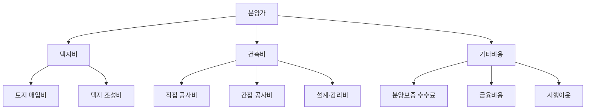
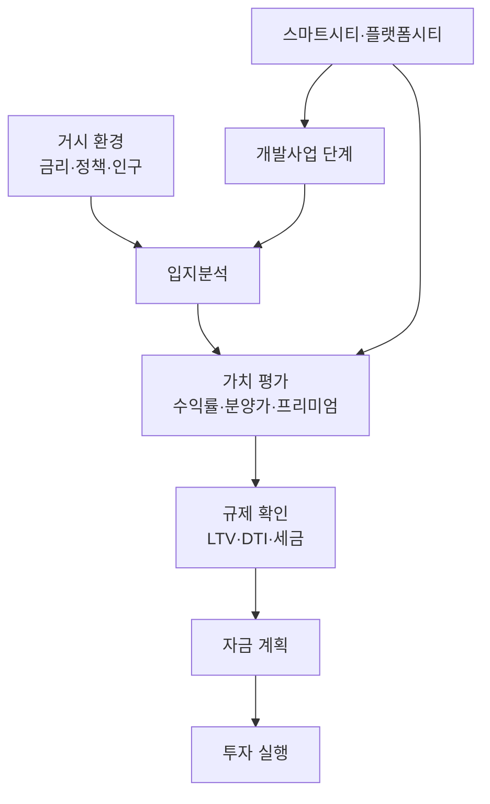

---
tags:
  - 부동산
  - 투자
  - 부동산투자
---
# 부동산 투자 핵심 개념

부동산 투자에 필요한 핵심 개념을 체계적으로 정리한다. 수익률 지표, 분양가 구조, 입지분석 프레임워크, 정책 도구, 개발사업 프로세스까지 투자 의사결정의 기초가 되는 개념들이다.

---

## 수익률 지표

부동산 투자의 수익성을 평가하는 주요 지표들이다. 투자 유형에 따라 적합한 지표가 다르다.

| 지표 | 계산 방식 | 용도 | 적합한 투자 유형 |
|------|----------|------|-----------------|
| **Cap Rate** | 순영업소득(NOI) ÷ 매입가 × 100 | 수익형 부동산 비교 | 상가, 오피스, 오피스텔 |
| **IRR** | 투자 기간 전체 현금흐름의 내부수익률 | 개발사업·장기투자 평가 | 재건축, 신도시, 토지 |
| **전세가율** | 전세가 ÷ 매매가 × 100 | 갭투자 안전마진 판단 | 아파트, 빌라 |
| **매매-전세 갭** | 매매가 - 전세가 | 실투자금 규모 산정 | 갭투자 전략 |
| **임대수익률** | 연 임대료 ÷ 매입가 × 100 | 월세 투자 수익성 | 오피스텔, 상가, 다가구 |
| **분양가 대비 시세** | (현재 시세 - 분양가) ÷ 분양가 × 100 | 프리미엄 수준 판단 | 신축 아파트, 신도시 |

!!! warning "수익률 함정"
    표면 수익률만으로 판단하면 안 된다. 취득세, 보유세, 중개수수료, 수선비, 공실 기간, 대출 이자를 모두 반영한 **순수익률**로 비교해야 한다. 특히 상가는 공실 리스크가 수익률을 크게 좌우한다.

---

## 분양가 구조

**분양가**는 시행사가 최초 분양 시 소비자에게 제시하는 가격이다. 분양가 상한제 적용 여부에 따라 구성이 달라진다.

| 구분 | 상한제 적용 | 상한제 미적용 |
|------|-----------|-------------|
| 가격 결정 | 국토부 기본형건축비 + 택지비 | 시행사 자율 책정 |
| 적용 지역 | 공공택지, 투기과열지구 | 민간택지 일부 |
| 전매 제한 | 강함 (3~10년) | 약함 (6개월~3년) |
| 투자 특징 | 시세 대비 저렴, 당첨 경쟁 치열 | 시세 반영, 프리미엄 제한적 |

---

## 프리미엄(P)

**프리미엄(P)**은 분양가 대비 현재 시세의 차이를 의미한다. 분양권 전매 시장에서 핵심적인 가격 지표다.

- **양(+)의 프리미엄**: 시세 > 분양가. 분양권에 웃돈이 붙은 상태
- **마이너스P**: 시세 < 분양가. 분양가보다 낮은 가격에 거래되는 상태
- **무P**: 시세 ≒ 분양가. 프리미엄이 거의 없는 상태

| 프리미엄에 영향을 미치는 요소 | 방향 |
|------------------------------|------|
| 주변 시세 상승 | P 상승 |
| 금리 인상 | P 하락 |
| 입주 물량 과다 | P 하락 |
| GTX 등 교통 호재 확정 | P 상승 |
| 전매 제한 해제 시점 | 거래량 증가, P 변동 |
| 분양가 상한제 적용 | 초기 P 형성 유리 |

!!! tip "프리미엄 판단 기준"
    프리미엄의 절대값보다 **주변 기존 단지 시세 대비 할인율**이 더 중요하다. 분양가 + P가 주변 시세보다 10~20% 이상 저렴하면 투자 매력이 있고, 시세와 동일하거나 높으면 신축 프리미엄을 감안해도 리스크가 크다.

---

## 입지분석 프레임워크

입지분석은 부동산 투자의 핵심 역량이다. 아래 5대 요소를 종합적으로 평가한다.

| 요소 | 세부 항목 | 평가 기준 |
|------|----------|----------|
| **교통** | 지하철·GTX 역세권, 도로망, 버스 노선 | 서울 주요 업무지구까지 소요시간 |
| **학군** | 학원가, 학교 배정, 학업 성취도 | 중학교 학업 성취도, 학원 밀집도 |
| **편의시설** | 대형마트, 백화점, 병원, 공원 | 도보·차량 접근성 |
| **개발호재** | 신규 노선, 상업지구, 기업 이전 | 확정 vs 예정 vs 검토 단계 구분 |
| **인구유입** | 주변 일자리, 산업단지, 인구 추세 | 순유입·순유출 추세, 연령대 구성 |

!!! warning "개발호재 함정"
    확정된 호재와 검토 단계의 호재를 구분해야 한다. "00선 추진 검토"는 실현까지 10년 이상 걸리거나 무산될 수 있다. **관보 고시**, **예비타당성 통과**, **실시설계 착수** 등 구체적 진행 단계를 확인하라.

---

## 부동산 정책 도구

정부가 부동산 시장을 조절하는 주요 정책 수단이다. 투자 의사결정 시 현행 규제를 반드시 확인해야 한다.

### 대출 규제

| 규제 | 설명 | 계산 방식 |
|------|------|----------|
| **LTV** (담보인정비율) | 주택 가격 대비 최대 대출 비율 | 대출액 ÷ 주택가격 × 100 |
| **DTI** (총부채상환비율) | 연소득 대비 연간 원리금 상환액 비율 | 연간 원리금상환 ÷ 연소득 × 100 |
| **DSR** (총부채원리금상환비율) | 연소득 대비 전체 대출 원리금 상환액 비율 | 전체대출 연간 원리금 ÷ 연소득 × 100 |

### 지역 규제

| 지역 지정 | 효과 | 적용 예시 |
|-----------|------|----------|
| **조정대상지역** | LTV 강화, 다주택 양도세 중과 | 수도권 주요 지역 |
| **투기과열지구** | LTV·전매 추가 제한, 분양가 상한제 | 서울 전역, 과천 등 |
| **투기지역** | 최강 규제, LTV 40% | 강남·서초·송파·용산 등 |

### 세금

| 세목 | 과세 시점 | 핵심 포인트 |
|------|----------|-----------|
| **취득세** | 매입 시 | 다주택자 중과 (8~12%) |
| **재산세·종부세** | 보유 중 | 공시가격 기준, 다주택 중과 |
| **양도소득세** | 매도 시 | 보유 기간·주택 수에 따라 세율 차등 |

---

## 개발사업 단계

대규모 택지개발·신도시 조성 사업의 진행 단계다. 각 단계마다 투자 기회와 리스크가 다르다.

| 단계 | 소요 기간 | 투자 포인트 | 리스크 |
|------|----------|-----------|--------|
| 지구 지정 | 1~3년 | 토지 투자 (확정 전 투기 주의) | 지정 취소·축소 |
| 보상 | 1~3년 | 보상가 협의, 이주 대책 | 보상 지연, 소송 |
| 조성 공사 | 2~5년 | 분양 일정 예측 | 공사 지연, 비용 초과 |
| 분양 | 수개월~1년 | 청약·분양권 매수 | 미분양, 분양가 논란 |
| 건축·입주 | 2~4년 | 프리미엄 형성 | 입주 물량 충격, P 하락 |

---

## 스마트시티·플랫폼시티

**스마트시티**는 ICT·데이터 기술을 도시 인프라에 접목하여 교통, 에너지, 안전, 환경 등을 효율적으로 운영하는 도시 모델이다. **플랫폼시티**는 여기에 자율주행, 도시 데이터 플랫폼, 모빌리티 허브 등을 추가한 차세대 개념이다.

| 구분 | 전통 신도시 | 스마트시티 | 플랫폼시티 |
|------|-----------|----------|-----------|
| 교통 | 도로·지하철 중심 | 교통 데이터 최적화 | 자율주행 전용도로, MaaS |
| 에너지 | 중앙 공급 | 스마트 그리드 | 마이크로 그리드, 제로에너지 |
| 데이터 | 개별 관리 | 통합 관제 | 도시 데이터 플랫폼 (개방형) |
| 거버넌스 | 행정 주도 | 시민 참여 | 데이터 기반 의사결정 |
| 국내 사례 | 분당, 일산 | 세종 스마트시티 | 용인플랫폼시티 |

!!! info "플랫폼시티가 투자에 미치는 영향"
    플랫폼시티는 첨단 인프라로 인해 초기 조성 비용이 높지만, 장기적으로 생활 편의성과 도시 브랜드 가치를 높여 부동산 가치 상승에 기여할 수 있다. 다만 기술 구현의 불확실성과 높은 분양가가 리스크 요인이다.

---

## 개념 간 관계

## 관련 문서

- [부동산 투자 개요](index.md)
- [주요 프로젝트 비교](products/index.md)
- [시장 트렌드](trends.md)
