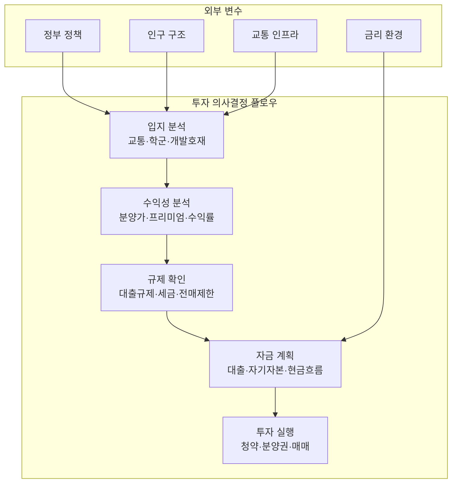

---
tags:
  - 부동산
  - 투자
  - 부동산투자
search:
  boost: 2
---
# 부동산 투자

**부동산 투자**는 주거용·상업용·토지 등 실물 부동산에 자본을 배분하여 시세차익(Capital Gain) 또는 임대수익(Rental Income)을 추구하는 행위다. 한국 가계자산의 70% 이상이 부동산에 집중되어 있으며, 정부 정책·금리·인구구조와 밀접하게 연동되는 대표적인 실물자산 투자 영역이다.

## 왜 중요한가

한국 부동산 시장은 가계 자산의 핵심이자 경제 정책의 중심축이다. 수도권 집중 현상, 3기 신도시 공급, GTX 등 광역교통망 확충은 향후 10년간 부동산 시장의 판도를 바꿀 구조적 변수다. 특히 **용인플랫폼시티**, 남양주왕숙, 하남교산 등 대규모 신도시 프로젝트는 새로운 투자 기회와 리스크를 동시에 제시한다.

2025년 이후 부동산 시장은 **스마트시티·플랫폼시티** 개념의 도입, 1~2인 가구 급증에 따른 주거 패러다임 전환, 금리 정상화에 따른 가격 조정 등 복합적 변화기에 접어들고 있다. 이러한 구조적 전환기에 입지분석, 수익성 분석, 정책 리스크 관리 역량이 어느 때보다 중요하다.

## 핵심 키워드

| 키워드 | 설명 |
|--------|------|
| **분양가** | 시행사가 최초 분양 시 책정하는 가격. 택지비 + 건축비 + 기타비용으로 구성 |
| **프리미엄(P)** | 분양가 대비 시세 차이. 양수면 프리미엄, 음수면 마이너스P |
| **입지분석** | 교통, 학군, 편의시설, 개발호재, 인구유입 등을 종합적으로 평가 |
| **전세가율** | 매매가 대비 전세가 비율. 투자 안전마진의 지표 |
| **Cap Rate** | 순영업소득(NOI) ÷ 매입가. 수익형 부동산의 기본 수익률 지표 |
| **GTX** | 수도권 광역급행철도. 서울 접근성을 획기적으로 개선하는 핵심 인프라 |
| **3기 신도시** | 수도권 주택 공급을 위해 지정된 대규모 택지지구 |
| **플랫폼시티** | 자율주행·데이터 기반 도시 운영 등 첨단 인프라를 적용한 차세대 신도시 모델 |

!!! info "부동산 투자 vs 부동산 토큰화(RWA)"
    이 도메인은 **실물 부동산 직접투자**(청약, 분양권, 매매)를 다룬다. 부동산을 블록체인 토큰으로 분할하여 소액 간접투자하는 **부동산 토큰화**는 [실물자산 토큰화(RWA)](../rwa/index.md) 도메인을 참고하라. 양자는 대상 자산(부동산)은 같지만 투자 메커니즘과 규제 체계가 근본적으로 다르다.

## 부동산 투자 유형 분류

| 투자 유형 | 특징 | 수익 구조 | 진입 장벽 |
|-----------|------|----------|----------|
| 아파트 (주거용) | 가장 보편적, 정책 영향 큼 | 시세차익 중심 | 중간 (청약·대출규제) |
| 오피스텔·빌라 | 소액 투자 가능, 전세가율 낮음 | 임대수익 + 시세차익 | 낮음 |
| 상가·오피스 (상업용) | 임대수익 중심, 공실 리스크 | 임대수익 (Cap Rate) | 높음 |
| 토지 | 장기 투자, 개발호재 의존 | 시세차익 | 높음 (유동성 낮음) |
| 신도시·택지지구 | 정부 주도 대규모 공급 | 시세차익 (입주 후 프리미엄) | 중간 (청약 경쟁) |
| 재건축·재개발 | 고수익 고위험, 사업 기간 장기 | 시세차익 (사업 완료 후) | 높음 (조합원 자격) |
| REITs·펀드 (간접투자) | 소액, 유동성 높음 | 배당 + 시세차익 | 낮음 |

!!! tip "학습 순서"
    ① [핵심 개념](concepts.md) → ② [주요 프로젝트 비교](products/index.md) → ③ [트렌드](trends.md)

## 이 섹션의 구성

| 문서 | 내용 |
|------|------|
| [핵심 개념](concepts.md) | 수익률, 분양가 구조, 입지분석, 정책 도구, 개발사업 단계 등 |
| [주요 프로젝트 비교](products/index.md) | 용인플랫폼시티, 남양주왕숙, 하남교산 등 수도권 신도시 비교 |
| [시장 트렌드](trends.md) | 3기 신도시, GTX, 인구구조 변화, 스마트시티, 규제 사이클 |

## 관련 도메인

- [실물자산 토큰화 (RWA)](../rwa/index.md) — 부동산 토큰화, 조각투자 플랫폼 (RealT, 카사, 펀블)
- [토큰증권 (STO)](../sto/index.md) — 부동산 수익증권의 토큰화 발행 메커니즘

## 실무 적용

- **개인 투자자**: 입지분석 프레임워크로 신도시 청약·매수 의사결정
- **시행사·시공사**: 개발사업 단계별 리스크 관리, 분양가 전략 수립
- **정책 분석가**: 부동산 정책 도구(LTV/DTI/DSR)의 시장 영향 분석
- **PM·리서처**: 부동산 도메인 지식 기반의 프로덕트·서비스 기획
