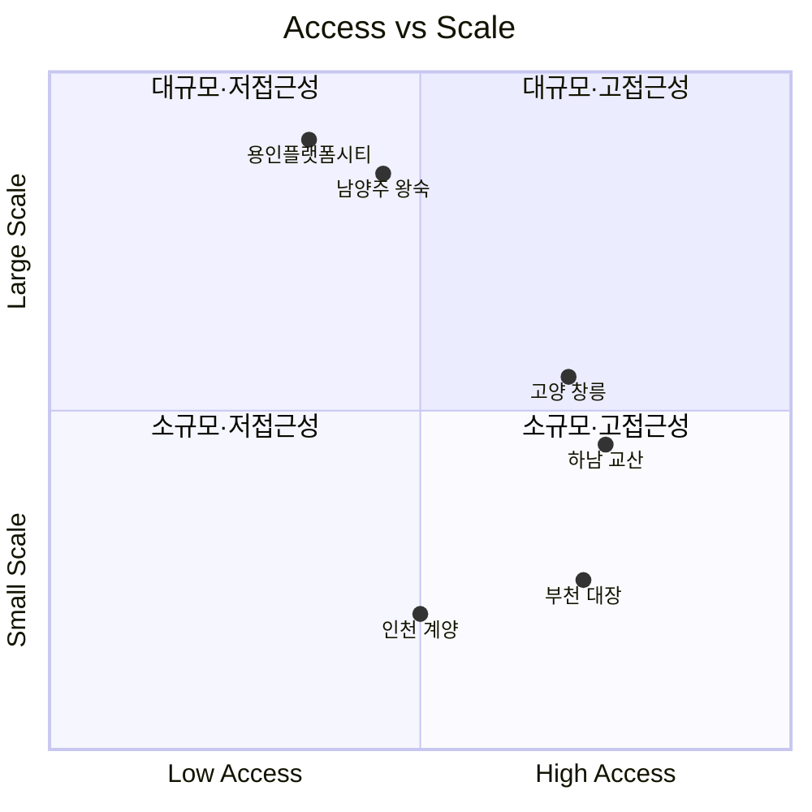

---
tags:
  - 부동산
  - 투자
  - 신도시
search:
  boost: 1.5
---
# 주요 부동산 프로젝트 비교

수도권 대규모 개발 프로젝트를 비교 분석한다. 3기 신도시와 플랫폼시티를 중심으로, 입지·규모·교통·특징을 종합적으로 비교한다.

---

## 비교 요약

| 항목 | 용인플랫폼시티 | 남양주 왕숙 | 하남 교산 | 인천 계양 | 고양 창릉 | 부천 대장 |
|------|-------------|-----------|----------|----------|----------|----------|
| **위치** | 용인시 처인구 | 남양주시 진접 | 하남시 교산동 | 인천 계양구 | 고양시 덕양구 | 부천시 대장동 |
| **면적** | 약 1,262만㎡ | 약 1,134만㎡ | 약 649만㎡ | 약 335만㎡ | 약 812만㎡ | 약 343만㎡ |
| **계획 세대** | ~7만 | ~6.6만 | ~3.2만 | ~1.7만 | ~3.8만 | ~2만 |
| **핵심 교통** | GTX-A 연장 추진 | GTX-B, 4호선 연장 | 3호선, 5호선 연장 | GTX-D, 인천1호선 | GTX-A, 3호선 연장 | 대장홍대선 |
| **서울 접근성** | 강남 40~50분 (GTX 시) | 강남 40분 (GTX 시) | 강남 30분 | 여의도 30분 | 서울역 20분 (GTX) | 홍대 20분 |
| **예상 입주** | 2030~ | 2027~ | 2027~ | 2027~ | 2028~ | 2028~ |
| **차별화** | 자율주행·플랫폼시티 | 최대 규모, GTX-B 수혜 | 서울 접근성 최상 | 인천 접근성, 소규모 | GTX-A 직접 수혜 | 서울 접근성 우수 |
| **사업 유형** | 플랫폼시티 (차세대) | 3기 신도시 | 3기 신도시 | 3기 신도시 | 3기 신도시 | 3기 신도시 |

---

## 포지셔닝 맵

!!! info "3기 신도시 vs 플랫폼시티"
    3기 신도시(왕숙, 교산, 계양, 창릉, 대장)는 **국토교통부 주도의 주거 공급** 프로젝트로, 공공택지에 대규모 아파트를 공급하는 전통적 모델이다. 반면 **용인플랫폼시티**는 자율주행, 도시 데이터 플랫폼 등 **첨단 기술 인프라를 도시 설계 단계부터 적용**하는 차세대 모델로, 단순 베드타운이 아닌 자족형 도시를 지향한다.

---

## 투자 관점 비교

| 기준 | 유리한 프로젝트 | 이유 |
|------|---------------|------|
| 단기 시세차익 (2027~2028) | 하남 교산, 고양 창릉 | 서울 접근성 우수, 조기 입주 |
| 대규모 신도시 성장 잠재력 | 남양주 왕숙, 용인플랫폼시티 | 자족 기능 + 대규모 인프라 |
| GTX 직접 수혜 | 고양 창릉 (GTX-A), 남양주 왕숙 (GTX-B) | 역세권 형성 확정 |
| 장기 브랜드 가치 | 용인플랫폼시티 | 스마트시티 프리미엄, 차세대 모델 |
| 낮은 분양가 기대 | 인천 계양, 부천 대장 | 상대적 저렴한 택지비 |

---

## 개별 프로젝트 상세

| 프로젝트 | 상세 페이지 |
|---------|-----------|
| 용인플랫폼시티 | [바로가기 (독립 도메인)](../../yongin-platform-city/index.md) |

---

## 관련 문서

- [부동산 투자 개요](../index.md) | [핵심 개념](../concepts.md)
- [시장 트렌드](../trends.md)
- [용인플랫폼시티 도메인](../../yongin-platform-city/index.md)
