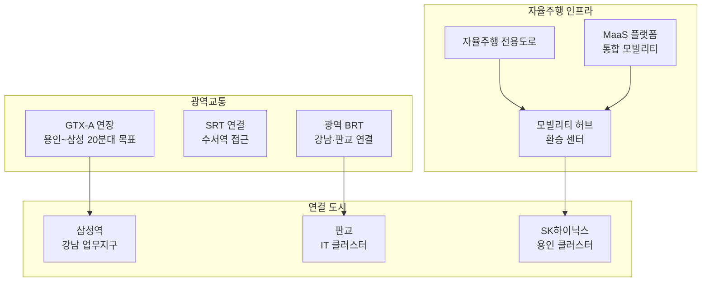
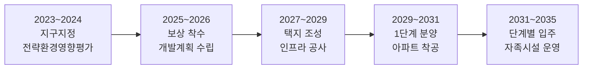

---
tags:
  - 부동산
  - 투자
  - 용인플랫폼시티
---
# 용인플랫폼시티

> 경기도 용인시 처인구에 조성되는 차세대 **플랫폼시티**. 자율주행, 도시 데이터 플랫폼, MaaS(Mobility as a Service) 등 첨단 인프라를 도시 설계 단계부터 적용하는 대규모 신도시 프로젝트다.

[< 프로젝트 비교 개요로 돌아가기](index.md)

---

## 기본 정보

| 항목 | 내용 |
|------|------|
| **사업명** | 용인 플랫폼시티 (구 용인 반도체 클러스터 배후도시) |
| **위치** | 경기도 용인시 처인구 남사읍·이동읍 일원 |
| **면적** | 약 1,262만㎡ (약 382만 평) |
| **계획 인구** | 약 17만 명 |
| **계획 세대** | 약 7만 세대 |
| **사업 시행** | LH (한국토지주택공사) + 경기도 + 용인시 |
| **사업 기간** | 2024 지구지정 ~ 2035 단계별 입주 (예상) |
| **핵심 교통** | GTX-A 연장 추진, 수도권 내부순환 연결, 자율주행 전용도로 |

---

## 핵심 특징

### 1. 플랫폼시티 개념

용인플랫폼시티는 전통적 택지개발(도로-아파트-상가)을 넘어, **도시 자체를 하나의 플랫폼으로 설계**하는 차세대 모델이다.

| 구분 | 전통 신도시 | 용인플랫폼시티 |
|------|-----------|-------------|
| 도시 설계 | 용도지역 구분 중심 | 데이터 기반 복합용도 |
| 교통 체계 | 도로·대중교통 | 자율주행 + MaaS 통합 |
| 에너지 | 중앙 공급 | 마이크로 그리드, 제로에너지 건축 |
| 데이터 | 개별 시스템 | 도시 통합 데이터 플랫폼 |
| 산업 연계 | 베드타운 | SK하이닉스 클러스터 배후 자족도시 |

### 2. 교통 인프라

용인플랫폼시티의 교통 계획은 서울 접근성과 자율주행 인프라를 두 축으로 한다.

| 교통 수단 | 목적지 | 예상 소요시간 | 현재 상태 |
|-----------|--------|-------------|----------|
| GTX-A 연장 | 삼성역 (강남) | 20~30분 | 추진 검토 중 |
| 광역 BRT | 판교역 | 20~30분 | 계획 |
| 자율주행 셔틀 | 내부 순환 | 도시 내 10분 | 설계 단계 |
| 기존 도로 | 강남 (경부고속도로) | 40~60분 (비혼잡) | 기존 인프라 |

!!! warning "GTX-A 연장 불확실성"
    GTX-A 용인 연장은 **추진 검토** 단계로, 확정이 아니다. 예비타당성 조사, 기본계획 수립, 착공까지 최소 5~10년이 소요될 수 있으며, 노선 변경·축소·무산 가능성도 존재한다. GTX 연장을 전제로 한 투자 의사결정은 리스크가 크다.

### 3. 스마트시티 기능

| 기능 영역 | 적용 기술 | 기대 효과 |
|----------|----------|----------|
| 자율주행 | 전용도로, V2X 인프라 | 교통사고 감소, 이동 효율화 |
| 에너지 | 마이크로 그리드, 제로에너지 건축 | 탄소중립 도시, 에너지 비용 절감 |
| 데이터 | 도시 통합 데이터 플랫폼 | 실시간 도시 관리, 시민 서비스 |
| 물관리 | 스마트 상하수도, 중수도 | 수자원 효율화 |
| 안전 | AI 방범, 재난 조기 경보 | 도시 안전성 향상 |

### 4. 주거 및 자족 기능

| 항목 | 계획 내용 |
|------|----------|
| 주택 유형 | 공공분양, 민간분양, 임대주택 혼합 |
| 분양가 상한제 | 공공택지 적용 (시세 대비 저렴 예상) |
| 자족 시설 | SK하이닉스 클러스터 배후 산업단지, R&D 센터 |
| 상업 시설 | 복합 상업지구, 생활 SOC |
| 교육 | 초·중·고 신설, 교육 특화 지구 |

---

## 개발 타임라인

!!! info "단계별 투자 포인트"
    - **현재 (지구지정 단계)**: 토지 보상 전, 직접 투자 어려움. 주변 시세 변동 모니터링
    - **보상~조성 단계**: 분양 일정 구체화, 청약 전략 수립 시점
    - **분양 단계**: 분양가 확인 후 청약·분양권 투자 판단
    - **입주 단계**: 입주 물량에 따른 전세가·매매가 변동 주시

---

## 투자 분석

### 긍정 요인

| 요인 | 설명 |
|------|------|
| SK하이닉스 클러스터 | 용인에 120조 규모 반도체 클러스터 조성. 고소득 일자리 유입 |
| 분양가 상한제 | 공공택지 분양가 상한제 적용으로 시세 대비 저렴한 분양가 기대 |
| 대규모 자족도시 | 7만 세대 + 산업단지로 베드타운이 아닌 자족 기능 |
| 플랫폼시티 프리미엄 | 차세대 도시 모델로서의 브랜드 가치 |
| 수도권 남부 수요 | 판교·분당·수원 등 수도권 남부 주거 수요 흡수 |

### 리스크 요인

| 리스크 | 설명 | 심각도 |
|--------|------|--------|
| GTX 연장 불확실 | 추진 검토 단계, 확정 아님. 무산 시 서울 접근성 한계 | **높음** |
| 장기 개발 기간 | 입주까지 10년 이상. 시장 환경 변화 리스크 | **높음** |
| 입주 물량 충격 | 7만 세대 + 주변 3기 신도시 동시 입주 시 공급 과잉 | **중간** |
| 스마트시티 구현 리스크 | 자율주행 등 기술이 계획대로 구현되지 않을 가능성 | **중간** |
| 분양가 수준 | 플랫폼시티 인프라 비용이 분양가에 전가될 가능성 | **중간** |
| 현재 접근성 | GTX 개통 전까지 대중교통 접근성 미흡 | **중간** |

---

## 주변 시세 참고

| 지역 | 대표 단지 | 전용 84㎡ 시세 (2025 기준) | 비고 |
|------|----------|-------------------------|------|
| 용인 수지 | 성복역 롯데캐슬 | 10~12억 | 분당선 역세권 |
| 용인 기흥 | 동백 센트럴자이 | 7~9억 | 에버라인 역세권 |
| 용인 처인 | 역북지구 | 4~6억 | 현재 플랫폼시티 인근 |
| 동탄2 | 동탄역 대방 디에트르 | 8~10억 | GTX-A 역세권 |

!!! tip "투자 체크리스트"
    - [ ] GTX-A 연장 진행 상황 (예비타당성 통과 여부) 확인
    - [ ] SK하이닉스 클러스터 착공·채용 일정 확인
    - [ ] 분양 일정 및 분양가 상한제 적용 범위 확인
    - [ ] 주변 3기 신도시 (왕숙, 교산) 입주 시기와의 물량 겹침 확인
    - [ ] 현재 교통 인프라 (경부고속도로, 용인경전철) 실제 소요시간 체험
    - [ ] 세종 스마트시티 실제 구현 수준 벤치마킹

---

## 다음 단계

- [주요 프로젝트 비교](index.md)에서 3기 신도시와 비교
- [핵심 개념](../concepts.md)에서 입지분석·분양가 구조 학습
- [시장 트렌드](../trends.md)에서 GTX·스마트시티 트렌드 확인
- [실물자산 토큰화(RWA)](../../rwa/index.md)에서 부동산 토큰화와 비교
