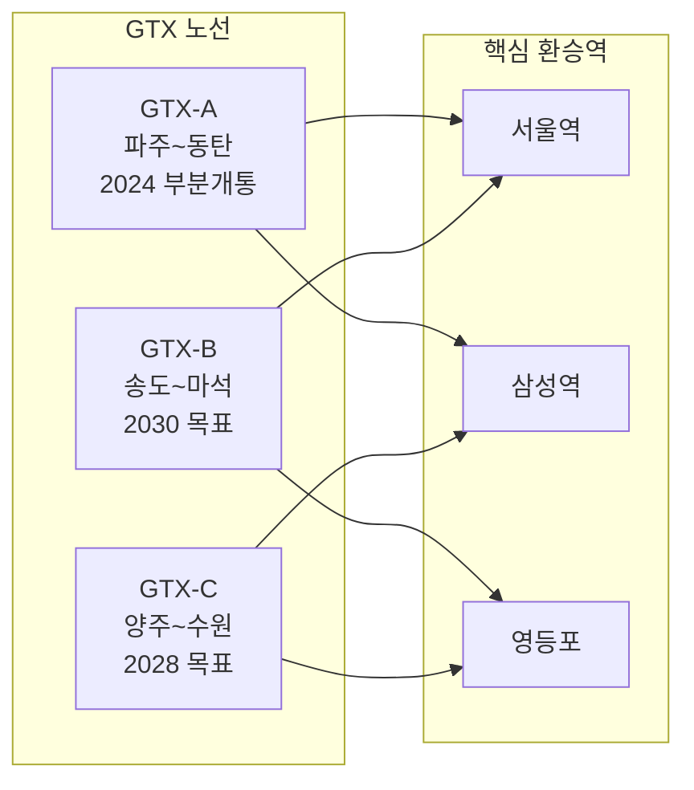
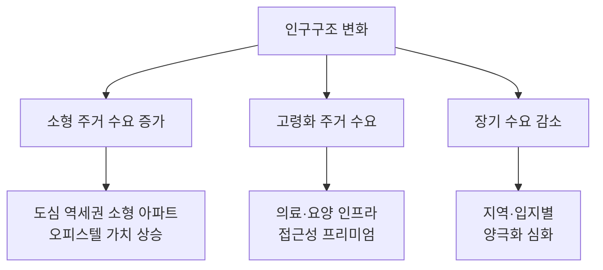
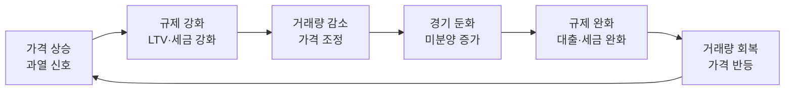
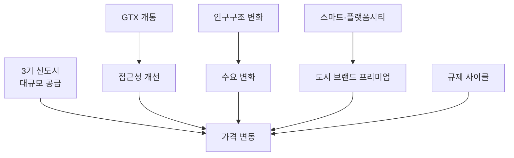

---
tags:
  - 부동산
  - 투자
  - 부동산투자
---
# 부동산 시장 트렌드

수도권 부동산 시장의 구조적 변화를 이끄는 5대 트렌드를 정리한다. 각 트렌드는 독립적이지 않으며 상호 연결되어 시장의 방향성을 결정한다.

---

## 1. 3기 신도시와 수도권 공급 확대

정부는 수도권 주택 공급 확대를 위해 3기 신도시와 추가 택지지구를 지정했다. 2025~2030년 사이 대규모 입주가 예정되어 있으며, 공급 물량과 시기가 주변 시세에 직접적 영향을 미친다.

| 사업지구 | 위치 | 면적 (만㎡) | 계획 세대 | 예상 입주 시기 | 핵심 교통 |
|----------|------|-----------|----------|-------------|----------|
| 남양주 왕숙 | 남양주시 진접 | 약 1,134 | ~6.6만 | 2027~ | GTX-B, 4호선 연장 |
| 하남 교산 | 하남시 교산동 | 약 649 | ~3.2만 | 2027~ | 3호선, 5호선 연장 |
| 인천 계양 | 인천 계양구 | 약 335 | ~1.7만 | 2027~ | GTX-D, 인천1호선 |
| 고양 창릉 | 고양시 덕양구 | 약 812 | ~3.8만 | 2028~ | GTX-A, 3호선 연장 |
| 부천 대장 | 부천시 대장동 | 약 343 | ~2만 | 2028~ | 대장홍대선 |
| **용인플랫폼시티** | **용인시 처인구** | **약 1,262** | **~7만** | **2030~** | **GTX-A 연장 추진** |

!!! info "3기 신도시 vs 플랫폼시티"
    3기 신도시(왕숙, 교산, 계양 등)는 국토교통부 주도의 **공공택지 공급** 성격이 강하다. 반면 용인플랫폼시티는 **자율주행·데이터 기반 도시 운영**을 표방하는 차세대 모델로, 단순 주거 공급을 넘어 산업·기술 생태계를 함께 조성하는 것이 차별점이다.

---

## 2. GTX 및 광역교통망 확충

GTX(수도권 광역급행철도)는 수도권 부동산 지도를 다시 그리는 핵심 인프라다. 서울 주요 업무지구까지의 접근성이 획기적으로 개선되며, 역세권 형성에 따른 부동산 가치 변동이 크다.

| 노선 | 구간 | 소요시간 변화 | 수혜 지역 | 진행 상태 |
|------|------|-------------|----------|----------|
| GTX-A | 파주 운정~동탄 | 동탄→삼성 70분→20분 | 킨텍스, 동탄 | 2024 부분개통 |
| GTX-B | 송도~마석 | 송도→서울역 80분→30분 | 남양주, 인천 | 착공 |
| GTX-C | 양주~수원 | 수원→삼성 60분→20분 | 양주, 의정부, 수원 | 착공 |

!!! warning "교통 프리미엄 리스크"
    GTX 역세권 프리미엄은 **착공 확정 시** 대부분 선반영된다. 개통 후에는 오히려 기대 대비 실망 매물이 출회될 수 있다. "소문에 사서 뉴스에 팔아라"는 원칙이 부동산에서도 적용된다. 특히 개통 지연(2~5년 흔함)은 프리미엄 유지에 부담이 된다.

---

## 3. 인구구조 변화와 주거 패러다임

한국의 인구구조 변화는 부동산 수요의 질적 전환을 이끌고 있다.

| 변화 요인 | 현황 (2025) | 부동산 영향 |
|-----------|-----------|-----------|
| 1~2인 가구 비중 | 전체 가구의 65%+ | 소형 주거(전용 59㎡ 이하) 수요 증가 |
| 합계출산율 | 0.7명대 (세계 최저) | 장기 주택 수요 감소 전망 |
| 고령화율 | 20%+ (초고령사회 진입) | 실버타운, 의료 접근성 중시 |
| 직주근접 선호 | MZ세대 직주근접 중시 | 서울·판교 등 업무지구 근접 수요 |
| 원격근무 확산 | 하이브리드 근무 정착 | 수도권 외곽 거주 수용도 상승 |

---

## 4. 스마트시티·플랫폼시티 부상

전통적 택지개발을 넘어 **데이터·AI·자율주행** 기반의 차세대 도시 모델이 부상하고 있다. 정부와 지자체가 미래 도시 경쟁력 확보를 위해 적극 추진 중이다.

| 프로젝트 | 위치 | 규모 | 핵심 기술 | 현재 단계 |
|---------|------|------|---------|----------|
| 세종 스마트시티 | 세종 5-1생활권 | 274만㎡ | 자율주행, 로봇배달, 데이터 허브 | 조성 중 |
| **용인플랫폼시티** | **용인 처인구** | **약 1,262만㎡** | **자율주행, 도시 데이터 플랫폼, MaaS** | **지구지정** |
| 부산 에코델타 | 부산 강서구 | 약 119만㎡ | 수열에너지, AR·VR | 입주 시작 |

!!! tip "투자 관점에서의 스마트시티"
    스마트시티·플랫폼시티는 **장기 가치 상승** 잠재력이 있지만, (1) 기술 구현의 불확실성, (2) 초기 높은 분양가, (3) 장기 개발 기간에 따른 기회비용이 리스크다. 세종 스마트시티의 실제 구현 수준과 부동산 가격 추이가 후발 프로젝트(용인플랫폼시티)의 벤치마크가 된다.

---

## 5. 부동산 규제 사이클

한국 부동산 시장은 정부 정책에 의해 강하게 조절된다. 규제 강화와 완화가 반복되는 사이클을 이해하면 투자 타이밍을 판단하는 데 도움이 된다.

| 시기 | 정책 기조 | 주요 내용 |
|------|----------|----------|
| 2017~2020 | 강력한 규제 | 다주택 중과, DSR 도입, 대출 규제 |
| 2021~2022 | 규제 절정 + 금리 인상 | 종부세 강화, 기준금리 급등 |
| 2023~2024 | 단계적 완화 | 규제지역 해제, 취득세 완화 |
| 2025~ | 선별적 완화·공급 확대 | 3기 신도시 분양 본격화, 재건축 규제 완화 |

---

## 트렌드 간 연결

## 관련 문서

- [부동산 투자 개요](index.md) | [핵심 개념](concepts.md)
- [주요 프로젝트 비교](products/index.md)
