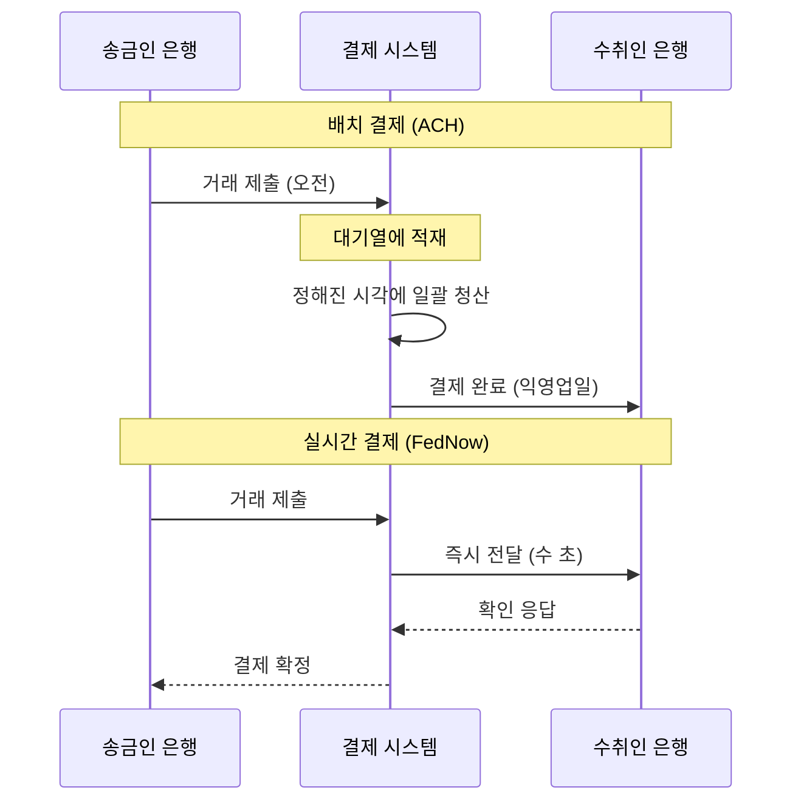
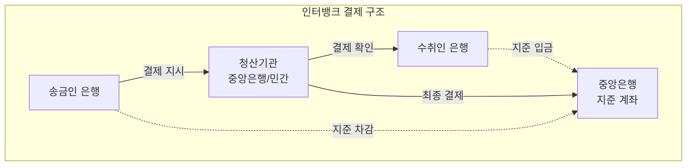

# 실시간 결제 핵심 개념

## 실시간 결제 vs 배치 결제

금융 결제의 가장 근본적인 구분은 **실시간(Real-Time)**과 **배치(Batch)**이다.

| 구분 | 배치 결제 | 실시간 결제 |
|------|-----------|-------------|
| 처리 방식 | 일정 시간에 모아서 일괄 처리 | 건별 즉시 처리 |
| 소요 시간 | 수 시간 ~ 수일 | 수 초 |
| 가용 시간 | 영업시간 내 | 24/7/365 |
| 결제 확정성 | 정산 후 확정 | 즉시 확정 (Irrevocable) |
| 취소 | 정산 전 취소 가능 | 원칙적 취소 불가 |
| 데이터 | 제한적 | ISO 20022 풍부한 데이터 |
| 예시 | ACH(미국), BACS(영국) | FedNow, UPI, PIX |

!!! tip "실시간 결제의 핵심 속성"
    - **Instant**: 수 초 내 처리 완료
    - **Irrevocable**: 한번 확정되면 취소 불가 (사기 방지 중요)
    - **Always-on**: 24/7/365 무중단 운영
    - **Rich Data**: ISO 20022로 상세 거래 정보 전송

---

## ISO 20022

차세대 금융 메시지 표준으로, 전 세계 결제 시스템이 이 표준으로 수렴하고 있다.

ISO 20022는 XML/JSON 기반의 구조화된 메시지 표준이다. 기존 SWIFT MT(Message Type) 포맷이 제한된 필드와 자유 형식 텍스트를 사용하는 반면, ISO 20022는 풍부한 구조화 데이터를 포함할 수 있다.

| 구분 | SWIFT MT (레거시) | ISO 20022 |
|------|-------------------|-----------|
| 형식 | 고정 필드 + 자유 텍스트 | 구조화 XML/JSON |
| 데이터 양 | 제한적 | 풍부 (송금 목적, 인보이스 정보 등) |
| 문자셋 | 라틴 문자 한정 | 유니코드 (다국어) |
| 호환성 | 시스템별 해석 차이 | 글로벌 표준 호환 |
| 자동화 | 수동 개입 빈번 | STP(Straight-Through Processing) 가능 |

!!! info "ISO 20022 마이그레이션 일정"
    - **SWIFT 크로스보더**: 2025년 11월 완전 전환
    - **FedNow**: 출시 시점부터 ISO 20022 네이티브
    - **SEPA**: 이미 ISO 20022 기반
    - **UPI/PIX**: 자체 표준이나 ISO 20022 매핑 지원

---

## 인터뱅크 결제 (Interbank Payment)

은행 간 자금 이동의 메커니즘이다. 실시간 결제 시스템의 핵심 인프라이다.

---

## 청산과 결제 (Clearing & Settlement)

| 단계 | 설명 | 비유 |
|------|------|------|
| **청산 (Clearing)** | 거래를 검증하고 각 은행의 순채무/순채권을 계산 | "누가 누구에게 얼마를 빚졌는지 정리" |
| **결제 (Settlement)** | 실제 자금을 중앙은행 계좌 간에 이동하여 채무를 해소 | "실제로 돈을 주고받음" |

실시간 결제에서는 청산과 결제가 **동시에 또는 거의 즉시** 이루어진다. 이를 **Instant Settlement** 또는 **Real-Time Gross Settlement (RTGS)** 방식이라 한다.

!!! warning "RTGS vs DNS"
    - **RTGS (Real-Time Gross Settlement)**: 건별 즉시 결제, 유동성 부담 높음
    - **DNS (Deferred Net Settlement)**: 일정 기간 거래를 모아 순액으로 결제, 유동성 효율적
    - 실시간 결제 시스템은 RTGS 또는 하이브리드 방식을 사용

---

## QR 결제

QR 코드를 스캔하여 결제하는 방식으로, 실시간 결제 시스템의 핵심 인터페이스이다.

UPI(인도)와 PIX(브라질)의 폭발적 성장은 QR 결제의 접근성 덕분이다. 가맹점이 고가의 POS 단말기 없이 인쇄된 QR 코드만으로 결제를 받을 수 있어, 소상공인과 비공식 경제까지 디지털 결제가 침투했다.

| QR 방식 | 설명 | 예시 |
|---------|------|------|
| **정적 QR** | 고정 QR 코드, 금액은 소비자가 입력 | 길거리 가판대 |
| **동적 QR** | 거래별 고유 QR, 금액 포함 | 이커머스, 대형 가맹점 |
| **소비자 제시** | 소비자 앱의 QR을 가맹점이 스캔 | 대형마트 결제 |
| **가맹점 제시** | 가맹점 QR을 소비자가 스캔 | UPI, PIX 대부분 |

---

## Request to Pay (RtP)

수취인이 송금인에게 결제를 요청하는 새로운 결제 패러다임이다.

전통적인 결제는 송금인(Payer)이 주도한다. RtP는 이를 뒤집어, 수취인(Payee)이 "이 금액을 결제해주세요"라는 요청을 보내고 송금인이 승인하는 방식이다.

!!! example "RtP 활용 시나리오"
    - **공과금 청구**: 전기/가스 회사가 RtP로 청구, 고객이 앱에서 승인
    - **정기 결제**: 구독 서비스가 매월 RtP 요청
    - **B2B 인보이스**: 공급업체가 인보이스와 함께 RtP 전송
    - **P2P 분할**: 식사 후 한 명이 나머지에게 RtP 발송

SEPA Instant의 SRTP(SEPA Request to Pay), FedNow의 RfP(Request for Payment) 등이 대표적 구현이다.

## 관련 문서

- [실시간 결제 개요](index.md)
- [제품 비교](products/index.md) -- FedNow, UPI, PIX 등 비교
- [트렌드](trends.md) -- ISO 20022 마이그레이션, 크로스보더 연동
- [오픈뱅킹 개념](../open-banking/concepts.md) -- 오픈뱅킹 API와 결제
