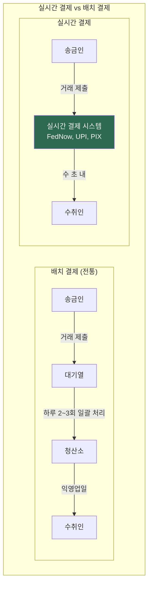
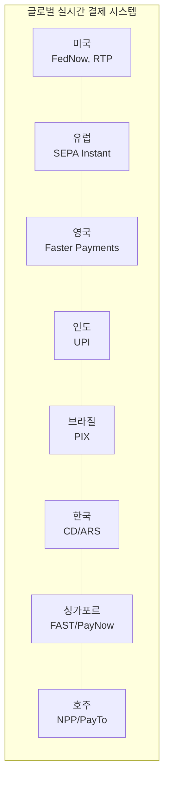

---
tags:
  - 결제
  - 실시간결제
search:
  boost: 2
---
# 실시간 결제 인프라 개요

## 정의

**실시간 결제(Real-Time Payment)**는 송금인의 계좌에서 수취인의 계좌로 자금이 **수 초 이내에 즉시 이체**되며, **24시간 365일(24/7/365)** 가용한 결제 인프라 시스템이다.

## 상세 설명

전통적인 은행 간 이체는 배치(Batch) 처리 방식을 사용한다. 하루에 몇 차례 정해진 시간에 거래를 모아서 일괄 처리(청산/결제)하기 때문에, 송금 후 자금이 실제로 수취인 계좌에 도착하기까지 수 시간에서 수일이 걸린다. 실시간 결제는 이 구조를 근본적으로 바꾸어, 건별로 즉시 처리(Instant Clearing & Settlement)하는 방식을 도입한다.

실시간 결제의 글로벌 확산은 폭발적이다. 인도의 UPI(Unified Payments Interface)는 월 100억 건 이상의 거래를 처리하며 세계 최대 규모이고, 브라질의 PIX는 출시 3년 만에 전 국민의 70%+ 가 이용한다. 미국은 2023년 FedNow를 출시하며 뒤늦게 실시간 결제에 합류했다.

이 시스템들의 공통적인 기술 기반은 **ISO 20022** 메시지 표준이다. ISO 20022는 풍부한 데이터(Rich Data)를 포함할 수 있는 XML/JSON 기반 금융 메시지 표준으로, 기존 SWIFT MT 등 레거시 포맷을 대체하고 있다.

## 핵심 포인트

!!! info "왜 중요한가"
    1. **즉시성**: 자금이 수 초 내에 이동, 유동성 관리 혁신
    2. **24/7/365**: 영업일/시간 제약 없이 언제든 이체 가능
    3. **금융 포용성**: 은행 계좌 없이도 QR 코드, 모바일 번호로 결제 (UPI, PIX)
    4. **효율성**: 중개자 감소, 결제 비용 절감, 현금 사용 감소
    5. **혁신 기반**: 오픈뱅킹, 임베디드 금융, CBDC의 기술적 토대

## 핵심 키워드

| 키워드 | 설명 |
|--------|------|
| **즉시 이체** | 자금이 수 초 내에 최종적으로(Irrevocably) 이동 |
| **24/7/365** | 연중무휴, 24시간 가용한 결제 인프라 |
| **ISO 20022** | 차세대 금융 메시지 표준, 풍부한 데이터 전송 가능 |
| **청산/결제** | Clearing(순채무 계산) & Settlement(최종 자금 이동) |
| **QR 결제** | QR 코드 기반 간편 결제 (UPI, PIX의 핵심) |
| **Request to Pay** | 수취인이 송금인에게 결제를 요청하는 방식 |

## 글로벌 실시간 결제 시스템 맵

!!! tip "학습 순서"
    ① [핵심 개념](concepts.md) → ② [제품/사례 비교](products/index.md) → ③ [트렌드](trends.md)

## 관련 문서

- [핵심 개념](concepts.md) -- 실시간 결제 vs 배치, ISO 20022, 청산/결제 상세
- [제품 비교](products/index.md) -- FedNow, UPI, PIX, SEPA Instant 등 비교
- [트렌드](trends.md) -- 글로벌 확산, 크로스보더, CBDC 연계
- [오픈뱅킹](../open-banking/index.md) -- 오픈뱅킹과 실시간 결제의 결합
- [임베디드 금융](../embedded-finance/index.md) -- 임베디드 결제의 인프라 기반
