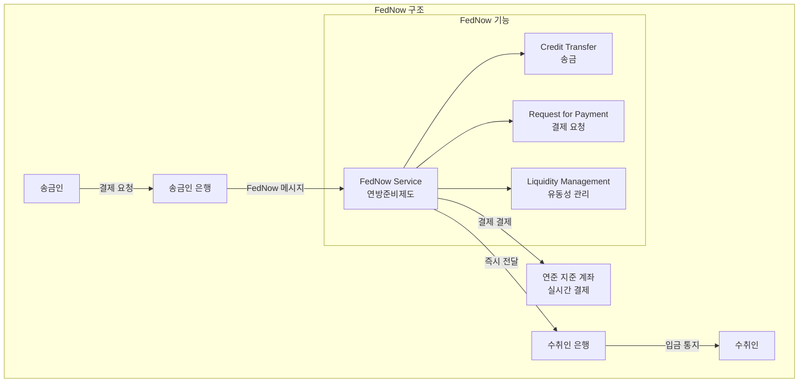
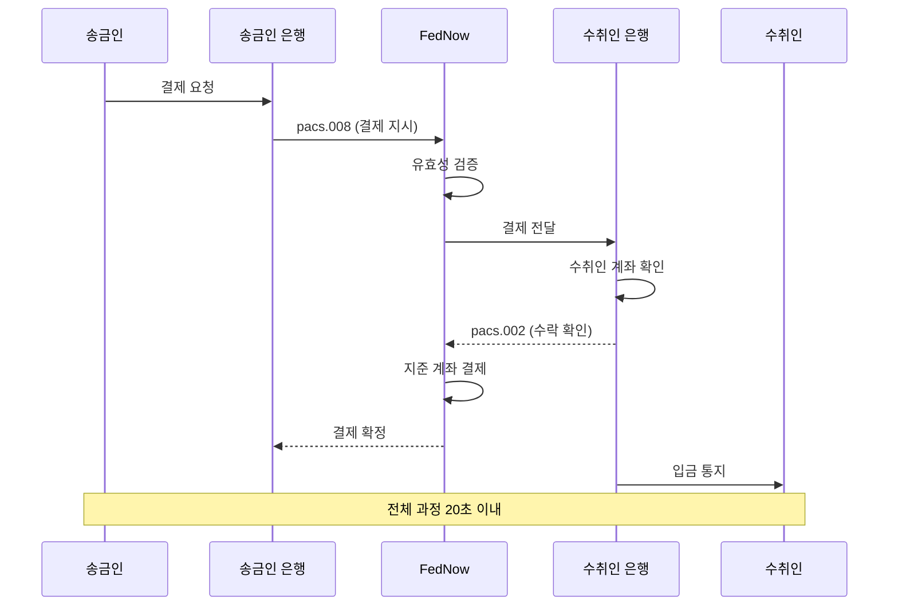

---
tags:
  - 결제
  - 실시간결제
---
# FedNow

## 기본 정보

| 항목 | 내용 |
|------|------|
| **출시** | 2023년 7월 |
| **운영 주체** | 미국 연방준비제도 (Federal Reserve) |
| **유형** | 실시간 결제 인프라 (RTGS) |
| **가용성** | 24/7/365 |
| **결제 한도** | $500,000 (기본, 기관별 조정 가능) |
| **결제 속도** | 20초 이내 |
| **메시지 표준** | ISO 20022 |
| **참여 기관** | 900+ (2024년 기준, 지속 증가) |

## 정의

FedNow는 미국 연방준비제도가 직접 운영하는 **미국 최초의 공공 실시간 결제 서비스**로, 은행과 신용조합이 고객에게 24/7/365 즉시이체를 제공할 수 있게 하는 인프라이다.

## 상세 설명

미국은 선진국 중 실시간 결제 도입이 가장 늦었다. 인도(UPI, 2016), 영국(Faster Payments, 2008), 유럽(SEPA Instant, 2017) 등이 먼저 구축한 실시간 결제를 미국은 2023년에야 공공 인프라로 갖추게 되었다. 이전에는 The Clearing House(TCH)가 운영하는 민간 RTP 네트워크(2017)만 존재했으나, 이는 대형 은행 위주였다.

FedNow의 핵심 의의는 **공공 인프라로서의 보편적 접근성**이다. 연준 계좌를 보유한 모든 은행과 신용조합이 참여할 수 있으며, 대형 은행과 소형 지역 은행 간의 결제 격차를 해소한다. 또한 ISO 20022를 네이티브로 채택하여, 풍부한 결제 데이터 전송이 가능하다.

## 핵심 특징

!!! info "FedNow의 5대 특징"
    1. **연준 직접 운영**: 중앙은행이 운영하여 최고 수준의 신뢰성과 안정성
    2. **보편적 접근**: 연준 계좌 보유 모든 금융기관 참여 가능
    3. **ISO 20022 네이티브**: 출시 시점부터 차세대 메시지 표준 채택
    4. **Request for Payment**: 수취인이 송금인에게 결제를 요청하는 기능
    5. **유동성 관리 도구**: 금융기관의 실시간 자금 관리 지원

## 구조 상세

### 결제 흐름

### FedNow vs RTP (The Clearing House)

| 구분 | FedNow | RTP (TCH) |
|------|--------|-----------|
| 운영 주체 | 연방준비제도 (공공) | The Clearing House (민간) |
| 출시 | 2023년 | 2017년 |
| 접근성 | 모든 연준 계좌 보유 기관 | TCH 회원 은행 중심 |
| 결제 한도 | $500K | $1M |
| 결제 방식 | 연준 지준 계좌 | TCH 정산 |
| 메시지 표준 | ISO 20022 | ISO 20022 |
| 참여 기관 | 900+ (증가 중) | 500+ |

!!! note "공존 전략"
    FedNow와 RTP는 경쟁이 아닌 공존 관계이다. 금융기관은 양쪽 모두에 참여할 수 있으며, 용도에 따라 선택한다. 연준은 FedNow를 통해 소규모 금융기관까지 실시간 결제를 확산시키고, TCH의 RTP는 대형 기관 간 고액 즉시 결제에 강점을 유지한다.

## 채택 현황

FedNow는 2023년 출시 이후 점진적으로 채택이 확대되고 있으나, 미국 전체 10,000+ 금융기관 대비 아직 초기 단계이다.

!!! warning "채택 과제"
    - **레거시 시스템**: 소규모 은행의 코어 뱅킹 시스템 업그레이드 필요
    - **비즈니스 케이스**: ACH 대비 실시간 결제의 추가 비용 정당화
    - **사기 방지**: 즉시 결제의 비가역성에 따른 사기 리스크
    - **소비자 인식**: "실시간 결제"에 대한 소비자 수요 형성

## 장점

- 미 연준의 직접 운영으로 최고 수준의 시스템 안정성
- 소규모 금융기관까지 보편적 접근 보장
- ISO 20022 네이티브로 미래 지향적 아키텍처
- Request for Payment(RfP)로 새로운 결제 패러다임 지원
- 연준 지준 계좌 직접 결제로 결제 확정성 최고

## 단점

- 2023년 출시, 아직 초기 채택 단계
- 기존 ACH/Wire/RTP 대비 전환 인센티브 부족
- QR 결제 등 소비자 인터페이스 미약 (UPI/PIX 대비)
- 금융기관의 시스템 업그레이드 비용 부담
- 사기 방지 프레임워크가 아직 발전 중

## 관련 문서

- [제품 비교](index.md)
- [실시간 결제 개요](../index.md)
- [UPI](upi.md) -- 세계 최대 실시간 결제 비교
- [PIX](pix.md) -- 가장 빠른 보급 사례 비교
- [트렌드](../trends.md) -- 미국 실시간 결제 확산 전망
