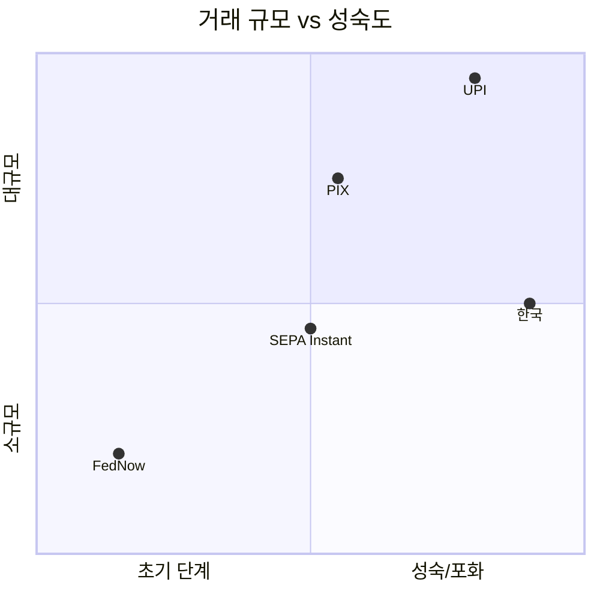

---
tags:
  - 결제
  - 실시간결제
search:
  boost: 1.5
---
# 실시간 결제 시스템 비교

## 비교 요약

| 시스템 | 국가 | 출시 | 운영 주체 | 월간 거래량 | 특징 |
|--------|------|------|-----------|-------------|------|
| **[FedNow](fednow.md)** | 미국 | 2023 | 연방준비제도(Fed) | 초기 단계 | 미 연준 최초 실시간 결제 |
| **[UPI](upi.md)** | 인도 | 2016 | NPCI | 100억+ 건/월 | 세계 최대, QR 기반 |
| **[PIX](pix.md)** | 브라질 | 2020 | 중앙은행(BCB) | 40억+ 건/월 | 전국민 보급, 3년 만에 |
| **SEPA Instant** | 유럽 (36개국) | 2017 | EPC | 증가 중 | 유럽 통합 즉시이체 |
| **한국 CD/ARS** | 한국 | 1988/2001 | 금융결제원 | 수억 건/월 | 사실상 실시간, 레거시 |

## 개별 시스템 강점 / 약점 / 차별화

### FedNow

- **강점**: 미 연준 직접 운영으로 최고 수준의 신뢰성, 전 은행 접근 가능
- **약점**: 2023년 출시, 채택률 아직 낮음, 기존 RTP(The Clearing House)와 병존
- **차별화**: 미국 최초의 공공 실시간 결제 인프라, 중앙은행 직접 결제

### UPI

- **강점**: 월 100억+ 건 세계 최대, 금융 포용성 혁명, 글로벌 확산 중
- **약점**: 가맹점 수수료 0원(수익 모델 부재), 인프라 안정성 과제
- **차별화**: 모바일 번호 기반 결제, 인도 13억 인구의 디지털 결제 전환

### PIX

- **강점**: 3년 만에 전국민 70%+ 보급, 중앙은행 주도 강력한 실행
- **약점**: 사기 증가, 국제 결제 미지원, 은행 수익성 압박
- **차별화**: 중앙은행 주도의 가장 빠른 실시간 결제 보급 사례

### SEPA Instant

- **강점**: 36개국 통합 즉시이체, 유로존 통합 결제 인프라
- **약점**: 참여 은행 비율 아직 100% 미달, 수수료 은행별 상이
- **차별화**: 다국가 통합 실시간 결제 (세계 유일)

### 한국 CD/ARS/이체 시스템

- **강점**: 1988년부터 사실상 실시간 이체 운영, 높은 안정성
- **약점**: 레거시 시스템, ISO 20022 미적용, 24/7 완전 가용은 아님
- **차별화**: 세계에서 가장 오래된 준실시간 결제 인프라 중 하나

## 시나리오별 선택 가이드

!!! tip "실시간 결제 시스템 활용 관점"

    **"미국에서 즉시이체를 구현하고 싶다"**
    → **FedNow** -- 연준 인프라, 장기적으로 표준이 될 가능성
    → 또는 **RTP (The Clearing House)** -- 이미 운영 중, 더 넓은 채택

    **"신흥국에서 금융 포용성 프로젝트를 진행한다"**
    → **UPI** 모델 연구 -- QR 기반, 모바일 번호 결제, 제로 수수료

    **"전국민 대상 즉시 결제 시스템을 빠르게 구축하고 싶다"**
    → **PIX** 모델 연구 -- 중앙은행 주도, 3년 내 보급

    **"유럽 다국가 서비스에서 즉시이체가 필요하다"**
    → **SEPA Instant** -- 36개국 통합, 유로화 즉시이체

    **"한국에서 실시간 이체 서비스를 구축한다"**
    → **금융결제원 시스템** + **오픈뱅킹 API** -- 기존 인프라 활용

## 핵심 비교: 기술 아키텍처

| 항목 | FedNow | UPI | PIX | SEPA Instant |
|------|--------|-----|-----|--------------|
| 메시지 표준 | ISO 20022 | 자체 (ISO 매핑) | 자체 (ISO 매핑) | ISO 20022 |
| 결제 한도 | $500K | ~$6,000 | ~$200K | EUR 100K |
| 결제 속도 | 20초 이내 | 수 초 | 수 초 | 10초 이내 |
| QR 지원 | 미정 | 핵심 | 핵심 | 부분적 |
| RtP 지원 | O (RfP) | O | O | O (SRTP) |
| 수수료 | Fed 정의 | 0원 (가맹점) | 무료 (P2P) | 은행별 상이 |

## 관련 문서

- [실시간 결제 개요](../index.md)
- [핵심 개념](../concepts.md)
- [트렌드](../trends.md)
- [오픈뱅킹 제품 비교](../../open-banking/products/index.md)
