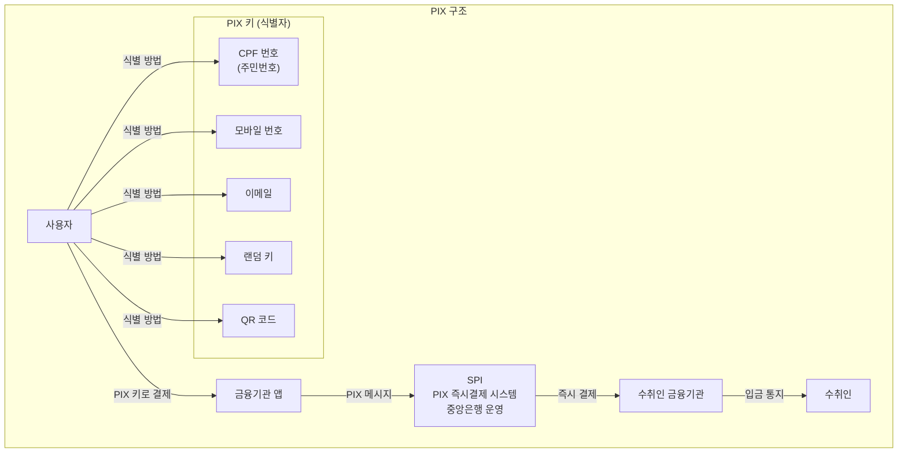
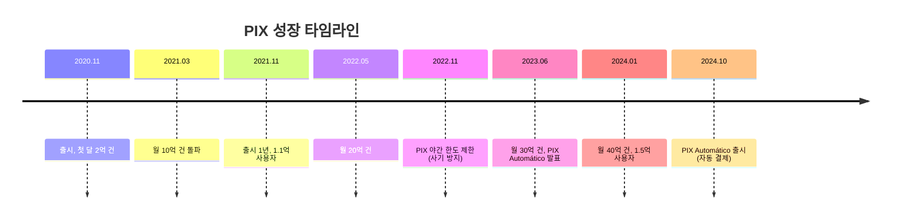

---
tags:
  - 결제
  - 실시간결제
---
# PIX

## 기본 정보

| 항목 | 내용 |
|------|------|
| **출시** | 2020년 11월 |
| **운영 주체** | 브라질 중앙은행 (Banco Central do Brasil, BCB) |
| **유형** | 실시간 결제 시스템 |
| **가용성** | 24/7/365 |
| **월간 거래** | 40억+ 건 (2024년 기준) |
| **등록 사용자** | 1.5억+ (브라질 인구의 ~70%) |
| **결제 속도** | 수 초 (평균 1.5초) |
| **결제 한도** | 야간 R$1,000 / 주간 사용자 설정 |

## 정의

PIX는 브라질 중앙은행이 직접 구축하고 운영하는 **즉시 결제 시스템**으로, QR 코드 기반의 24/7/365 실시간 이체를 전 국민에게 제공한다.

## 상세 설명

PIX는 실시간 결제 시스템의 "빠른 보급" 기록을 보유하고 있다. 2020년 11월 출시 후 3년 만에 브라질 인구의 70%+가 PIX를 이용하게 되었다. 이는 브라질 중앙은행(BCB)의 강력한 실행력과 전략적 설계 덕분이다.

PIX의 설계 철학은 **포괄성(Inclusivity)**이다. 은행 계좌, 디지털 지갑, 결제 기관 등 어떤 금융 기관의 고객이든 PIX를 사용할 수 있다. 가맹점은 인쇄된 QR 코드만으로 결제를 받을 수 있어, 브라질의 방대한 비공식 경제(Informal Economy)까지 디지털 결제가 침투했다. P2P 송금은 무료이며, 가맹점 결제도 기존 카드 결제 대비 현저히 저렴하다.

특히 주목할 점은 **중앙은행의 직접 구축과 의무화 전략**이다. BCB는 일정 규모 이상의 모든 금융기관에 PIX 참여를 의무화했고, API 스펙과 UX 가이드라인까지 직접 정의했다. 이는 규제 기관이 혁신을 주도한 모범 사례로 전 세계에서 연구되고 있다.

## 핵심 특징

!!! info "PIX의 5대 특징"
    1. **초고속 보급**: 3년 만에 전국민 70%+ 이용, 세계 기록
    2. **중앙은행 직접 운영**: BCB가 시스템 구축, API 정의, 참여 의무화
    3. **PIX 키**: CPF(주민번호), 모바일, 이메일 등 다양한 식별자
    4. **QR 코드 중심**: 정적/동적 QR로 가맹점 결제 보편화
    5. **P2P 무료**: 개인 간 송금 완전 무료

## 성장 타임라인

## PIX의 혁신 제품

| 기능 | 설명 | 출시 |
|------|------|------|
| **PIX Saque/Troco** | 가맹점에서 현금 인출 (ATM 대체) | 2021 |
| **PIX Cobranca** | 청구서 기반 결제 (인보이스 대체) | 2021 |
| **PIX Garantido** | 할부 결제 (BNPL 유사) | 2024 |
| **PIX Automático** | 정기 자동 결제 (구독) | 2024 |
| **PIX Internacional** | 크로스보더 결제 (개발 중) | 예정 |

!!! tip "PIX Automático의 의미"
    PIX Automático는 정기 결제(구독, 공과금 등)를 PIX로 자동화한다. 이는 기존의 Boleto(인쇄 청구서), 카드 자동결제를 대체하며, PIX 생태계를 B2B와 구독 경제로 확장하는 핵심 기능이다.

## 사기 방지

PIX의 빠른 보급 이면에는 사기(Fraud) 증가라는 심각한 과제가 있다.

!!! danger "PIX 사기 현황과 대응"
    - **사기 유형**: "PIX 납치(sequestro relâmpago)" -- 강제로 PIX 송금을 요구하는 범죄 급증
    - **야간 한도 제한**: 20:00~06:00 사이 PIX 이체 한도를 R$1,000으로 제한
    - **MED (메커니즘 특별 반환)**: 사기 피해 시 자금 회수 메커니즘
    - **Artificial Intelligence**: BCB가 AI 기반 사기 탐지 시스템 도입
    - **거래 모니터링**: 비정상 거래 패턴 실시간 탐지 의무화

## 장점

- 세계 최고 속도의 실시간 결제 보급 (3년 만에 전국민)
- 중앙은행 직접 운영으로 표준화와 의무 참여 보장
- P2P 무료로 현금 사용 급감 (금융 포용성)
- 다양한 PIX 키로 접근성 극대화
- 지속적인 기능 확장 (Automático, Garantido)

## 단점

- 사기/범죄 급증 (PIX 납치 등)
- 국제 결제 미지원 (개발 중)
- 은행의 수익성 압박 (카드 수수료 수익 감소)
- 시스템 장애 시 전국적 영향
- 브라질 특화 설계로 직접 이식 어려움

## 실무 적용

!!! example "PIX 모델에서 배우는 교훈"
    - **중앙은행 주도 혁신**: 규제 기관이 기술 스펙까지 직접 정의하면 보급 속도 극대화
    - **의무 참여**: 일정 규모 이상 금융기관 참여 의무화로 네트워크 효과 가속
    - **다양한 식별자**: 계좌번호 대신 모바일, 이메일, 국민ID 등으로 접근성 향상
    - **단계적 기능 확장**: 핵심(P2P) → 가맹점 → 자동결제 → 할부 → 국제 순서로 확장

## 관련 문서

- [제품 비교](index.md)
- [실시간 결제 개요](../index.md)
- [UPI](upi.md) -- 인도 실시간 결제 비교
- [FedNow](fednow.md) -- 미국 실시간 결제 비교
- [트렌드](../trends.md) -- 글로벌 확산, 사기 방지
