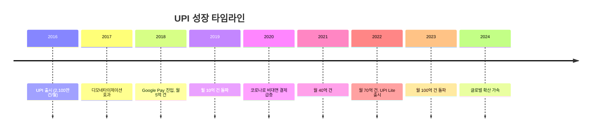

# UPI (Unified Payments Interface)

## 기본 정보

| 항목 | 내용 |
|------|------|
| **출시** | 2016년 4월 |
| **운영 주체** | NPCI (National Payments Corporation of India) |
| **유형** | 실시간 모바일 결제 시스템 |
| **가용성** | 24/7/365 |
| **월간 거래** | 100억+ 건 (2024년 기준) |
| **월간 거래액** | ₹20조+ (~$2,400억+) |
| **등록 사용자** | 3.5억+ |
| **결제 한도** | ₹1 lakh (~$1,200, 일부 카테고리 ₹5 lakh) |

## 정의

UPI(Unified Payments Interface)는 인도 NPCI가 운영하는 **세계 최대 규모의 실시간 모바일 결제 시스템**으로, 모바일 번호와 QR 코드만으로 은행 간 즉시 이체를 가능하게 한다.

## 상세 설명

UPI는 인도의 디지털 결제 혁명을 이끈 핵심 인프라이다. 2016년 출범 이후 폭발적으로 성장하여, 2024년 기준 월 100억 건 이상의 거래를 처리하며 세계에서 가장 큰 실시간 결제 시스템으로 자리잡았다. 이는 인도 전체 디지털 결제의 80%+ 를 차지한다.

UPI의 성공 비결은 **극단적인 접근성**에 있다. 은행 계좌가 있는 누구나 모바일 번호만으로 결제/송금할 수 있다. 가맹점은 고가의 POS 단말기 없이 인쇄된 QR 코드만으로 결제를 받는다. P2P 송금, 가맹점 결제, 공과금 납부, 투자 등 거의 모든 결제가 UPI로 수렴하고 있다.

결정적으로, **가맹점 수수료가 0원(Zero MDR)**이다. 인도 정부가 UPI 보급을 위해 가맹점 수수료를 면제하고, 처리 비용을 정부 보조금으로 충당한다. 이 정책은 UPI의 폭발적 보급을 가능하게 했지만, 장기적 지속가능성에 대한 논쟁이 있다.

```mermaid
graph TB
    subgraph "UPI 아키텍처"
        User[사용자] -->|모바일 앱| PSP[PSP 앱<br/>GPay, PhonePe, Paytm]
        PSP -->|UPI 프로토콜| NPCI[NPCI<br/>UPI 스위치]
        NPCI -->|결제 라우팅| Bank1[사용자 은행]
        NPCI -->|결제 라우팅| Bank2[수취인 은행]

        subgraph "UPI 식별자"
            VPA[VPA<br/>user@bank]
            Mobile[모바일 번호]
            QR[QR 코드]
            Aadhaar[Aadhaar 번호]
        end

        User -->|결제 수단| VPA
        User -->|결제 수단| Mobile
        User -->|결제 수단| QR
        User -->|결제 수단| Aadhaar
    end
```

## 핵심 특징

!!! info "UPI의 5대 특징"
    1. **월 100억 건**: 세계 최대 실시간 결제 볼륨
    2. **Zero MDR**: 가맹점 수수료 무료, 정부 보조금 모델
    3. **VPA(Virtual Payment Address)**: 계좌번호 대신 user@bank 형태의 주소
    4. **QR 기반**: 길거리 가판대부터 대형 매장까지 QR 결제 보편화
    5. **글로벌 확산**: 싱가포르, UAE, 프랑스 등 해외에서 UPI 결제 가능

## UPI 제품 진화

| 버전/기능 | 출시 | 내용 |
|-----------|------|------|
| UPI 1.0 | 2016 | 기본 P2P 이체 |
| UPI 2.0 | 2018 | 사전 승인, 오버드래프트, 인보이스 |
| UPI Lite | 2022 | 소액 결제 (PIN 없이, $2.5 이하) |
| UPI 123PAY | 2022 | 피처폰 UPI (스마트폰 없이) |
| UPI Autopay | 2020 | 정기 결제 자동화 |
| UPI International | 2023 | 해외 가맹점 결제 |



## 생태계 플레이어

| 앱 | 시장 점유율 | 특징 |
|----|-----------|------|
| **PhonePe** | ~48% | Walmart 자회사, 1위 |
| **Google Pay (GPay)** | ~36% | 구글, 2위 |
| **Paytm** | ~8% | 초기 선구자, 규제 이슈로 하락 |
| **CRED** | ~3% | 프리미엄 사용자 타겟 |
| **기타** | ~5% | WhatsApp Pay, Amazon Pay 등 |

## 장점

- 세계 최대 규모의 실시간 결제 볼륨 (검증된 확장성)
- Zero MDR로 소상공인까지 디지털 결제 보급
- 모바일 번호/QR로 극단적 접근성 실현
- 인도 13억 인구의 금융 포용성 혁명
- 글로벌 표준으로 확산 중 (UPI International)

## 단점

- Zero MDR로 결제 사업자 수익 모델 불분명
- 시스템 장애 빈도 (월 수 차례 다운타임)
- 사기/피싱 증가 (소셜 엔지니어링)
- 3개 앱(PhonePe, GPay, Paytm)의 과점
- 고가 결제에 부적합 (한도 제한)

## 글로벌 확산

!!! tip "UPI의 글로벌 확산 현황"
    - **싱가포르**: UPI-PayNow 연동 (2023)
    - **UAE**: UPI 결제 가능 (2023)
    - **프랑스**: Eiffel Tower 등 관광지 UPI 결제
    - **스리랑카, 모리셔스**: UPI 도입 추진
    - **NPCI International**: 글로벌 확산 전담 자회사

인도 정부는 UPI를 "디지털 공공재(Digital Public Good)"로 포지셔닝하며, 개발도상국에 기술 수출을 추진하고 있다.

## 관련 문서

- [제품 비교](index.md)
- [실시간 결제 개요](../index.md)
- [FedNow](fednow.md) -- 미국 실시간 결제 비교
- [PIX](pix.md) -- 브라질 실시간 결제 비교
- [트렌드](../trends.md) -- 크로스보더 연동, 글로벌 확산
