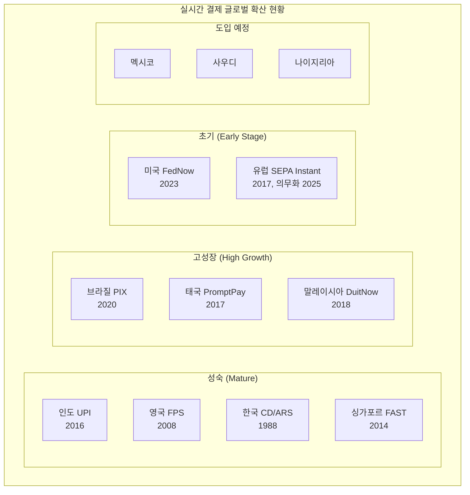
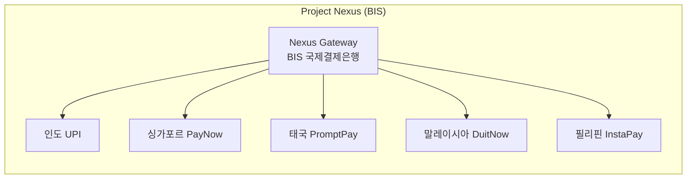
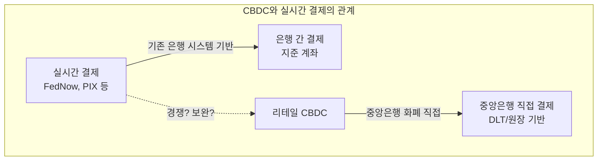

# 실시간 결제 인프라 트렌드

## 글로벌 확산

실시간 결제 시스템은 전 세계적으로 가장 빠르게 확산되는 금융 인프라이다. 2024년 기준 70개국 이상이 실시간 결제 시스템을 운영 중이며, 추가로 20개국 이상이 도입을 추진하고 있다.

!!! info "확산 패턴"
    - **아시아**: 가장 앞서 있으며, 인도(UPI), 태국(PromptPay), 싱가포르(FAST) 등이 선도
    - **라틴아메리카**: 브라질(PIX)의 성공 후 멕시코, 콜롬비아 등이 유사 시스템 추진
    - **유럽**: SEPA Instant의 의무화(2025)로 전 은행 참여 기대
    - **미국**: FedNow 출시로 뒤늦게 합류, 채택 가속화 필요
    - **아프리카**: 모바일 머니(M-Pesa)와 실시간 결제의 융합

---

## 크로스보더 연동

국내 실시간 결제 시스템 간의 **국제 연동**은 차세대 핵심 과제이다.

현재 국제 송금은 SWIFT 기반의 코레스(Correspondent Banking) 네트워크에 의존하며, 3~5일의 시간과 높은 수수료($25~$50+)가 소요된다. 각국의 실시간 결제 시스템을 직접 연결하면 이를 수 초, 저비용으로 대체할 수 있다.

| 연동 프로젝트 | 참여국 | 현황 |
|--------------|--------|------|
| **UPI-PayNow** | 인도-싱가포르 | 2023년 운영 시작 |
| **UPI-PromptPay** | 인도-태국 | 추진 중 |
| **PIX Internacional** | 브라질-글로벌 | 개발 중 |
| **SEPA-UK FPS** | 유럽-영국 | 논의 중 |
| **Project Nexus** | BIS 주도, 다국가 | 프로토타입 완료 |

!!! tip "Project Nexus의 의미"
    BIS(국제결제은행)의 Project Nexus는 각국의 실시간 결제 시스템을 직접 연결하는 허브 모델이다. N개 국가를 연결할 때 N(N-1)/2개의 양자 연동 대신, Nexus 허브를 통해 N개의 연동만 필요하다. 이는 크로스보더 실시간 결제의 확장성을 획기적으로 높인다.

---

## ISO 20022 마이그레이션

전 세계 금융 메시지 시스템이 ISO 20022로 수렴하고 있다. 이는 단순한 기술 표준 교체가 아닌, **금융 데이터 혁명**이다.

| 시스템 | ISO 20022 전환 일정 | 현황 |
|--------|---------------------|------|
| **SWIFT 크로스보더** | 2025년 11월 완전 전환 | 공존기간 중 |
| **FedNow** | 출시 시점부터 네이티브 | 완료 |
| **SEPA** | 이미 ISO 20022 기반 | 완료 |
| **Fedwire** | 2025년 3월 → 연기 중 | 진행 중 |
| **CHAPS (영국)** | 2023년 전환 완료 | 완료 |
| **CHIPS (미국)** | 2024년 전환 완료 | 완료 |

ISO 20022의 풍부한 데이터(Rich Data)가 가져올 변화:

!!! info "ISO 20022의 실질적 효과"
    1. **AML/CFT 향상**: 상세 거래 정보로 자금세탁 탐지 정확도 향상
    2. **STP(Straight-Through Processing)**: 수동 개입 없이 자동 처리율 증가
    3. **인보이스 자동 매칭**: 결제 메시지에 인보이스 정보 포함
    4. **데이터 분석**: 풍부한 거래 데이터로 새로운 비즈니스 인사이트
    5. **상호운용성**: 글로벌 표준으로 크로스보더 결제 효율화

---

## CBDC 연계

**CBDC(Central Bank Digital Currency, 중앙은행 디지털 화폐)**와 실시간 결제 인프라의 관계는 복잡하다.

| 관점 | 설명 |
|------|------|
| **경쟁론** | CBDC가 실시간 결제를 대체할 수 있음 (둘 다 즉시 결제) |
| **보완론** | CBDC는 프로그래머블 머니, 실시간 결제는 기존 인프라 현대화 |
| **현실** | 대부분의 중앙은행은 실시간 결제를 우선 구축하고, CBDC는 보완재로 검토 |

!!! note "주요 CBDC 프로젝트"
    - **디지털 위안(e-CNY)**: 중국, 파일럿 진행 중
    - **디지털 유로**: ECB, 2025년 설계 단계
    - **디지털 루피**: 인도, UPI와의 통합 검토
    - **한국 CBDC**: 한국은행, 파일럿 완료 후 검토 중

---

## 사기 방지

실시간 결제의 **비가역성(Irrevocability)**은 사기 방지를 핵심 과제로 만든다.

배치 결제에서는 정산 전에 의심 거래를 차단할 수 있었지만, 실시간 결제에서는 수 초 내에 자금이 최종 이동한다. 사기범이 즉시 자금을 인출하면 회수가 극히 어렵다.

!!! danger "실시간 결제 사기 유형과 대응"
    **주요 사기 유형:**
    - APP(Authorized Push Payment) 사기: 피해자가 직접 송금하도록 유도
    - 계좌 탈취(Account Takeover): 인증 정보 탈취 후 즉시 이체
    - PIX 납치: 물리적 위협으로 강제 송금 (브라질)

    **대응 전략:**
    - AI/ML 기반 실시간 이상 거래 탐지
    - 결제 지연 메커니즘 (고위험 거래 시 수 분 대기)
    - 수취인 확인(Confirmation of Payee)
    - 결제 한도 관리 (야간 제한 등)
    - 사기 보상 프레임워크 (영국 APP 사기 보상 의무화)

---

## 향후 전망

!!! tip "2025-2027 주요 전망"
    1. **SEPA Instant 의무화**: 2025년 유럽 전 은행 참여 의무화로 채택 급증
    2. **FedNow 성장**: 미국 금융기관 채택 가속, ACH 대체 시작
    3. **크로스보더 연동 확대**: Project Nexus, UPI-PayNow 등 국제 실시간 결제 확산
    4. **ISO 20022 완전 전환**: SWIFT 크로스보더 전환으로 글로벌 데이터 표준화
    5. **AI 사기 방지**: 실시간 결제의 비가역성에 대응하는 AI 기반 사기 탐지 고도화
    6. **Request to Pay 보편화**: RtP가 청구서/인보이스의 디지털 전환을 가속

## 관련 문서

- [실시간 결제 개요](index.md)
- [핵심 개념](concepts.md)
- [제품 비교](products/index.md)
- [오픈뱅킹 트렌드](../open-banking/trends.md) -- 오픈뱅킹 결제와의 결합
- [임베디드 금융 트렌드](../embedded-finance/trends.md) -- 임베디드 결제 인프라
- [BNPL 트렌드](../bnpl/trends.md) -- 실시간 결제 기반 BNPL
