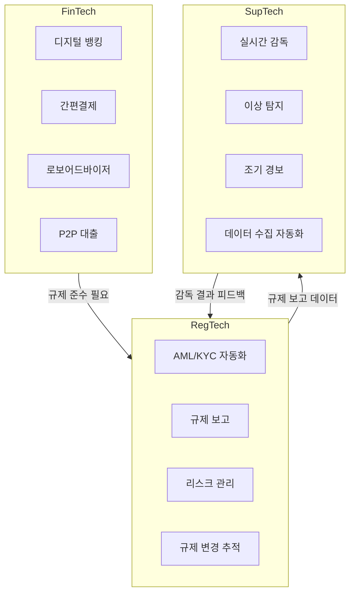
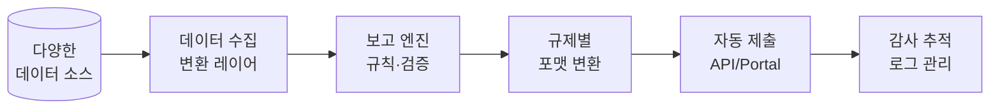
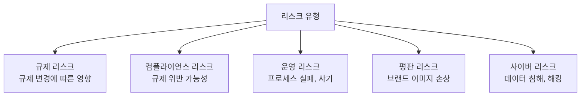
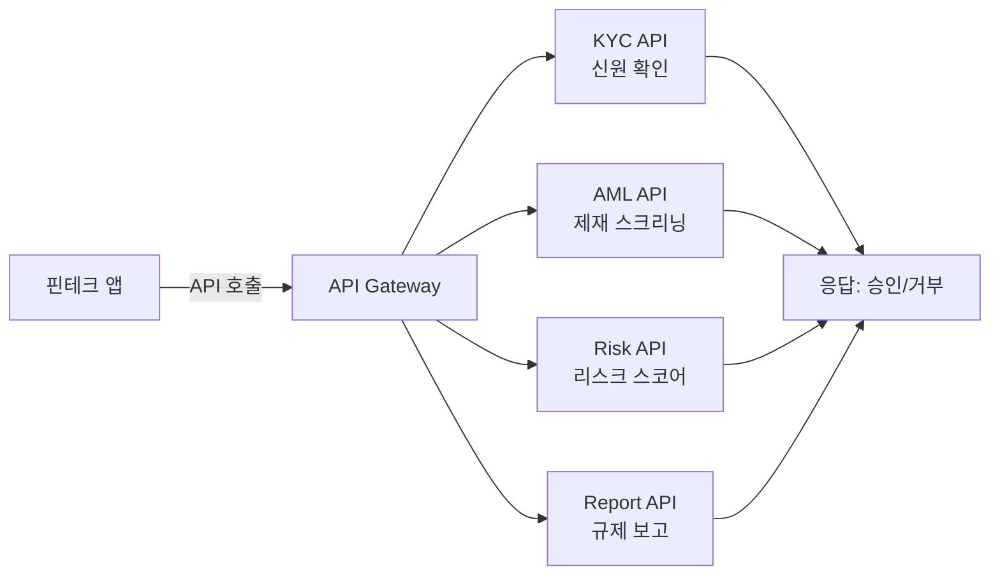

---
tags:
  - 규제
  - 레그테크
---
# 레그테크 핵심 개념

## RegTech vs SupTech vs FinTech

세 개념은 금융 기술 생태계에서 서로 다른 역할을 담당하며, 상호 보완적으로 작동한다.

**RegTech(Regulatory Technology)**는 피규제 기관(금융기관, 기업)이 규제 준수를 효율화하기 위해 사용하는 기술이다. **SupTech(Supervisory Technology)**는 규제·감독 기관이 감독 업무를 고도화하기 위해 활용하는 기술이다. **FinTech(Financial Technology)**는 금융 서비스 자체를 혁신하는 기술로, RegTech의 수요를 창출하는 동인이다.

| 구분 | RegTech | SupTech | FinTech |
|------|---------|---------|---------|
| 사용자 | 금융기관, 기업 | 감독 기관 | 소비자, 기업 |
| 목적 | 규제 준수 효율화 | 감독 업무 고도화 | 금융 서비스 혁신 |
| 핵심 기술 | AI, API, 클라우드 | 빅데이터, AI, 시각화 | 블록체인, AI, 모바일 |
| 시장 규모 (2025) | ~$200억 | ~$50억 | ~$3,000억 |
| 성장률 | ~20% | ~25% | ~15% |

!!! info "SupTech 사례: 한국 금융감독원"
    금융감독원은 AI 기반 이상 거래 탐지 시스템, 자연어 처리 기반 민원 분석, 빅데이터 기반 조기 경보 시스템 등을 도입하여 감독 역량을 강화하고 있다.

---

## 규제 보고 자동화 (Regulatory Reporting Automation)

**규제 보고 자동화**는 금융기관이 감독 기관에 제출해야 하는 각종 보고서의 데이터 수집, 가공, 검증, 제출 과정을 기술로 자동화하는 것이다.

### 기존 프로세스의 문제

| 문제 | 설명 |
|------|------|
| 수동 작업 | 스프레드시트 기반, 오류 발생률 높음 |
| 사일로화 | 부서별 데이터 분절, 일관성 부족 |
| 비용 | 대형 은행 연간 수억 달러 보고 비용 |
| 시간 | 보고서 작성에 수일~수주 소요 |
| 규제 변경 | 규제 변경 시 수동 반영, 지연 위험 |

### 자동화 아키텍처

### 주요 규제 보고 유형

| 보고 유형 | 규제 | 지역 | 빈도 |
|----------|------|------|------|
| Basel III 자본적정성 | BIS | 글로벌 | 분기 |
| MiFID II 거래 보고 | ESMA | EU | 실시간 |
| STR/CTR | 각국 FIU | 글로벌 | 수시 |
| 재무 건전성 보고 | 금감원 | 한국 | 월/분기 |
| 소비자 보호 보고 | CFPB | 미국 | 분기/연간 |

---

## 실시간 모니터링

**실시간 모니터링**은 거래, 커뮤니케이션, 행동 데이터를 실시간으로 분석하여 규제 위반, 이상 거래, 내부자 거래 등을 즉시 탐지하는 기능이다.

### 모니터링 유형

| 유형 | 대상 | 목적 | 예시 솔루션 |
|------|------|------|-----------|
| 거래 모니터링 | 금융 거래 | AML, 사기 탐지 | [Chainalysis KYT](../aml-kyc/products/chainalysis.md), NICE Actimize |
| 커뮤니케이션 감시 | 이메일, 채팅, 통화 | 내부자 거래, 시장 조작 | Behavox, NICE |
| 행동 분석 | 직원 행동 패턴 | 내부 부정, 정보 유출 | Behavox, Securonix |
| 시장 감시 | 주문·체결 데이터 | 시세 조종, 불공정 거래 | Nasdaq Surveillance |

!!! tip "실시간 모니터링의 핵심 기술"
    **CEP(Complex Event Processing)**: 실시간 이벤트 스트림에서 복합 패턴을 탐지하는 기술. 수백만 건의 거래를 밀리초 단위로 분석하여 이상 패턴을 즉시 알림으로 전환한다.

---

## 리스크 평가 (Risk Assessment)

RegTech에서의 리스크 평가는 규제 리스크, 운영 리스크, 컴플라이언스 리스크를 기술적으로 정량화하고 관리하는 활동이다.

### 리스크 유형

### 기술 기반 리스크 평가

| 기술 | 적용 | 효과 |
|------|------|------|
| 머신러닝 | 리스크 스코어링 자동화 | 평가 일관성 향상, 인적 편향 제거 |
| NLP | 규제 문서 분석, 뉴스 모니터링 | 규제 변경 조기 감지 |
| 시뮬레이션 | 스트레스 테스트, 시나리오 분석 | 극단 상황 대비 |
| 그래프 분석 | 관계 네트워크 리스크 매핑 | 숨겨진 리스크 연결고리 발견 |

---

## 규제 변경 관리 (Regulatory Change Management)

**규제 변경 관리**는 전 세계 규제 변경 사항을 추적·분석하고, 자사에 대한 영향을 평가하여 선제적으로 대응하는 프로세스다.

### 관리 프로세스

1. **식별(Identify)**: 관련 규제 기관의 발표, 법령 개정, 가이드라인 변경 모니터링
2. **분석(Analyze)**: 자사 비즈니스·프로세스에 대한 영향 범위 분석
3. **계획(Plan)**: 대응 계획 수립, 담당자 지정, 일정 설정
4. **실행(Implement)**: 정책·절차·시스템 변경 실행
5. **검증(Validate)**: 변경 사항의 적절한 반영 확인, 감사 추적

!!! warning "규제 변경의 규모"
    글로벌 금융기관은 연간 평균 50,000건 이상의 규제 변경 사항을 추적해야 한다. 수동 관리는 사실상 불가능하며, 자동화된 규제 변경 관리 솔루션이 필수다.

---

## API 기반 컴플라이언스

**API 기반 컴플라이언스**는 RegTech 솔루션을 RESTful API 또는 실시간 API(WebSocket, gRPC)로 연동하여, 기존 시스템에 규제 준수 기능을 내장(Embedded Compliance)하는 접근법이다.

### API 아키텍처 패턴

### API 기반 컴플라이언스의 이점

| 이점 | 설명 |
|------|------|
| 내장형 준수 | 비즈니스 프로세스에 규제 준수를 자연스럽게 내장 |
| 실시간 처리 | 거래 시점에 즉시 컴플라이언스 체크 |
| 확장성 | 트래픽 증가에 따른 자동 스케일링 |
| 유연성 | 벤더 교체, 기능 추가가 API 수준에서 가능 |
| 비용 효율 | 사용량 기반 과금(Pay-per-call) |

---

## 관련 문서

- [레그테크 개요](index.md) — 전체 개요 및 생태계
- [제품 비교](products/index.md) — RegTech 솔루션 비교
- [트렌드](trends.md) — AI/ML 규제 기술, 규제 샌드박스
- [AML/KYC 개념](../aml-kyc/concepts.md) — AML/KYC 핵심 개념
- [데이터 규제 개념](../data-regulation/concepts.md) — 개인정보 보호 개념
