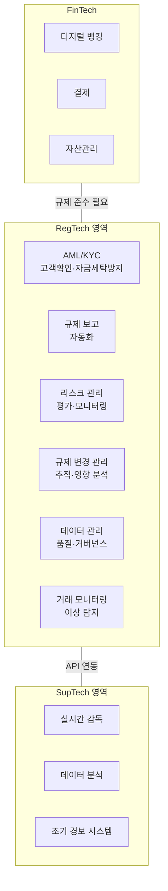

# 레그테크 (RegTech) 개요

## 정의

**레그테크(RegTech, Regulatory Technology)**는 기술을 활용하여 규제 준수(Compliance)를 자동화·효율화하는 분야로, 금융기관 및 기업이 복잡하고 빠르게 변화하는 규제 환경에 비용 효율적으로 대응할 수 있도록 지원하는 기술 솔루션의 총체이다.

## 상세 설명

2008년 글로벌 금융위기 이후 각국의 금융 규제가 대폭 강화되면서, 금융기관의 컴플라이언스 비용이 급증했다. 대형 글로벌 은행은 연간 수십억 달러를 규제 준수에 투입하며, 전체 직원의 10~15%가 컴플라이언스 업무에 종사하는 실정이다. RegTech는 이 비용 문제를 기술로 해결하려는 움직임에서 탄생했다.

RegTech의 핵심 가치는 **규제 준수의 자동화**다. 수동으로 수행하던 규제 보고, 리스크 평가, 거래 모니터링, 고객 확인 등의 업무를 AI, 클라우드, API, 빅데이터 기술로 자동화하여 비용을 절감하고 정확도를 높인다. 글로벌 RegTech 시장은 2025년 기준 약 200억 달러 규모로, 연 20% 이상의 성장률을 보이고 있다.

유사 개념으로 **SupTech(Supervisory Technology)**가 있다. RegTech가 피규제 기관(금융기관, 기업)이 사용하는 기술이라면, SupTech는 규제 기관(감독 당국)이 감독 업무에 활용하는 기술이다. 두 영역은 API를 통해 점차 연결되는 추세다.

## 핵심 키워드

| 키워드 | 설명 |
|--------|------|
| **규제 자동화** | 규제 준수 업무를 기술로 자동화하여 비용·시간 절감 |
| **컴플라이언스** | 법규·규정·내부 정책 준수 활동 전반 |
| **리스크 관리** | 규제, 운영, 신용, 시장 리스크의 식별·평가·완화 |
| **SupTech** | 감독 기관이 활용하는 규제 기술 |
| **보고 자동화** | 규제 보고서 작성·제출 프로세스의 자동화 |

## RegTech 생태계

## 핵심 포인트

!!! info "RegTech vs FinTech"
    FinTech가 금융 서비스 자체를 혁신하는 기술이라면, RegTech는 금융 서비스에 수반되는 규제 준수를 혁신하는 기술이다. FinTech의 성장은 필연적으로 RegTech 수요를 증가시킨다.

!!! tip "RegTech 도입의 ROI"
    RegTech 솔루션 도입 시 평균 30~50%의 컴플라이언스 비용 절감이 가능하다. 특히 규제 보고 자동화와 AML 모니터링 영역에서 ROI가 가장 높다.

!!! warning "RegTech의 한계"
    기술만으로 규제 준수를 완전히 대체할 수는 없다. 규제 해석, 윤리적 판단, 복잡한 사안의 의사결정은 여전히 인간의 전문성이 필요하다.

## RegTech 적용 영역

| 영역 | 주요 솔루션 | 관련 규제 |
|------|-----------|----------|
| [AML/KYC](../aml-kyc/index.md) | Chainalysis, Sumsub, Jumio | FATF, 특금법, AML 지침 |
| 규제 보고 | Ascent, AxiomSL, Regnology | Basel III, MiFID II, 금감원 보고 |
| 리스크 관리 | Ayasdi, Behavox | Basel III, IFRS 9 |
| [데이터 규제](../data-regulation/index.md) | OneTrust, TrustArc | GDPR, 개인정보보호법, CCPA |
| 거래 감시 | NICE Actimize, Behavox | MAR, MiFID II, 불공정거래 |
| 규제 변경 관리 | Ascent, CUBE | 모든 규제 영역 |

## 관련 개념

- [핵심 개념 상세](concepts.md) — RegTech vs SupTech, 규제 보고 자동화, 리스크 평가 등
- [제품 비교](products/index.md) — ComplyAdvantage, Sumsub, Chainalysis KYT 등 솔루션 비교
- [트렌드](trends.md) — AI/ML 규제 기술, 규제 샌드박스, ESG 컴플라이언스
- [AML/KYC](../aml-kyc/index.md) — RegTech의 핵심 하위 도메인
- [데이터 규제](../data-regulation/index.md) — 데이터 컴플라이언스 기술

## 실무 적용

1. **RegTech 도입 로드맵**: 현행 컴플라이언스 프로세스 분석 → 자동화 대상 선정 → 솔루션 평가·선정 → 파일럿 → 전사 확대
2. **API 중심 아키텍처**: RegTech 솔루션을 레거시 시스템과 API로 연동하는 통합 전략 수립
3. **데이터 품질 확보**: RegTech 효과는 입력 데이터 품질에 좌우되므로, 데이터 거버넌스 체계 우선 구축
4. **규제 변경 대응**: 규제 변경 관리(Regulatory Change Management) 솔루션 도입으로 선제적 대응 체계 구축
5. **SupTech 연계**: 감독 기관의 SupTech 도입에 따른 데이터 제출 표준 변화에 대비
