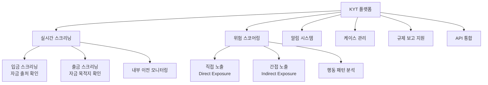
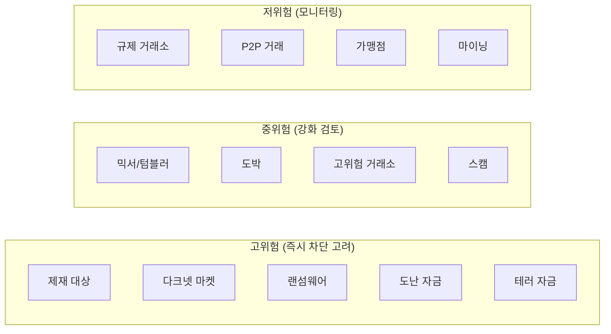
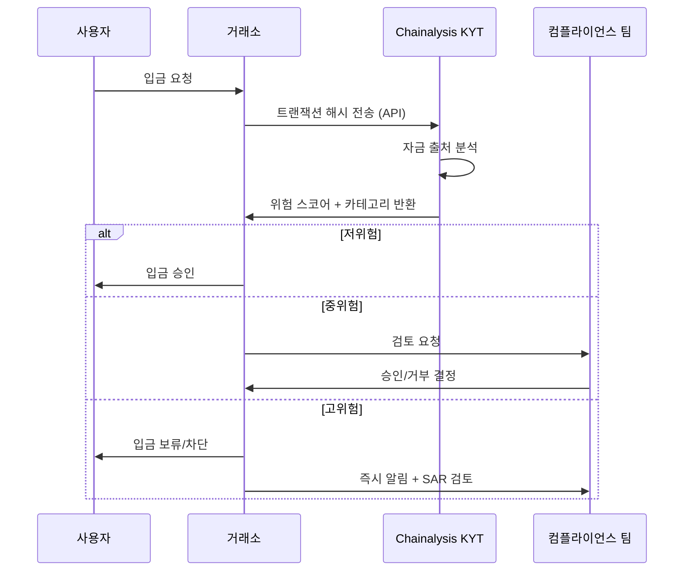

---
tags:
  - 규제
  - 레그테크
---
# Chainalysis KYT (Know Your Transaction)

## 정의

**Chainalysis KYT**는 가상자산 사업자를 위한 실시간 블록체인 트랜잭션 모니터링 솔루션으로, 거래의 위험도를 자동 평가하고 AML 규제 준수를 지원하는 RegTech 영역의 블록체인 분석 표준이다.

## 상세 설명

KYT(Know Your Transaction)는 Chainalysis가 개척한 개념으로, 전통 금융의 거래 모니터링을 블록체인 환경에 적용한 것이다. 가상자산의 특성상 거래 당사자의 신원이 즉시 확인되지 않으므로, **거래 자체의 위험도**를 평가하는 것이 핵심이다.

KYT는 Chainalysis의 방대한 블록체인 라벨링 데이터를 기반으로 작동한다. 수십억 개의 지갑 주소가 거래소, 다크넷 마켓, 믹서, 랜섬웨어, 제재 대상 등으로 분류되어 있으며, 거래 상대방이 이러한 카테고리에 해당하는지를 실시간으로 평가한다.

AML/KYC 관점에서의 Chainalysis 전체 플랫폼은 [AML/KYC 도메인](../../aml-kyc/products/chainalysis.md)에서 다루며, 이 문서에서는 **RegTech 관점에서의 KYT**, 즉 규제 준수 자동화 도구로서의 가치에 집중한다.

## 핵심 기능

### 위험 스코어링 메커니즘

KYT의 위험 스코어는 다층적으로 구성된다:

| 스코어 요소 | 설명 | 예시 |
|------------|------|------|
| **직접 노출 (Direct)** | 거래 상대방이 직접 위험 카테고리에 해당 | OFAC 제재 지갑과 직접 거래 |
| **간접 노출 (Indirect)** | 자금이 위험 카테고리를 거쳐 도달 | 믹서를 경유한 자금 수신 |
| **행동 패턴** | 거래 패턴 자체의 의심스러움 | 구조화, 레이어링 패턴 |
| **카테고리 위험도** | 상대방 카테고리의 고유 위험도 | 다크넷 > 믹서 > P2P > 거래소 |

### 위험 카테고리

### 알림 관리

- **즉시 알림**: 제재 대상, 고위험 카테고리 탐지 시 실시간 알림
- **임계값 알림**: 사전 설정 위험 점수 초과 시 자동 알림
- **패턴 알림**: 구조화, 레이어링 등 의심 패턴 탐지
- **커스텀 알림**: 기업 고유 규칙에 따른 맞춤 알림 설정

### API 통합

!!! tip "API-First 설계"
    KYT는 RESTful API를 통해 거래소·지갑 서비스의 입출금 시스템과 직접 연동된다. 입금 시 자금 출처를 자동 확인하고, 출금 시 목적지를 사전 스크리닝하여, 위험 거래를 거래 완료 전에 차단할 수 있다.

## 강점 (RegTech 관점)

- **규제 준수 자동화**: Travel Rule, STR/CTR 보고에 필요한 데이터를 자동 생성
- **감사 대비**: 모든 스크리닝 결과, 의사결정, 근거가 자동 기록되어 규제 검사 대비 완료
- **규제 기관 인정**: FATF, 각국 FIU가 Chainalysis 데이터를 신뢰하는 사실상 표준
- **크로스체인 커버리지**: 1,000+ 가상자산 지원으로 멀티체인 환경의 규제 준수 가능
- **사전 차단**: 거래 완료 전 위험 평가로 proactive 규제 준수

## 약점 (RegTech 관점)

- **법정화폐 미지원**: 전통 금융 거래 모니터링은 불가, 별도 솔루션 필요
- **KYC 기능 부재**: 고객 신원 확인은 Sumsub, Jumio 등과 별도 연동 필요
- **높은 비용**: 소규모 VASP에게는 부담, 연 $50K~$500K+
- **프라이버시 우려**: 블록체인의 익명성을 무력화한다는 커뮤니티 비판
- **DeFi 한계**: DEX, 브릿지 등 DeFi 프로토콜 분석은 아직 발전 중

## Travel Rule 대응

KYT는 FATF Travel Rule 대응의 핵심 도구다:

| Travel Rule 요소 | KYT 기능 |
|------------------|---------|
| 송신인 정보 확인 | 지갑 주소의 소유자 파악 (라벨링 데이터) |
| 수신인 정보 확인 | 목적지 지갑의 서비스 식별 |
| 위험 평가 | 거래 상대방의 AML 위험도 자동 평가 |
| 기록 보관 | 모든 Travel Rule 정보 자동 저장 |
| 보고 | STR/SAR에 필요한 증빙 자동 생성 |

## 관련 문서

- [RegTech 솔루션 비교](index.md) — 전체 비교표
- [ComplyAdvantage](complyadvantage.md) — AI 기반 AML 스크리닝 대안
- [Sumsub (RegTech)](sumsub.md) — 올인원 컴플라이언스 플랫폼
- [Chainalysis (AML/KYC)](../../aml-kyc/products/chainalysis.md) — AML/KYC 관점의 전체 분석
- [AML/KYC 트렌드](../../aml-kyc/trends.md) — 블록체인 AML 동향
