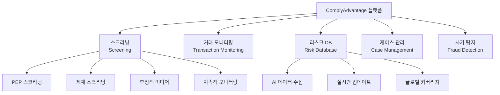

# ComplyAdvantage

## 정의

**ComplyAdvantage**는 AI 기반 금융 범죄 리스크 데이터 및 탐지 플랫폼으로, 자체 구축한 실시간 리스크 데이터베이스와 머신러닝을 활용하여 AML 스크리닝, PEP/제재 확인, 거래 모니터링을 제공하는 RegTech 선도 기업이다.

## 상세 설명

2014년 런던에서 설립된 ComplyAdvantage는 "세계 금융 범죄 데이터의 구글"을 표방한다. 전통적인 AML 데이터 제공자(Refinitiv World-Check, Dow Jones 등)가 사람이 수동으로 큐레이션한 정적 데이터베이스에 의존하는 반면, ComplyAdvantage는 AI가 수백만 개의 데이터 소스에서 실시간으로 리스크 정보를 수집·분석·분류하는 동적 접근법을 취한다.

이 접근법의 핵심 장점은 **속도와 커버리지**다. 새로운 제재 지정, PEP 변동, 부정적 뉴스가 발생하면 수분 내 데이터베이스에 반영되는 반면, 전통적 데이터베이스는 수일~수주가 걸린다. 현재 PEP, 제재, 범죄, 부정적 미디어를 포함한 수천만 건의 엔티티 프로필을 보유하고 있다.

Goldman Sachs, Barclays가 투자한 기업으로, Revolut, Stripe, Gemini, Coinbase 등 주요 핀테크와 가상자산 기업이 고객이다. 2022년 기준 기업 가치 14억 달러의 유니콘 기업이다.

## 핵심 제품

### AI 리스크 데이터베이스

ComplyAdvantage의 핵심 자산이다. 전통적 데이터베이스와의 차이:

| 항목 | ComplyAdvantage | 전통적 DB (World-Check 등) |
|------|----------------|---------------------------|
| 데이터 수집 | AI 자동 수집 | 사람 수동 큐레이션 |
| 업데이트 속도 | 수분 내 | 수일~수주 |
| 데이터 소스 | 수백만 개 (뉴스, 관보, 법원 등) | 수천~수만 개 |
| 프로필 정확도 | AI+사람 하이브리드 검증 | 사람 검증 중심 |
| 오탐률 | 상대적으로 낮음 (AI 매칭) | 상대적으로 높음 (문자열 매칭) |

### 거래 모니터링 (Transaction Monitoring)

- 규칙 기반 + AI 기반 하이브리드 탐지
- 사전 구축된 규칙 템플릿 (자금세탁, 구조화, 환치기 등)
- AI가 거래 패턴을 학습하여 오탐률 감소
- 실시간 + 배치 모니터링 지원

### 케이스 관리

- 알림(Alert)에서 케이스(Case)로 자동 에스컬레이션
- 조사관 워크플로우 자동화
- SAR/STR 보고서 자동 생성 지원
- 완전한 감사 추적(Audit Trail)

!!! info "ComplyAdvantage의 AI 파이프라인"
    NLP로 전 세계 뉴스·관보를 실시간 수집 → 엔티티 인식(NER)으로 인물·기관 식별 → 관계 분석으로 연결고리 매핑 → 리스크 분류 모델로 위험도 평가 → 데이터베이스 자동 업데이트. 이 파이프라인이 24/7 자동 운영된다.

## 강점

- **데이터 신선도**: AI 기반 실시간 업데이트로 최신 리스크 정보 반영
- **낮은 오탐률**: AI 퍼지 매칭으로 전통적 문자열 매칭 대비 오탐률 대폭 감소
- **빠른 통합**: RESTful API 중심 설계, 평균 1~2주 내 기본 통합 완료
- **핀테크 친화**: 핀테크 고객 경험 기반의 직관적 UX, 합리적 가격
- **확장성**: 월 수백만 건 스크리닝 처리 가능, 자동 스케일링

## 약점

- **신원 확인 부재**: ID Verification, 생체인증 기능 없음 (별도 KYC 솔루션 필요)
- **데이터 깊이**: 특정 지역·산업의 심층 데이터는 World-Check 대비 부족할 수 있음
- **블록체인 분석 한계**: 온체인 분석은 Chainalysis 수준에 미달
- **엔터프라이즈 레퍼런스**: 대형 은행 레퍼런스가 Refinitiv 대비 제한적
- **커스터마이징**: 대형 금융기관의 복잡한 요구사항에 대한 맞춤화 한계

## 가격 정보

| 플랜 | 스크리닝 건수 | 기능 | 예상 가격 |
|------|-------------|------|----------|
| Starter | ~5,000건/월 | 스크리닝 기본 | 월 $500~ |
| Professional | ~50,000건/월 | 스크리닝 + 모니터링 | 월 $2,000~ |
| Enterprise | 커스텀 | 전체 플랫폼 | 커스텀 견적 |

## 경쟁사 비교

| 항목 | ComplyAdvantage | Refinitiv World-Check | Dow Jones Risk & Compliance |
|------|----------------|----------------------|----------------------------|
| 데이터 방식 | AI 동적 수집 | 사람 큐레이션 | 사람 큐레이션 |
| 업데이트 속도 | 수분 | 수일 | 수일 |
| 가격 | 중~높음 | 높음 | 높음 |
| 대상 고객 | 핀테크~중견 | 대형 금융기관 | 대형 금융기관 |
| 통합 속도 | 1~2주 | 수주~수개월 | 수주~수개월 |

## 관련 문서

- [RegTech 솔루션 비교](index.md) — 전체 솔루션 비교표
- [Sumsub](sumsub.md) — 올인원 컴플라이언스 대안
- [Chainalysis KYT](chainalysis-kyt.md) — 블록체인 특화 모니터링
- [AML/KYC 개요](../../aml-kyc/index.md) — AML/KYC 기본 개념
- [AML/KYC 트렌드](../../aml-kyc/trends.md) — AI 기반 AML 동향
