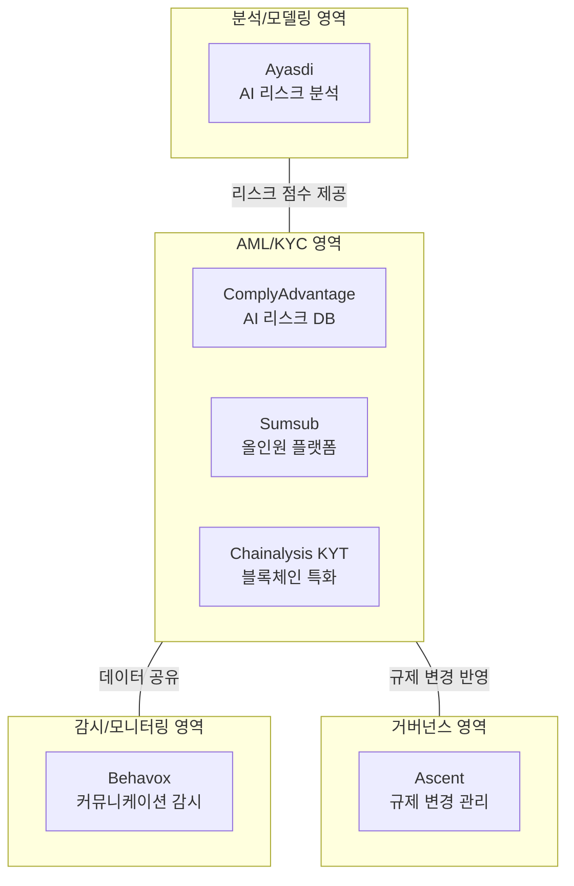

---
tags:
  - 규제
  - 레그테크
search:
  boost: 1.5
---
# RegTech 솔루션 비교

## 비교 요약

RegTech 시장의 주요 솔루션을 핵심 기능, 기술 기반, 대상 고객 기준으로 비교한다. AML/KYC 특화, 커뮤니케이션 감시, 규제 변경 관리, AI 리스크 분석 등 다양한 영역의 솔루션이 존재한다.

| 솔루션 | 핵심 영역 | AI 활용 | 주요 고객 | 글로벌 커버리지 | 가격대 |
|--------|----------|---------|----------|---------------|--------|
| **[ComplyAdvantage](complyadvantage.md)** | AI 기반 AML, 리스크 DB | ★★★★★ | 핀테크, 금융기관 | ★★★★★ | 중~높음 |
| **[Sumsub](sumsub.md)** | 올인원 KYC+AML+모니터링 | ★★★★☆ | 핀테크, 스타트업 | ★★★★★ | 중간 |
| **[Chainalysis KYT](chainalysis-kyt.md)** | 블록체인 거래 모니터링 | ★★★★☆ | 거래소, 정부 | ★★★★☆ | 높음 |
| **Behavox** | 커뮤니케이션 감시 | ★★★★★ | 투자은행, 자산운용 | ★★★★☆ | 높음 |
| **Ascent** | 규제 변경 관리 | ★★★★☆ | 금융기관 | ★★★★☆ | 높음 |
| **Ayasdi (SymphonyAI)** | AI 리스크 분석 | ★★★★★ | 대형 금융기관 | ★★★☆☆ | 높음 |

## 기능 매트릭스

| 기능 | ComplyAdvantage | Sumsub | Chainalysis KYT | Behavox | Ascent | Ayasdi |
|------|----------------|--------|-----------------|---------|--------|--------|
| KYC/신원 확인 | △ | ● | X | X | X | X |
| AML 스크리닝 | ● | ● | △ | X | X | X |
| 거래 모니터링 | ● | ● | ● | X | X | ● |
| 블록체인 분석 | △ | △ | ● | X | X | X |
| 커뮤니케이션 감시 | X | X | X | ● | X | X |
| 규제 변경 관리 | X | X | X | X | ● | X |
| 리스크 모델링 | △ | X | X | △ | X | ● |
| 규제 보고 | X | X | X | ● | ● | X |

● 핵심 기능 / △ 부분 지원 / X 미지원

## 영역별 포지셔닝

## 개별 솔루션 강점/약점

### ComplyAdvantage

- **강점**: 자체 구축 AI 리스크 DB, 실시간 PEP/제재 스크리닝, 빠른 통합 (API 중심)
- **약점**: 신원 확인(ID Verification) 기능 부재, 블록체인 분석 제한적
- **차별화**: 전통적 정적 데이터베이스 대비 AI 기반 동적 리스크 데이터

### Sumsub

- **강점**: KYC+AML+거래 모니터링 통합, 합리적 가격, 글로벌 커버리지
- **약점**: 개별 영역 전문성은 특화 솔루션 대비 부족
- **차별화**: No-code 워크플로우 빌더, 빠른 구축 (2~3일)

### Chainalysis KYT

- **강점**: 블록체인 거래 모니터링 시장 1위, 정부기관 신뢰도 최고
- **약점**: 법정화폐 거래 모니터링 불가, 높은 가격
- **차별화**: 수십억 개 라벨링된 지갑 주소, 크로스체인 추적

### Behavox

- **강점**: 100+ 커뮤니케이션 채널 감시, NLP 기반 의도 분석
- **약점**: AML/KYC 기능 없음, 높은 도입 비용
- **차별화**: 음성 분석 포함, 행동 패턴 기반 내부자 위험 탐지

### Ascent

- **강점**: AI 기반 규제 변경 자동 추적, 의무 사항 자동 매핑
- **약점**: AML/KYC, 거래 모니터링 기능 없음
- **차별화**: 규제 텍스트를 구체적 의무 사항으로 자동 분해

### Ayasdi (SymphonyAI)

- **강점**: 위상 데이터 분석(TDA) 기반 고급 리스크 모델링
- **약점**: 높은 도입 장벽, 중소기업 부적합
- **차별화**: 비지도학습 기반 이상 패턴 발견, AML 오탐률 대폭 감소

## 시나리오별 선택 가이드

!!! tip "핀테크/네오뱅크"
    **ComplyAdvantage** + **Sumsub** 조합. API 기반 빠른 통합과 KYC/AML 전체 커버리지 확보.

!!! tip "가상자산 사업자"
    **[Chainalysis KYT](chainalysis-kyt.md)** 필수 + **Sumsub**(온보딩). 블록체인 거래와 고객 확인을 모두 커버.

!!! tip "투자은행/자산운용"
    **Behavox**(커뮤니케이션 감시) + **ComplyAdvantage**(AML) + **Ascent**(규제 변경). 시장 규제 준수의 3대 축.

!!! tip "대형 글로벌 은행"
    **Ayasdi**(리스크 모델링) + **Ascent**(규제 변경) + 기존 AML 시스템 보완. 복잡한 리스크 분석과 규제 거버넌스 강화.

## 관련 문서

- [레그테크 개요](../index.md) — RegTech 전체 개요
- [핵심 개념](../concepts.md) — 규제 보고, 리스크 평가 등 개념
- [AML/KYC 솔루션 비교](../../aml-kyc/products/index.md) — AML/KYC 특화 솔루션
- [트렌드](../trends.md) — RegTech 시장 성장 트렌드
