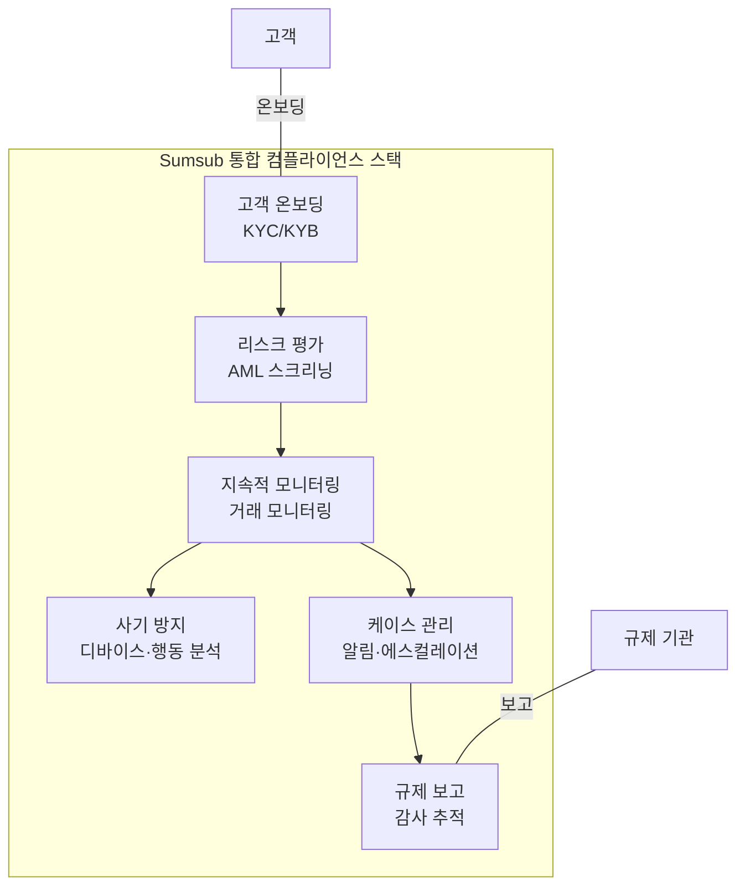

# Sumsub (RegTech 관점)

## 정의

**Sumsub**은 KYC, AML 스크리닝, 거래 모니터링, 사기 방지를 단일 플랫폼에 통합한 올인원 컴플라이언스 솔루션으로, RegTech 분야에서 "하나의 플랫폼으로 전체 컴플라이언스를 커버"하는 대표적 사례다.

## 상세 설명

Sumsub은 AML/KYC 도메인의 솔루션이자 RegTech 영역의 핵심 플레이어이기도 하다. AML/KYC 관점에서는 [고객 확인과 자금세탁 방지](../../aml-kyc/products/sumsub.md)에 초점을 맞추지만, RegTech 관점에서는 **규제 준수 자동화의 통합 플랫폼**으로서의 가치에 주목한다.

RegTech의 핵심 과제는 분절된 컴플라이언스 도구의 통합이다. 기업은 KYC에 한 벤더, AML 스크리닝에 다른 벤더, 거래 모니터링에 또 다른 벤더를 사용하면서 통합 비용, 데이터 사일로, 관리 복잡성에 시달린다. Sumsub은 이 문제를 단일 플랫폼으로 해결한다.

Sumsub의 RegTech 관점 핵심 가치:
- **벤더 통합**: 3~5개 벤더를 1개로 통합 가능
- **데이터 일관성**: 단일 데이터 소스에서 KYC, AML, 모니터링 운영
- **비용 효율**: 개별 솔루션 조합 대비 40~60% 비용 절감
- **규제 대응 속도**: No-code 빌더로 규제 변경에 즉시 대응

## 컴플라이언스 스택

## RegTech로서의 핵심 기능

### 1. 규제별 워크플로우 자동화

Sumsub은 국가별·규제별 사전 구축된 워크플로우 템플릿을 제공한다:

| 규제 | 워크플로우 | 자동화 수준 |
|------|----------|-----------|
| 한국 특금법 | VASP KYC + Travel Rule | 90% |
| EU AML 6차 지침 | EDD + 거래 모니터링 | 85% |
| FATF Travel Rule | 송수신인 정보 교환 | 95% |
| 영국 FCA | KYC + AML + 보고 | 85% |
| MAS (싱가포르) | CDD + 제재 스크리닝 | 90% |

### 2. 거래 모니터링 규칙 엔진

- **사전 정의 규칙**: 30+ 유형 (구조화, 환치기, 미러링 등)
- **커스텀 규칙**: 조건·임계값·행동을 No-code로 설정
- **AI 보강**: 규칙 기반 알림을 AI가 우선순위 정렬
- **실시간 + 배치**: 실시간 거래 스크리닝과 주기적 배치 분석 동시 지원

### 3. 감사 추적 (Audit Trail)

!!! info "완전한 감사 추적"
    모든 검증 결과, 의사결정, 규칙 변경, 사용자 행동이 타임스탬프와 함께 기록된다. 규제 검사(Regulatory Examination) 시 증빙 자료로 즉시 제출 가능한 포맷으로 내보내기를 지원한다.

## 강점 (RegTech 관점)

- **통합 효율성**: KYC → AML → 모니터링 → 보고의 전체 흐름을 단일 플랫폼에서 운영
- **규제 변경 대응**: No-code 빌더로 규제 변경 시 워크플로우를 개발자 없이 즉시 수정
- **글로벌 규제 커버리지**: 220+ 국가의 규제 요건에 대한 사전 구축 템플릿
- **TCO 절감**: 멀티 벤더 대비 총 소유 비용(TCO) 40~60% 절감
- **빠른 시장 진입**: 신규 시장 진출 시 해당 국가 템플릿 적용으로 빠른 컴플라이언스 구축

## 약점 (RegTech 관점)

- **규제 보고 한계**: 정식 규제 보고(Basel III, MiFID II 등) 기능은 전문 솔루션 대비 부족
- **리스크 모델링 한계**: 고급 리스크 분석·시뮬레이션은 Ayasdi 수준에 미달
- **커뮤니케이션 감시 없음**: 직원 커뮤니케이션 모니터링은 Behavox 등 별도 솔루션 필요
- **규제 변경 추적 한계**: 규제 변경 자동 감지·분석은 Ascent 수준에 미달
- **대형 금융기관 적합성**: 복잡한 조직 구조, 레거시 시스템 통합에 제약

## Sumsub vs 멀티 벤더 비교

| 항목 | Sumsub 단일 플랫폼 | 멀티 벤더 조합 |
|------|-------------------|---------------|
| 통합 비용 | 낮음 (1회 통합) | 높음 (벤더 수 x 통합) |
| 데이터 일관성 | 단일 소스 | 데이터 매핑 필요 |
| 유지보수 | 1개 벤더 관리 | 3~5개 벤더 관리 |
| 기능 깊이 | 중간 (범용) | 높음 (영역별 특화) |
| 규제 대응 속도 | 빠름 (No-code) | 느림 (벤더별 조율) |
| 총 비용 | 중간 | 높음 |

## 관련 문서

- [RegTech 솔루션 비교](index.md) — 전체 솔루션 비교
- [ComplyAdvantage](complyadvantage.md) — AI 기반 AML 특화 대안
- [Chainalysis KYT](chainalysis-kyt.md) — 블록체인 모니터링 보완 솔루션
- [AML/KYC Sumsub](../../aml-kyc/products/sumsub.md) — AML/KYC 관점에서의 Sumsub
- [레그테크 개요](../index.md) — RegTech 전체 개요
