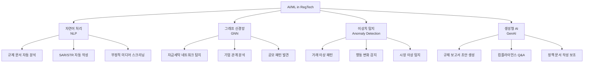
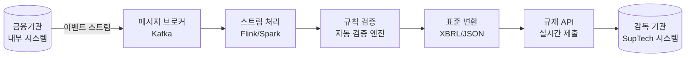
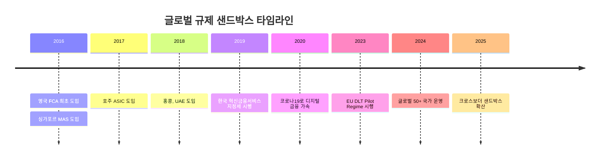
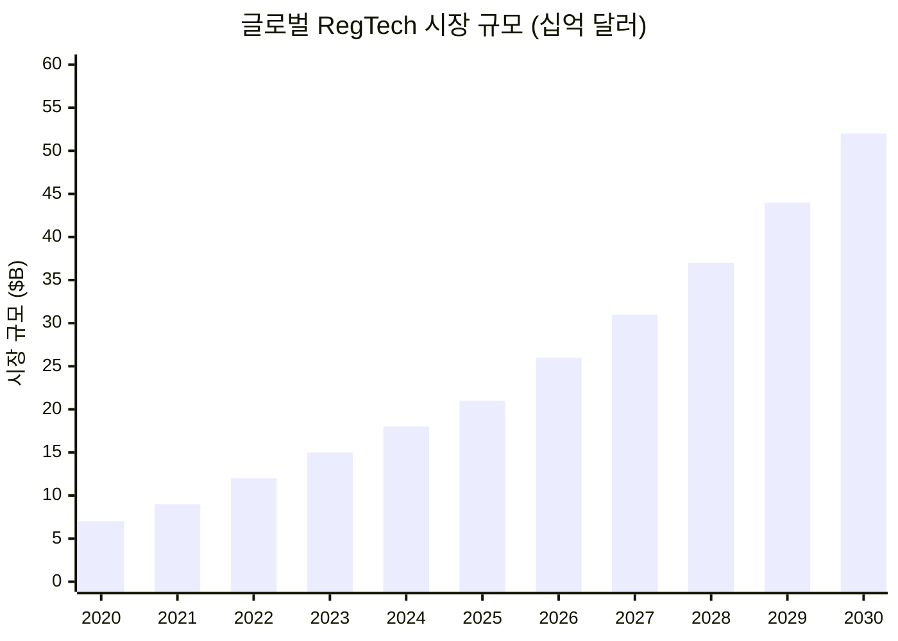

---
tags:
  - 규제
  - 레그테크
---
# 레그테크 트렌드

## 개요

RegTech 시장은 규제 복잡성 증가, AI 기술 발전, ESG 컴플라이언스 부상에 힘입어 급성장 중이다. 글로벌 RegTech 시장은 2025년 약 200억 달러에서 2030년 500억 달러 이상으로 성장할 전망이며, AI/ML 기반 솔루션, 실시간 규제 보고, 규제 샌드박스 확산이 핵심 동인이다.

---

## 1. AI/ML 규제 기술

### 현황

AI/ML은 RegTech의 모든 하위 영역에 침투하고 있다. 거래 모니터링의 오탐률 감소, 규제 문서의 자동 분석, 리스크 모델링의 정교화, 규제 보고의 자동 생성 등 전 분야에서 AI가 핵심 기술로 자리 잡았다.

### AI 적용 영역

### 생성형 AI의 RegTech 적용

| 적용 분야 | 현황 | 성숙도 |
|----------|------|--------|
| SAR/STR 초안 작성 | LLM이 알림 데이터로 보고서 초안 자동 생성 | 도입 초기 |
| 규제 Q&A 챗봇 | 컴플라이언스 담당자의 규제 해석 질문에 AI 응답 | 파일럿 |
| 정책 문서 생성 | 규제 요건을 내부 정책으로 자동 변환 | 연구 단계 |
| 규제 변경 요약 | 신규 규제의 핵심 내용과 영향을 자동 요약 | 도입 초기 |

!!! warning "AI RegTech의 규제 리스크"
    AI 자체가 규제 대상이 되고 있다. EU AI Act는 고위험 AI 시스템에 대한 적합성 평가를 요구하며, AML 의사결정에 사용되는 AI도 해당될 수 있다. RegTech AI의 설명 가능성(Explainability)과 공정성(Fairness) 확보가 필수적이다.

---

## 2. 실시간 규제 보고

### 현황

전통적인 배치 기반(월/분기/연간) 규제 보고에서 **실시간 또는 준실시간 보고**로의 전환이 가속화되고 있다. 감독 기관은 위기 상황의 조기 감지를 위해 실시간 데이터 접근을 원하며, 기술적으로도 이것이 가능해졌다.

### 실시간 보고 추진 사례

| 기관/이니셔티브 | 내용 |
|---------------|------|
| EU DRR (Digital Regulatory Reporting) | 기계 판독 가능(Machine-Readable) 규제 보고 표준 |
| MAS (싱가포르) | API 기반 실시간 규제 데이터 수집 파일럿 |
| FCA (영국) | Digital Sandbox에서 실시간 보고 테스트 |
| 한국 금감원 | 실시간 재무 건전성 모니터링 시스템 구축 |

### 기술 아키텍처

!!! info "XBRL과 규제 보고"
    XBRL(eXtensible Business Reporting Language)은 금융 보고의 글로벌 표준이다. 실시간 보고에서는 XBRL-JSON, XBRL-CSV 등 경량화된 포맷이 사용되며, API를 통한 자동 제출이 가능해지고 있다.

---

## 3. 규제 샌드박스

### 현황

**규제 샌드박스(Regulatory Sandbox)**는 혁신적인 금융 서비스·기술을 제한된 환경에서 실험할 수 있도록 규제를 유예하는 제도다. RegTech 기업과 FinTech 기업이 주요 참여자이며, 감독 기관은 혁신 기술의 규제 영향을 사전에 평가할 수 있다.

### 글로벌 현황

| 국가 | 운영 기관 | 시작 연도 | 참여 기업 수 | 특징 |
|------|----------|----------|------------|------|
| 영국 | FCA | 2016 | 200+ | 글로벌 최초, 가장 성숙 |
| 싱가포르 | MAS | 2016 | 100+ | 아시아 선도 |
| 한국 | 금융위원회 | 2019 | 300+ | 혁신금융서비스 지정 |
| 호주 | ASIC | 2017 | 50+ | Enhanced Sandbox (2020) |
| EU | EBA/ESMA | 2023 | DLT Pilot Regime | EU 차원 통합 |

!!! tip "한국 혁신금융서비스"
    한국의 규제 샌드박스(혁신금융서비스 지정제)는 최대 4년간 규제를 유예하며, 마이데이터, 오픈뱅킹, P2P 금융 등 다수의 핀테크 서비스가 이를 통해 시장에 진입했다.

---

## 4. ESG 컴플라이언스

### 현황

ESG(환경·사회·거버넌스) 규제의 급속한 강화로, ESG 컴플라이언스가 RegTech의 새로운 성장 동력으로 부상하고 있다. EU CSRD(기업 지속가능성 보고 지침), SEC 기후 공시 규칙, 한국 ESG 공시 의무화 등이 핵심 동인이다.

### ESG RegTech 영역

| 영역 | 규제 | RegTech 솔루션 |
|------|------|---------------|
| 탄소 공시 | EU CSRD, SEC Climate Rule | 탄소 배출 자동 산정·보고 |
| ESG 데이터 관리 | SFDR, EU Taxonomy | ESG 데이터 수집·검증·분류 |
| 공급망 실사 | EU CSDDD, 독일 공급망법 | 공급망 리스크 자동 모니터링 |
| 그린워싱 방지 | EU 그린 클레임 지침 | ESG 주장의 근거 검증 |

!!! info "ESG와 AML의 교차점"
    ESG 컴플라이언스는 AML과 교차하는 영역이 있다. 제재 대상국의 환경 범죄 수익 세탁, ESG 펀드를 통한 자금세탁, 탄소 크레딧 사기 등이 대표적이다. 통합적 리스크 관리가 필요해지고 있다.

---

## 5. 글로벌 RegTech 시장 성장

### 시장 규모 전망

### 성장 동인

| 동인 | 영향도 | 설명 |
|------|--------|------|
| 규제 복잡성 증가 | ★★★★★ | 글로벌 규제 수 연간 10%+ 증가 |
| AI/ML 기술 발전 | ★★★★★ | 자동화 범위 확대, 비용 절감 |
| 디지털 전환 가속 | ★★★★☆ | 클라우드·API 기반 솔루션 도입 용이 |
| ESG 규제 강화 | ★★★★☆ | 새로운 컴플라이언스 수요 창출 |
| 가상자산 규제 | ★★★★☆ | VASP 규제에 따른 신규 시장 |
| 과징금 상향 | ★★★☆☆ | 규제 위반 비용 증가로 솔루션 수요 증가 |

### 지역별 시장

| 지역 | 점유율 | 성장 동인 |
|------|--------|----------|
| 북미 | ~40% | FinTech 생태계, 주법 확산 |
| 유럽 | ~30% | GDPR, AML, ESG 규제 선도 |
| 아태 | ~20% | 디지털 금융 성장, 가상자산 허브 |
| 기타 | ~10% | 신흥국 금융 포용 확대 |

---

## 실무 시사점

1. **AI 우선 전략**: 신규 RegTech 도입 시 AI/ML 기반 솔루션을 우선 평가. 오탐률 감소, 자동화율 향상이 ROI의 핵심
2. **실시간 대비**: 실시간 규제 보고 요건에 대비하여 데이터 파이프라인과 API 인프라를 사전 구축
3. **ESG 통합**: ESG 컴플라이언스를 기존 AML/금융 규제 컴플라이언스 프레임워크에 통합 설계
4. **샌드박스 활용**: 혁신적 컴플라이언스 접근법을 규제 샌드박스에서 사전 검증 후 본격 도입
5. **생성형 AI 파일럿**: SAR 자동 생성, 규제 Q&A 등 생성형 AI 적용 가능 영역에서 파일럿 시작

## 관련 문서

- [레그테크 개요](index.md) — RegTech 전체 개요
- [핵심 개념](concepts.md) — 규제 보고, 리스크 평가, API 기반 컴플라이언스
- [제품 비교](products/index.md) — RegTech 솔루션 비교
- [AML/KYC 트렌드](../aml-kyc/trends.md) — AI 기반 AML 모니터링
- [데이터 규제 트렌드](../data-regulation/trends.md) — AI와 개인정보, 글로벌 규제 수렴
