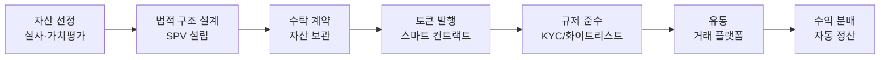
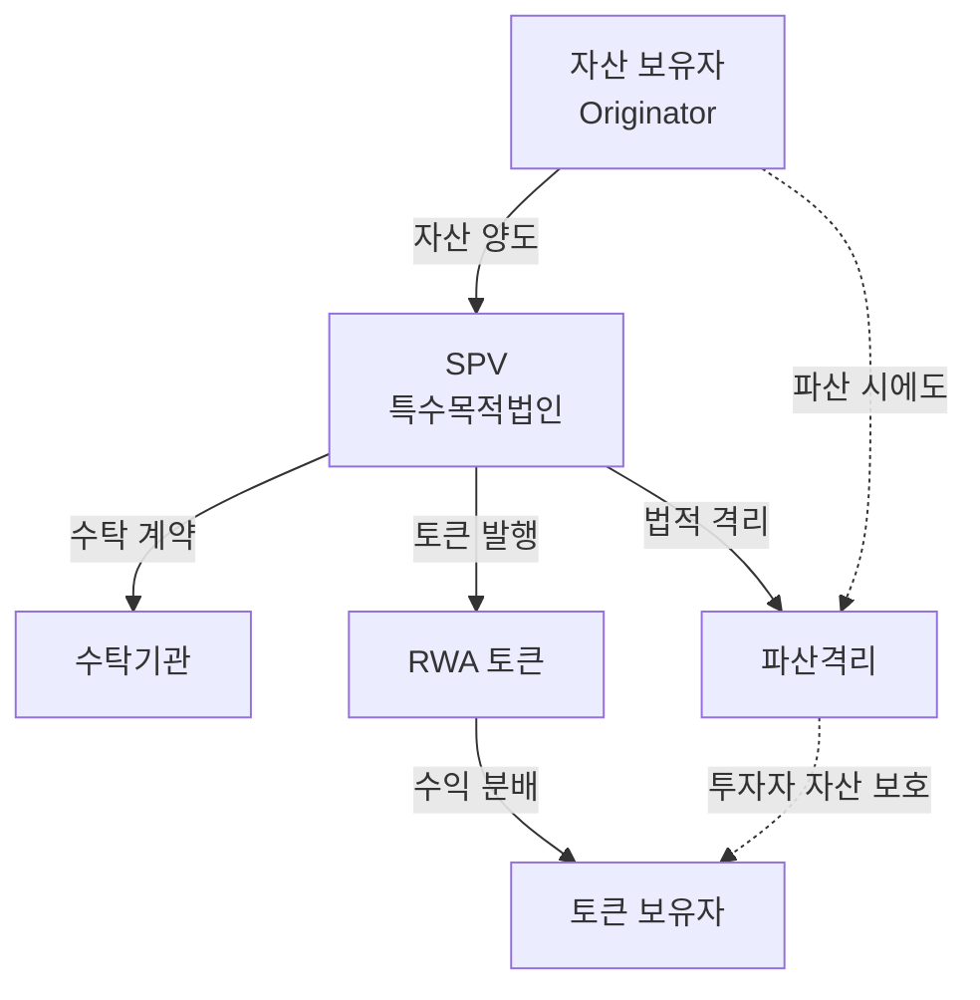
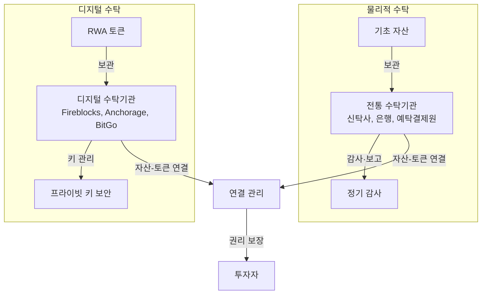
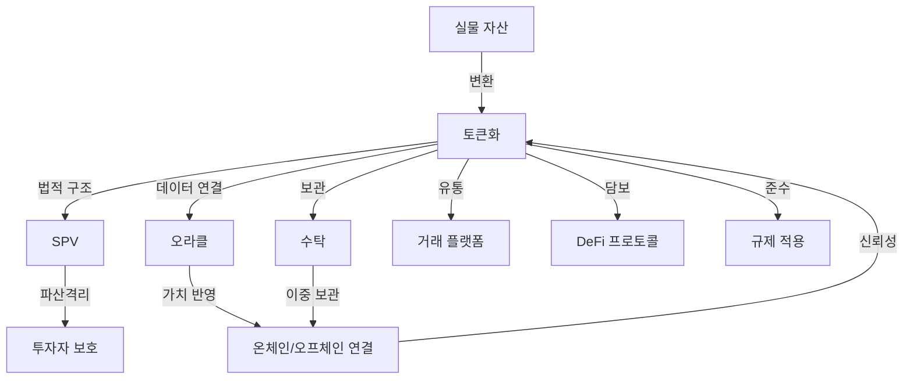

---
tags:
  - 디지털자산
  - RWA
  - 토큰화
---
# RWA 핵심 개념

실물자산 토큰화 생태계를 구성하는 핵심 개념을 체계적으로 정리한다. 법적 구조, 기술 인프라, 자산 특성이 긴밀하게 얽혀 있으며, 각 개념의 상호 관계를 이해하는 것이 중요하다.

---

## 토큰화 (Tokenization)

**토큰화**는 실물 자산의 소유권·수익권을 블록체인상의 디지털 토큰으로 변환하는 과정이다. 단순한 디지털화가 아니라, 법적 권리와 기술적 표현을 연결하는 복합적 프로세스다.

토큰화의 핵심 가치는 **프로그래머블 소유권(Programmable Ownership)**이다. 배당 분배, 의결권 행사, 양도 제한 등 자산 권리를 스마트 컨트랙트로 자동화할 수 있으며, 이를 통해 중개 비용 절감, 24/7 거래, 분할소유가 가능해진다.

| 구분 | 전통 자산 관리 | 토큰화 자산 |
|------|-------------|-----------|
| 소유권 기록 | 등기소, 예탁기관 | 블록체인 원장 |
| 거래 시간 | 영업일 한정 | 24/7 |
| 정산 | T+2 (2영업일) | T+0 (즉시) 또는 T+1 |
| 최소 투자 | 수백만~수억 원 | 수천 원~ |
| 배당 분배 | 수동, 수일 소요 | 스마트 컨트랙트 자동 |
| 규제 준수 | 인력 기반 확인 | 코드 기반 자동화 |

---

## SPV (Special Purpose Vehicle)

**SPV(특수목적법인)**는 RWA 토큰화에서 기초 자산을 법적으로 격리하는 핵심 구조다. 자산 보유자(Originator)의 파산 위험으로부터 투자자를 보호하는 **파산격리(Bankruptcy Remoteness)** 기능을 제공한다.

토큰화 과정에서 SPV는 (1) 원래 자산 보유자로부터 자산을 양수받고, (2) 해당 자산을 기반으로 토큰을 발행하며, (3) 토큰 보유자에게 자산의 수익을 분배하는 역할을 한다.

| SPV 구조 유형 | 관할 | 특징 |
|-------------|------|------|
| Delaware LLC | 미국 | 가장 보편적, 유연한 구조 |
| Cayman Islands SPV | 케이맨 | 역외 구조, 세제 혜택 |
| Singapore VCC | 싱가포르 | 변동자본회사, 펀드 친화적 |
| Luxembourg SV | 룩셈부르크 | 유럽 기관 선호, 증권화 전문 |

!!! warning "법적 리스크"
    SPV 구조가 관할권별 법률에 부합하지 않으면 토큰 보유자의 권리가 보장되지 않을 수 있다. 특히 크로스보더 토큰화에서 어느 관할권의 법이 적용되는지가 핵심 법적 리스크다.

---

## 온체인/오프체인 자산 연결

RWA 토큰화의 근본적 과제는 **오프체인의 물리적 자산과 온체인의 디지털 토큰 사이에 신뢰할 수 있는 연결(linkage)**을 유지하는 것이다. 부동산이 멸실되거나, 채무자가 디폴트하거나, 담보 자산의 가치가 변동할 때 토큰이 이를 정확히 반영해야 한다.

| 접근 방식 | 설명 | 장점 | 단점 | 대표 사례 |
|----------|------|------|------|----------|
| **네이티브 온체인** | 자산 자체가 온체인에서 생성 | 완전한 투명성 | 실물 자산 불가 | 스테이블코인, 온체인 채권 |
| **미러링** | 오프체인 원장이 법적 권위, 블록체인은 복제 | 기존 법체계 호환 | 원장 불일치 리스크 | 한국 STO, 대부분 초기 구현 |
| **하이브리드** | 블록체인 원장을 법적으로 인정하되 오프체인 백업 | 균형적 | 복잡한 구조 | 스위스 DLT법, 싱가포르 |

!!! info "연결 실패 리스크"
    온체인/오프체인 연결이 끊어지면 토큰 가격이 기초 자산 가치와 괴리될 수 있다. 이를 "디페깅(de-pegging)" 리스크라 하며, 정기적인 감사(audit)와 오라클 피드로 완화한다.

---

## 오라클 (Oracle)

**오라클**은 실물 자산의 가격, NAV(순자산가치), 이자율, 상환 상태 등 오프체인 데이터를 블록체인에 전달하는 인프라다. DeFi에서 암호자산 가격 피드에 사용되는 오라클과 동일한 원리이나, RWA에서는 더 복잡한 데이터 유형과 더 높은 신뢰 요건이 필요하다.

| 데이터 유형 | 설명 | 갱신 주기 |
|-----------|------|----------|
| NAV 피드 | 펀드·채권 순자산가치 | 일별~주별 |
| 자산 가치 평가 | 부동산·미술품 감정가 | 월별~분기별 |
| 이자율·수익률 | 국채 수익률, 대출 이자 | 실시간~일별 |
| 상환·디폴트 상태 | 대출 상환 여부 | 이벤트 기반 |
| 보험·보관 상태 | 물리적 자산 상태 | 이벤트 기반 |

**주요 RWA 오라클 제공자**:

- **Chainlink (CCIP + Proof of Reserve)** — 가장 넓은 커버리지, 크로스체인 지원
- **Chronicle** — MakerDAO에서 분리 독립, RWA 특화
- **API3** — 퍼스트파티 오라클, 데이터 제공자 직접 연결
- **기관 전용 오라클** — BlackRock BUIDL 등은 자체 NAV 피드 구축

!!! tip "DeFi 오라클과의 차이"
    DeFi 가격 오라클은 초 단위 갱신과 탈중앙화에 집중하지만, RWA 오라클은 **법적 신뢰성(감사 가능한 데이터 출처)**과 **정확성**이 더 중요하다. 부동산 감정가를 초 단위로 갱신하는 것은 불필요하지만, 출처의 신뢰성은 반드시 검증되어야 한다.

---

## 수탁 (Custody)

RWA 토큰화에서 **수탁**은 이중 구조를 갖는다. 기초 자산의 물리적/법적 보관과 토큰의 디지털 보관을 동시에 관리해야 하며, 양쪽의 연결이 끊어지면 토큰의 가치가 보장되지 않는다.

| 수탁 유형 | 역할 | 주요 기관 |
|----------|------|----------|
| 물리적 수탁 | 기초 자산 보관·관리 | 신탁사, 은행, 예탁결제원 |
| 디지털 수탁 | 토큰 프라이빗 키 보관 | Fireblocks, Anchorage, BitGo |
| 통합 수탁 | 물리+디지털 일원화 | Securitize, Komainu |

자세한 수탁 메커니즘은 [STO 수탁 개념](../sto/concepts.md)을 참고하라.

---

## 자산 클래스별 토큰화 특성

각 자산 클래스는 유동성, 규제 복잡도, 가치 평가 난이도가 다르므로 토큰화 접근 방식이 달라진다.

| 자산 클래스 | 유동성 | 규제 복잡도 | 가치 평가 | 시장 규모 | 대표 플랫폼 |
|------------|--------|-----------|----------|----------|-----------|
| 국채·MMF | 높음 | 낮음 | 명확 (시장가) | $60B+ | Ondo, BUIDL, Franklin |
| 사모신용 | 중간 | 중간 | 모델 기반 | $15B+ | Maple, Centrifuge |
| 부동산 | 낮음 | 높음 | 감정 기반 | $10B+ | RealT, 카사 |
| 비상장 주식 | 낮음 | 높음 | 밸류에이션 | $5B+ | Securitize |
| 원자재 | 높음 | 중간 | 시장가 | $3B+ | Paxos Gold |
| 미술품 | 매우 낮음 | 중간 | 감정 의존 | $2B+ | Masterworks |
| IP·로열티 | 낮음 | 높음 | 현금흐름 모델 | 초기 | Royal |

!!! info "국채 토큰화가 선행하는 이유"
    국채는 (1) 가치 평가가 명확하고, (2) 규제 복잡도가 상대적으로 낮으며, (3) 기관 수요가 크고, (4) 높은 유동성을 갖추고 있어 토큰화의 첫 대규모 시장이 되었다. 반면 부동산·미술품은 감정, 보관, 보험 등 추가 인프라가 필요하여 성장이 느리다.

---

## 규제 적용

RWA 토큰의 법적 성격은 관할권마다 다르게 판단되며, 이는 발행·유통·투자자 보호의 모든 측면에 영향을 미친다.

| 관할권 | 규제 접근 | 주요 법령 | RWA 특이사항 |
|--------|---------|----------|-------------|
| **미국** | 기존 증권법 적용 | Securities Act, Howey Test | 대부분 RWA 토큰은 증권으로 분류 |
| **유럽** | MiCA + DLT Pilot Regime | MiCA, MiFID II | DLT Pilot로 토큰화 증권 거래 실험 |
| **한국** | 자본시장법 개정 추진 | 토큰증권 가이드라인 | 조각투자법 제정 논의 중 |
| **싱가포르** | 유연한 규제 + 실험 | MAS Project Guardian | 기관 RWA 토큰화 허브 지향 |
| **스위스** | DLT법으로 명시적 인정 | DLT법 (2021) | 토큰화 증권에 법적 확실성 부여 |

!!! warning "증권성 판단의 중요성"
    RWA 토큰이 증권으로 분류되면 발행 등록, 공시 의무, 유통 제한 등 증권법 규제가 적용된다. 반대로 비증권으로 분류되면 규제가 완화되지만 투자자 보호가 약해진다. 관할별 규제 차이는 [가상자산 규제](../crypto-regulation/index.md)와 [STO 핵심 개념](../sto/concepts.md)을 참고하라.

---

## 개념 간 관계

## 관련 문서

- [RWA 개요](index.md)
- [주요 플랫폼 비교](products/index.md)
- [시장 트렌드](trends.md)
