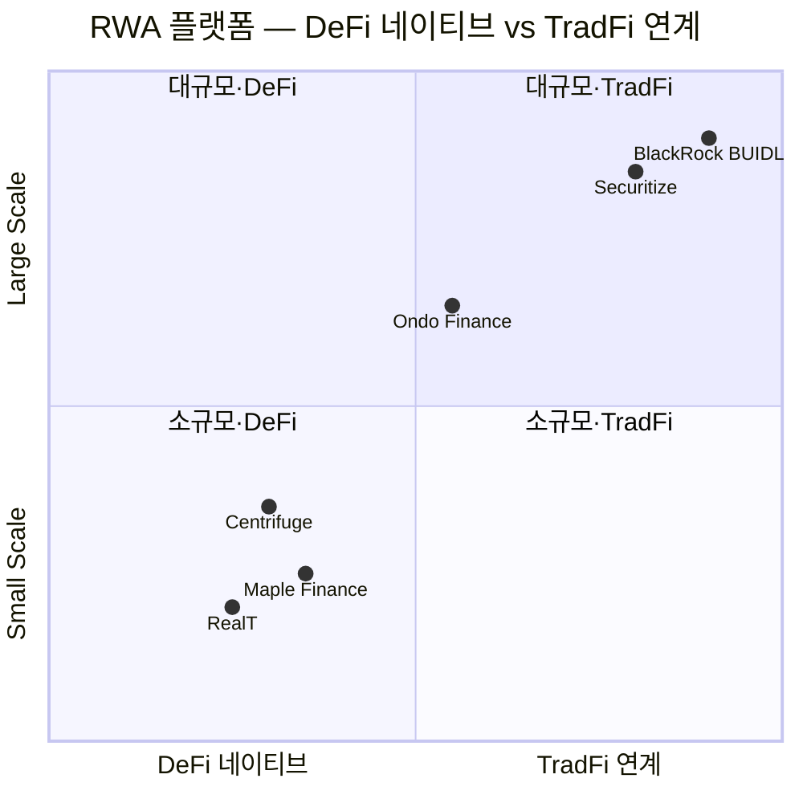
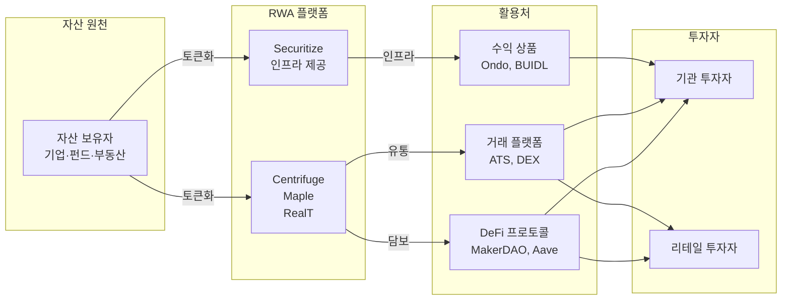

---
tags:
  - 디지털자산
  - RWA
  - 토큰화
search:
  boost: 1.5
---
# 주요 RWA 플랫폼 비교

글로벌 RWA 토큰화 생태계를 이끄는 주요 플랫폼을 비교 분석한다. DeFi 네이티브 프로토콜부터 기관급 인프라까지, 다양한 포지션의 플랫폼을 다룬다.

---

## 비교 요약

| 항목 | Centrifuge | Ondo Finance | Maple Finance | RealT | Securitize | BlackRock BUIDL |
|------|-----------|-------------|--------------|-------|-----------|----------------|
| **국가** | 미국/독일 | 미국 | 미국/호주 | 미국 | 미국 | 미국 |
| **설립** | 2017 | 2021 | 2019 | 2019 | 2017 | 2024 (펀드 출시) |
| **핵심 역할** | 구조화 신용 토큰화 | 국채 수익 토큰 | 기관 신용 대출 | 부동산 분할소유 | 발행+유통+수탁 풀스택 | 토큰화 MMF |
| **대상 자산** | 무역금융, 인보이스, 부동산대출 | 미국 국채, MMF | 기업 대출, 무역금융 | 주거용 부동산 | 펀드, 채권, 주식 | 미국 국채 |
| **블록체인** | Ethereum, Centrifuge Chain | Ethereum, Solana | Ethereum, Solana, Base | Ethereum (Gnosis) | Ethereum, Avalanche, Polygon | Ethereum |
| **TVL/AUM** | ~$250M | ~$600M+ | ~$100M | ~$100M | ~$2B+ | ~$500M+ |
| **규제 상태** | DeFi 프로토콜 | SEC Reg D 등록 | DeFi 프로토콜 | SEC Reg D | SEC Transfer Agent, ATS | SEC 등록 펀드 |
| **차별화** | DeFi 최초 RWA 브릿지 | 국채 수익 온체인화 선도 | 기관 언더라이팅 | 리테일 부동산 접근 | BlackRock 파트너 | 세계 최대 자산운용사 |

!!! info "Securitize 참고"
    Securitize는 [STO 도메인](../../sto/products/securitize.md)에서 토큰증권 플랫폼으로 상세히 다루고 있다. 여기서는 RWA 토큰화 인프라로서의 역할에 초점을 맞춘다.

---

## 포지셔닝 맵

---

## 개별 플랫폼 요약

### Centrifuge

RWA를 DeFi에 연결한 최초의 프로토콜로, 실물 자산(무역금융, 인보이스, 부동산 대출)을 토큰화하여 DeFi 렌딩 풀에 공급한다. MakerDAO의 RWA 담보 도입에 핵심 역할을 했으며, 자체 체인(Centrifuge Chain)과 Ethereum을 연결하는 구조를 운영한다.

**강점**: DeFi-RWA 브릿지 선구자, MakerDAO 파트너십 실적, 다양한 자산 유형 지원
**약점**: TVL 성장 정체, 복잡한 구조(자체 체인 + Ethereum), 신용 리스크 관리 과제

### Ondo Finance

미국 국채 수익을 온체인으로 가져오는 데 특화된 플랫폼이다. USDY(수익형 스테이블코인)와 OUSG(온체인 미국 국채 펀드)를 통해 DeFi 사용자에게 국채 수익률을 제공한다. 2024~2025년 가장 빠르게 성장한 RWA 프로토콜 중 하나다.

**강점**: 국채 수익 토큰 시장 선도, 멀티체인 배포(Ethereum, Solana), 명확한 규제 구조
**약점**: 미국 국채에 집중(자산 다변화 제한), 기관 투자자 중심(리테일 접근 제한적)

### Maple Finance

기관급 신용 대출을 토큰화하는 프로토콜이다. 기업 대출, 무역금융 등을 온체인 렌딩 풀로 구성하며, 전문 언더라이터(Pool Delegate)가 신용 평가를 수행하는 구조다. 2022년 FTX/Alameda 사태로 부실이 발생했으나 이후 리스크 관리를 강화하여 재건했다.

**강점**: 기관 신용 대출 전문성, 체계적 언더라이팅, 높은 수익률
**약점**: 과거 디폴트 이력(신뢰 회복 과정), 규모 대비 높은 집중 리스크

### RealT

미국 주거용 부동산을 토큰화하여 소액 분할소유를 제공하는 플랫폼이다. 개별 부동산을 LLC로 감싸고 토큰을 발행하여, 토큰 보유자가 임대 수익을 자동으로 받는 구조다. SEC Reg D로 등록하여 미국 적격투자자 대상으로 운영한다.

**강점**: 부동산 분할소유의 실질적 구현, 임대 수익 자동 분배, 2차 거래 가능
**약점**: 미국 적격투자자 한정, 부동산 유지관리 리스크, 유동성 제한

### Securitize

SEC에 Transfer Agent로 등록된 풀스택 토큰증권 플랫폼으로, BlackRock BUIDL 펀드의 기술 파트너다. 발행·유통·수탁을 원스톱으로 제공하며, 기관급 RWA 토큰화의 사실상 표준이 되고 있다. RWA 관점에서는 대형 기관이 토큰화를 실행할 때 선택하는 핵심 인프라다.

**강점**: SEC 등록 인프라, BlackRock·KKR 등 기관 실적, 멀티체인 지원
**약점**: 높은 서비스 비용, 기관 중심(소규모 발행자 접근 제한)

→ [Securitize 상세 (STO 도메인)](../../sto/products/securitize.md)

### BlackRock BUIDL

BlackRock이 Securitize와 협력하여 Ethereum에서 출시한 토큰화 미국 국채 MMF(머니마켓 펀드)다. 세계 최대 자산운용사($10T+ AUM)의 온체인 진출이라는 점에서 RWA 시장의 상징적 전환점이다.

**강점**: BlackRock 브랜드·인프라, 기관 신뢰도, 규제 준수 완비
**약점**: 기관 적격투자자 전용(최소 $5M), Ethereum 단일 체인, DeFi 활용 제한적

---

## 시나리오별 선택 가이드

| 시나리오 | 추천 플랫폼 | 이유 |
|---------|-----------|------|
| 국채 수익을 온체인에서 접근 | Ondo Finance, BUIDL | 국채 토큰 시장 선도, 검증된 수익률 |
| DeFi 프로토콜에 RWA 담보 도입 | Centrifuge | DeFi-RWA 브릿지 전문, MakerDAO 실적 |
| 부동산 분할투자 | RealT | 실물 부동산 토큰화 실적, 임대 수익 자동화 |
| 기관급 대형 토큰화 인프라 | Securitize, BUIDL | SEC 등록, 기관 실적, 풀스택 인프라 |
| 사모신용·기업대출 토큰화 | Maple Finance | 기관 언더라이팅, 신용 대출 전문 |
| 한국 시장 조각투자 | [한국 STO 플랫폼](../../sto/products/korea-sto.md) | 국내 규제 적합, 원화 결제 |

---

## 밸류체인 내 위치

## 관련 문서

- [RWA 개요](../index.md) | [핵심 개념](../concepts.md)
- [시장 트렌드](../trends.md)
- [STO 플랫폼 비교](../../sto/products/index.md)
