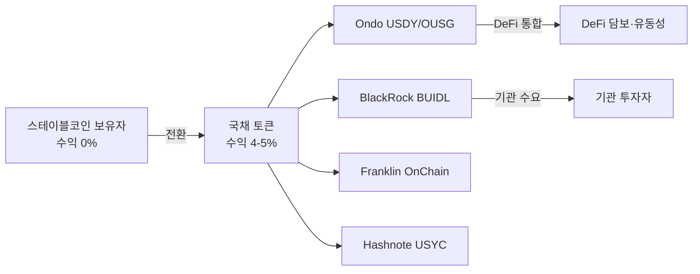
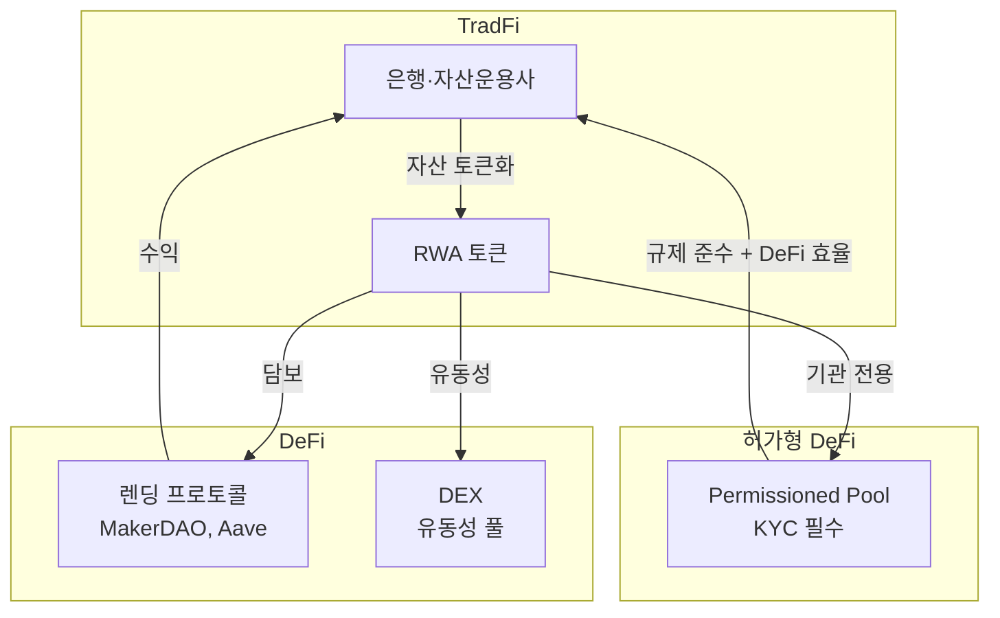
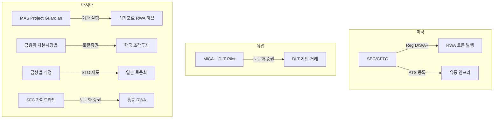
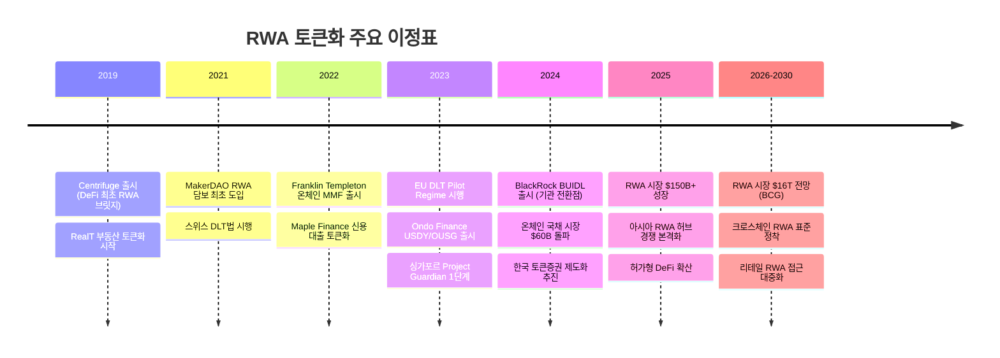

---
tags:
  - 디지털자산
  - RWA
  - 토큰화
---
# RWA 시장 트렌드

실물자산 토큰화 시장을 형성하는 5가지 핵심 트렌드를 분석한다. 국채 토큰화의 폭발적 성장, 기관 투자자의 본격 진입, DeFi와 TradFi의 수렴이 시장의 방향을 결정하고 있다.

---

## 1. 국채/MMF 토큰화 붐

미국 국채(T-Bill) 토큰화는 RWA 시장 성장의 핵심 동력이다. 2023년 초 수억 달러 수준이던 온체인 국채 시장은 2025년 **$60B 이상**으로 폭발적으로 성장했다. 고금리 환경에서 스테이블코인 보유자가 "보유만으로 수익"을 얻을 수 있는 대안을 찾으면서, 국채 수익의 온체인화가 킬러 유스케이스로 부상했다.

| 국채 토큰 상품 | 운용사 | AUM | 블록체인 | 특징 |
|-------------|--------|-----|---------|------|
| BUIDL | BlackRock (via Securitize) | $500M+ | Ethereum | 기관 전용, 최소 $5M |
| USDY | Ondo Finance | $300M+ | Ethereum, Solana | 수익형 스테이블코인 대안 |
| OUSG | Ondo Finance | $200M+ | Ethereum | 단기 국채 ETF 토큰 |
| OnChain Fund | Franklin Templeton | $400M+ | Stellar, Polygon | 최초 온체인 뮤추얼 펀드 |
| USYC | Hashnote | $200M+ | Ethereum | 기관급 수익 토큰 |

!!! tip "왜 국채인가"
    국채는 (1) 가치 변동이 작고, (2) 규제가 명확하며, (3) 가격 평가가 투명하고, (4) 기관 수요가 큰 자산이다. 이 특성이 토큰화의 "안전한 첫 단계"로 작용하여, 더 복잡한 자산 클래스의 토큰화를 위한 인프라와 규제 선례를 만들고 있다.

---

## 2. 기관 투자자의 본격 참여

2024~2025년은 글로벌 금융기관이 RWA 토큰화에 **직접 참여**한 전환점이다. 이전까지 관망 또는 연구 단계에 머물던 기관들이 실제 상품을 출시하고 인프라를 구축하기 시작했다.

| 기관 | 참여 내용 | AUM/규모 | 의미 |
|------|----------|---------|------|
| **BlackRock** | BUIDL 토큰화 MMF | $500M+ | 세계 최대 자산운용사의 온체인 진출 |
| **JPMorgan** | Onyx 플랫폼, 토큰화 레포 | $100B+ 처리 | IB 인프라의 토큰화 전환 |
| **Goldman Sachs** | GS DAP (Digital Asset Platform) | 기관 전용 | 대형 IB 자체 토큰화 플랫폼 |
| **Franklin Templeton** | OnChain US Govt Money Fund | $400M+ | 최초 온체인 뮤추얼 펀드 |
| **KKR** | Health Care fund on Avalanche | PE 펀드 | PE 펀드의 토큰화 선례 |
| **Citi** | 토큰화 예금, 크로스보더 연구 | 파일럿 | 대형 은행의 예금 토큰화 |
| **HSBC** | Orion 플랫폼 (금 토큰화) | 파일럿 | 원자재 토큰화 |
| **UBS** | 토큰화 변동금리 채권 | $50M+ | 스위스 DLT 인프라 활용 |

!!! info "기관 진입의 파급 효과"
    기관 투자자의 참여는 (1) 규제 기관에 대한 신뢰 시그널, (2) 인프라 표준화 촉진, (3) 리테일 투자자 신뢰도 향상, (4) 유동성 확대 등 생태계 전반에 선순환을 만든다. 자세한 내용은 [STO 기관 투자자 유입](../sto/trends.md)을 참고하라.

---

## 3. DeFi-TradFi 수렴

RWA 토큰화는 **전통 금융(TradFi)과 탈중앙 금융(DeFi)의 경계를 허무는** 핵심 매개체다. DeFi 프로토콜이 RWA를 담보로 채택하고, TradFi 기관이 DeFi 인프라를 활용하면서 양쪽이 수렴하고 있다.

**주요 DeFi-RWA 통합 사례**:

| 프로토콜 | RWA 활용 | 규모 |
|---------|---------|------|
| [MakerDAO](../defi/products/makerdao.md) | 미국 국채 RWA를 DAI 담보로 편입 | $1B+ |
| [Aave](../defi/products/aave.md) | RWA 담보 렌딩 시장 (Aave Arc) | 기관 파일럿 |
| Centrifuge | 실물 자산 → DeFi 렌딩 브릿지 | $250M |
| Ondo Finance | 국채 토큰 → DeFi 유동성 | $600M+ |
| Flux Finance | Ondo OUSG 담보 대출 | $50M+ |

!!! warning "허가형 DeFi의 부상"
    기관 투자자는 KYC/AML 없는 비허가(permissionless) DeFi에 참여할 수 없다. 이에 따라 **허가형 DeFi(Permissioned DeFi)** — KYC를 통과한 참가자만 접근 가능한 온체인 풀 — 가 새로운 중간 형태로 부상하고 있다. Aave Arc, Maple의 기관 풀, Securitize의 DeFi 통합이 대표적이다.

---

## 4. 신흥 자산 클래스 확대

국채와 부동산을 넘어, 새로운 자산 클래스의 토큰화가 확대되고 있다.

### 탄소크레딧 (Carbon Credits)

자발적 탄소 시장(VCM)의 탄소크레딧을 토큰화하여 투명한 거래와 은퇴(retirement)를 가능하게 한다. Toucan Protocol, KlimaDAO 등이 선도하며, ESG 투자와의 연계가 성장 동력이다.

### IP·로열티 (Intellectual Property & Royalties)

음악 스트리밍 수익, 특허 로열티, 콘텐츠 저작권 수익을 토큰화하여 분할소유한다. Royal(음악), Anotherblock(음악), IPwe(특허) 등이 시장을 개척 중이다.

### 공급망 금융 (Supply Chain Finance)

무역금융의 인보이스, 매출채권을 토큰화하여 DeFi 렌딩에 연결한다. Centrifuge, Goldfinch가 개발도상국 소규모 기업의 자금조달에 활용되는 사례가 늘고 있다.

### 사모펀드 (Private Equity)

KKR, Hamilton Lane 등 대형 PE 운용사가 펀드 지분을 토큰화하여 유동성과 접근성을 개선하고 있다. 최소 투자금 인하($100K → $10K)와 2차 거래 가능성이 핵심 가치다.

---

## 5. 규제 프레임워크 정비

주요국이 RWA 토큰화에 대한 규제 프레임워크를 정비하면서 시장 불확실성이 감소하고 있다.

| 규제 이니셔티브 | 관할 | 상태 | RWA 영향 |
|-------------|------|------|---------|
| DLT Pilot Regime | EU | 시행 중 (2023~) | 토큰화 증권 거래소 실험 허용 |
| Project Guardian | 싱가포르 | 2단계 진행 | 기관 RWA 토큰화 표준 도출 |
| 자본시장법 개정 | 한국 | 추진 중 | 토큰증권 법적 근거 마련 |
| Tokenized Securities Framework | 홍콩 | 가이드라인 발표 | 아시아 RWA 허브 경쟁 |
| DLT법 | 스위스 | 시행 중 (2021~) | 토큰화 자산에 법적 확실성 부여 |

!!! info "규제 경쟁"
    싱가포르, 홍콩, 스위스, 영국이 RWA 토큰화 허브가 되기 위해 규제 경쟁을 벌이고 있다. 유연하고 명확한 규제를 먼저 구축하는 관할권이 기관 자본과 기술 인재를 유치할 것이다.

---

## 향후 전망

1. **국채·MMF가 킬러 유스케이스로 고착**: 온체인 국채 시장 $100B+ 돌파 전망, 스테이블코인과의 경계가 모호해질 것
2. **크로스체인 RWA 상호운용성**: Chainlink CCIP, LayerZero 등을 통해 RWA 토큰이 멀티체인에서 자유롭게 이동하는 구조 정착
3. **AI 기반 자산 가치 평가**: 부동산, 미술품 등 비유동 자산의 가치 평가에 AI 모델 활용 확대
4. **리테일 RWA 접근 확대**: 규제 정비와 함께 일반 투자자의 RWA 토큰 접근이 확대, 한국 조각투자 시장 본격 성장
5. **아시아 RWA 허브 경쟁**: 싱가포르, 홍콩, 한국, 일본 간 규제 경쟁력·인프라 구축 경쟁 가속
6. **RWA 네이티브 스테이블코인**: 국채 수익 기반 스테이블코인(Ondo USDY 류)이 기존 스테이블코인의 대안으로 성장
7. **DeFi-TradFi 경계 소멸**: 허가형 DeFi의 확산으로 기관과 DeFi의 상호 침투 가속

## 타임라인

## 관련 문서

- [RWA 개요](index.md) | [핵심 개념](concepts.md)
- [주요 플랫폼 비교](products/index.md)
- [STO 트렌드](../sto/trends.md) | [DeFi 트렌드](../defi/trends.md)
