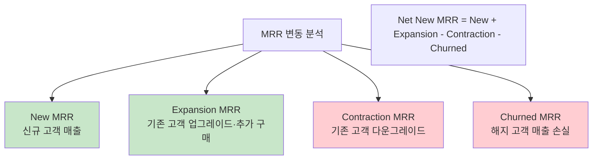
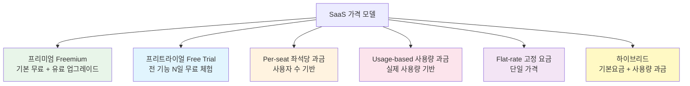
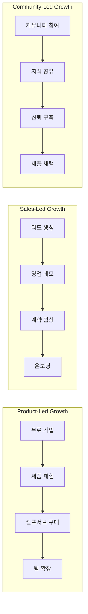

---
tags:
  - 비즈니스모델
  - SaaS
---
# SaaS 비즈니스 모델 - 핵심 개념

> SaaS 도메인을 이해하기 위한 필수 지표, 가격 전략, GTM 모델, 유닛 이코노믹스를 정리한다.

[< SaaS 비즈니스 모델 개요로 돌아가기](index.md)

---

## SaaS 핵심 지표

### ARR / MRR (Annual / Monthly Recurring Revenue)

**정의**: 구독 기반 반복 매출을 연간(ARR) 또는 월간(MRR)으로 집계한 지표다. 일회성 매출(설치비, 컨설팅 등)은 제외한다.

**왜 중요한가**: SaaS 기업의 규모와 성장률을 가장 직접적으로 나타내는 지표다. 투자자는 ARR과 ARR 성장률을 기업 가치 평가의 1순위 기준으로 본다. 시리즈 A 단계에서 $1M ARR, 시리즈 B에서 $5~10M ARR이 일반적인 벤치마크다.

**MRR 분해**:



**실제 예시**: Notion이 한 달에 New MRR $500K, Expansion MRR $300K, Contraction MRR $50K, Churned MRR $100K를 기록했다면, Net New MRR = $650K이다.

---

### Churn Rate (이탈률)

**정의**: 일정 기간(보통 월간) 동안 서비스를 해지한 고객 수(Customer Churn) 또는 손실된 매출(Revenue Churn)의 비율이다.

**왜 중요한가**: Churn은 SaaS의 "조용한 살인자"다. 월 5% Churn이면 1년 후 고객의 46%가 사라진다. B2B SaaS의 건강한 월간 Customer Churn은 1~2%, Revenue Churn은 음수(Negative Revenue Churn, 즉 NRR > 100%)가 이상적이다.

**종류**:

| 종류 | 계산 | 좋은 수치 (B2B) |
|------|------|-----------------|
| Customer Churn | 해지 고객 수 / 기초 고객 수 | < 2%/월 |
| Gross Revenue Churn | (Contraction + Churned MRR) / 기초 MRR | < 1%/월 |
| Net Revenue Churn | (Contraction + Churned - Expansion) / 기초 MRR | < 0% (Negative) |

!!! warning "Logo Churn vs Revenue Churn"
    소수의 대형 고객이 이탈하면 Logo Churn은 낮아도 Revenue Churn이 급등할 수 있다. 반드시 두 지표를 함께 추적해야 한다.

---

### LTV / CAC 비율

**정의**:

- **LTV(Customer Lifetime Value)**: 한 고객이 전체 구독 기간 동안 가져오는 총 수익
- **CAC(Customer Acquisition Cost)**: 신규 고객 1명을 획득하는 데 드는 마케팅·영업 비용
- **LTV/CAC 비율**: 투자 대비 회수 효율을 나타내는 핵심 비율

**왜 중요한가**: LTV/CAC > 3이 건강한 SaaS의 기준이다. 3 미만이면 고객 획득 비용을 충분히 회수하지 못하고 있으며, 10 이상이면 성장에 더 공격적으로 투자할 여지가 있다는 의미다.

**계산 공식**:

```
LTV = ARPU × Gross Margin / Churn Rate
CAC = (마케팅 비용 + 영업 비용) / 신규 고객 수
CAC Payback Period = CAC / (ARPU × Gross Margin) (개월)
```

!!! tip "CAC Payback Period"
    LTV/CAC 비율만큼 중요한 것이 **CAC 회수 기간**이다. 건강한 SaaS는 12~18개월 내에 CAC를 회수한다. SMB 대상 PLG 제품은 6개월 이내, 엔터프라이즈는 18~24개월이 벤치마크다.

---

### NRR (Net Revenue Retention)

**정의**: 기존 고객만으로(신규 고객 제외) 1년 전 대비 매출이 얼마나 유지·성장하는지를 나타내는 비율이다.

**왜 중요한가**: NRR > 100%이면 기존 고객의 확장 매출이 이탈을 초과한다는 뜻이다. 이는 신규 고객 획득 없이도 매출이 성장한다는 것을 의미하며, 최고의 SaaS 기업들은 NRR 120~150%를 기록한다.

**벤치마크**:

| 등급 | NRR | 대표 기업 |
|------|-----|-----------|
| 최상 | > 130% | Snowflake, Datadog, Twilio |
| 우수 | 120~130% | Slack, Zoom, HubSpot |
| 양호 | 110~120% | 대부분의 성공적 B2B SaaS |
| 주의 | 100~110% | 확장 매출 전략 필요 |
| 위험 | < 100% | 매출 자연 감소 중 |

---

### 매직넘버 (Magic Number)

**정의**: SaaS 기업의 영업·마케팅 투자 효율을 측정하는 지표다. 분기 Net New ARR을 전 분기 영업·마케팅 비용으로 나눈다.

**계산**: `매직넘버 = (당분기 ARR - 전분기 ARR) / 전분기 S&M 비용`

**해석**:

| 매직넘버 | 해석 |
|----------|------|
| > 1.0 | 공격적 투자 가능. S&M 비용 대비 효율적 성장 |
| 0.75~1.0 | 건강한 수준. 투자 유지 |
| 0.5~0.75 | 효율 개선 필요 |
| < 0.5 | 투자 재검토 필요. GTM 전략 점검 |

---

## 가격 전략

SaaS 가격 모델은 고객 획득, 전환, 확장에 직접적 영향을 미치는 전략적 의사결정이다.



### 프리미엄 (Freemium)

**정의**: 기본 기능을 무료로 제공하고, 고급 기능·용량·지원에 대해 유료 구독을 유도하는 모델이다.

**핵심 설계 원칙**:

- 무료 플랜이 충분히 가치 있어서 바이럴을 유도해야 한다
- 동시에 유료 플랜으로의 전환 동기가 명확해야 한다
- 전환율 벤치마크: 2~5% (B2C), 5~15% (B2B)

**대표 사례**: [Notion](products/notion.md)(개인 무료, 팀 유료), [Figma](products/figma.md)(개인 무료, 팀 유료), [Slack](products/slack.md)(메시지 제한으로 유료 유도)

### 프리트라이얼 (Free Trial)

**정의**: 유료 기능 전체를 N일(7~30일) 동안 무료로 체험하게 한 뒤 구독 전환을 유도하는 모델이다.

**핵심 포인트**: 프리미엄보다 전환율이 높지만(15~25%), 무료 사용자 기반을 통한 바이럴 효과는 약하다. 제품의 가치를 빠르게 체험할 수 있는 경우에 적합하다.

### Per-seat (좌석당 과금)

**정의**: 사용하는 인원 수에 비례하여 요금을 부과하는 모델이다.

**장점**: 매출이 고객 조직 성장과 자연스럽게 연동되어 NRR이 높다. 예측 가능한 비용 구조.

**단점**: "쉐어링(계정 공유)" 문제, 조직 축소 시 매출 감소. AI 도구 확산으로 사용자 수 자체가 줄어들 가능성.

**대표 사례**: [Slack](products/slack.md)($8.75/user/월), Atlassian, Salesforce

### Usage-based (사용량 과금)

**정의**: API 호출 수, 저장 용량, 처리 건수 등 실제 사용량에 따라 과금하는 모델이다.

**장점**: 고객 입장에서 공정하고, 사용량 증가에 따라 매출이 자연 확장된다.

**단점**: 매출 예측이 어렵고, 경기 침체 시 사용량 감소로 매출이 직접 타격받는다.

**대표 사례**: AWS, Twilio, Snowflake, OpenAI API

---

## GTM (Go-to-Market) 전략



### PLG (Product-Led Growth)

**정의**: 제품 자체가 고객 획득(Acquisition), 활성화(Activation), 매출 전환(Monetization)의 주요 동력이 되는 전략이다.

**핵심 요소**:

- 셀프서브 가입 및 온보딩
- 프리미엄 또는 프리트라이얼
- 제품 내 바이럴 루프 (초대, 공유, 협업)
- 제품 사용 데이터 기반 업셀 시그널 (PQL — Product Qualified Lead)

**대표 기업**: [Figma](products/figma.md), [Notion](products/notion.md), [Slack](products/slack.md), Zoom, Calendly, Canva

### SLG (Sales-Led Growth)

**정의**: 영업팀(SDR, AE)이 잠재 고객을 발굴하고 데모·협상을 통해 계약을 체결하는 전통적인 B2B 판매 전략이다.

**적합한 경우**: ACV(연간 계약 금액)가 높은 엔터프라이즈 제품, 복잡한 도입 과정이 필요한 경우, 규제 산업.

**대표 기업**: Salesforce, ServiceNow, Workday

### CLG (Community-Led Growth)

**정의**: 사용자 커뮤니티, 개발자 생태계, 교육 콘텐츠를 통해 인지도와 신뢰를 구축하고 제품 채택을 유도하는 전략이다.

**대표 기업**: [Notion](products/notion.md)(템플릿 커뮤니티), [Figma](products/figma.md)(디자인 커뮤니티), HubSpot(인바운드 마케팅 교육)

---

## 유닛 이코노믹스

SaaS 비즈니스의 지속 가능성을 판단하는 핵심 프레임워크다.

| 지표 | 건강한 기준 | 의미 |
|------|-------------|------|
| LTV/CAC | > 3x | 고객 가치가 획득 비용의 3배 이상 |
| CAC Payback | < 18개월 | 획득 비용을 18개월 내 회수 |
| Gross Margin | > 70% | SaaS 특유의 높은 매출 총이익률 |
| Rule of 40 | 성장률 + 이익률 > 40% | 성장과 수익성의 균형 |
| NRR | > 110% | 기존 고객 매출 자연 성장 |
| Burn Multiple | < 2x | 순소진 현금 / Net New ARR < 2 |

!!! tip "Rule of 40"
    **Rule of 40**은 SaaS 기업의 건강도를 한 숫자로 요약하는 공식이다. `매출 성장률(%) + EBITDA 마진(%) ≥ 40`이면 건강하다고 본다. 빠르게 성장 중이면 적자여도 괜찮고, 성장이 둔화되면 수익성으로 보상해야 한다.

---

## 다음 단계

- [제품 비교](products/index.md)에서 실제 SaaS 기업들이 이 개념을 어떻게 적용하는지 확인
- [트렌드](trends.md)에서 가격 모델과 GTM 전략의 최신 변화 방향 확인
- [플랫폼 이코노미 핵심 개념](../platform-economy/concepts.md)과 비교하여 SaaS와 플랫폼의 차이점 이해
