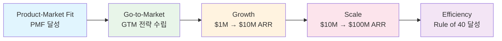

# SaaS 비즈니스 모델 개요

**SaaS(Software as a Service)** 란 소프트웨어를 설치·구매하는 대신 클라우드를 통해 구독 방식으로 제공하는 비즈니스 모델이다. 고객은 월간 또는 연간 요금을 지불하고, 서비스 제공자는 인프라 관리·업데이트·보안을 책임진다.

---

## 왜 알아야 하는가

- **반복 매출(Recurring Revenue)**: 일회성 판매가 아닌 예측 가능한 구독 매출 구조로, 기업 가치 평가에서 높은 멀티플을 받는다.
- **제품 주도 성장(PLG)**: 영업팀 없이도 제품 자체가 사용자를 획득·전환·확장하는 새로운 성장 모델이 SaaS에서 탄생했다.
- **지표 중심 운영**: ARR, Churn, LTV/CAC 등 정량적 지표로 비즈니스 건강도를 실시간 모니터링하고 의사결정하는 체계가 PM의 핵심 역량이다.
- **가격 전략의 복잡성**: 프리미엄, Per-seat, Usage-based 등 다양한 가격 모델이 성장과 수익성에 직접적인 영향을 미친다.

---

## 핵심 키워드

| 키워드 | 설명 |
|--------|------|
| **ARR** | Annual Recurring Revenue — 연간 반복 매출. SaaS 기업 가치 평가의 핵심 지표 |
| **MRR** | Monthly Recurring Revenue — 월간 반복 매출. ARR = MRR × 12 |
| **Churn Rate** | 이탈률 — 일정 기간 내 서비스를 해지한 고객/매출 비율 |
| **LTV** | Customer Lifetime Value — 고객 생애 가치. 한 고객이 전체 기간 동안 가져오는 총 수익 |
| **CAC** | Customer Acquisition Cost — 고객 획득 비용. 마케팅·영업 비용을 신규 고객 수로 나눈 값 |
| **NRR** | Net Revenue Retention — 순매출 유지율. 기존 고객의 확장·축소·이탈을 반영한 매출 유지 비율 |
| **PLG** | Product-Led Growth — 제품 주도 성장. 제품 자체가 고객 획득·전환·확장의 핵심 동력 |
| **프리미엄** | Freemium — 기본 기능 무료, 고급 기능 유료 모델 |

---

## SaaS 비즈니스의 성장 단계

---

## 하위 문서

| 문서 | 내용 |
|------|------|
| [핵심 개념](concepts.md) | ARR/MRR, Churn, LTV/CAC, NRR, 가격 전략, GTM, 유닛 이코노믹스 상세 |
| [제품 비교](products/index.md) | Notion, Figma, Slack, Zoom, HubSpot, Atlassian 비즈니스 모델 비교 |
| [트렌드 및 전망](trends.md) | AI SaaS, 버티컬 SaaS, 컴파운드 스타트업, Usage-based 가격 등 |

---

## 관련 도메인

- [PG (Payment Gateway)](../pg-service/index.md) — SaaS의 구독 결제를 처리하는 결제 인프라. 빌링키 기반 정기결제, Stripe Billing 등이 SaaS 결제의 핵심이다.
- [MOR (Merchant of Record)](../mor-service/index.md) — SaaS의 글로벌 판매 시 세금·환불·컴플라이언스를 대행하는 모델. Paddle, Lemon Squeezy 등이 SaaS 특화 MOR이다.
- [플랫폼 이코노미](../platform-economy/index.md) — SaaS 중 마켓플레이스·플랫폼 성격을 가진 제품(Shopify, HubSpot 등)은 플랫폼 이코노미의 역학도 함께 적용된다.
