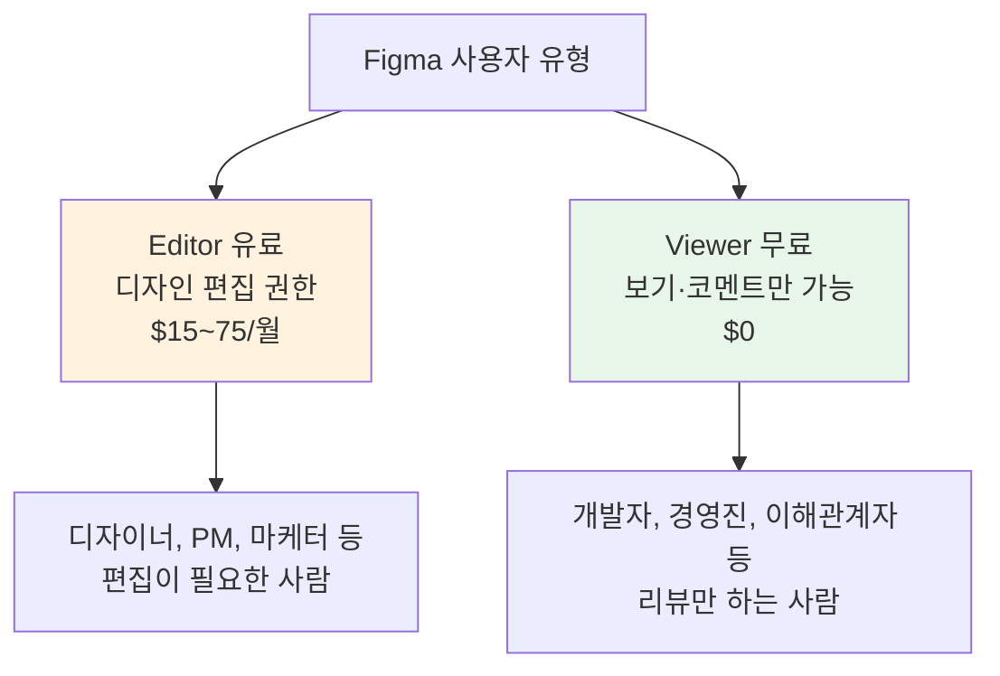
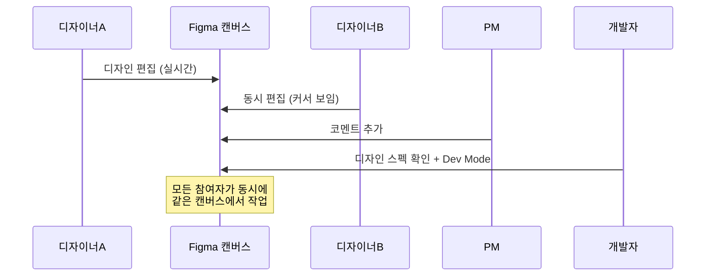
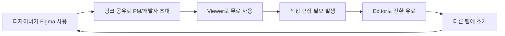

# Figma

> PLG의 교과서. 브라우저 기반 멀티플레이어 디자인 툴로, 설치 없이 URL 하나로 협업이 가능한 혁신적 SaaS다.

[< 제품 비교 개요로 돌아가기](index.md)

---

## 기본 정보

| 항목 | 내용 |
|------|------|
| **회사명** | Figma, Inc. |
| **설립** | 2012년 (Dylan Field, Evan Wallace) |
| **본사** | 미국 샌프란시스코 |
| **기업가치** | 약 $12.5B (2024년 기준, Adobe 인수 무산 후 재평가) |
| **ARR** | $600M+ (추정, 2025년 기준) |
| **사용자** | 수백만 팀, 디자이너 외 PM·개발자·마케터까지 확장 |
| **웹사이트** | [figma.com](https://figma.com) |

---

## 비즈니스 모델

### 가격 구조

| 플랜 | 가격 (월, 연간 결제 기준) | 핵심 기능 |
|------|---------------------------|-----------|
| **Starter** | $0 | 3 Figma + 3 FigJam 파일 |
| **Professional** | $15/editor | 무제한 파일, 공유 라이브러리 |
| **Organization** | $45/editor | Design system analytics, SSO, 브랜치 |
| **Enterprise** | $75/editor | 고급 보안, 전용 인프라, 감사 로그 |

### Per-editor 가격 모델

Figma의 가격 모델에서 가장 독특한 점은 **Editor만 과금**하는 구조다.

!!! tip "Per-editor 모델의 전략적 의미"
    Viewer를 무료로 두면 조직 내 모든 사람이 Figma에 접근할 수 있다. 이렇게 Figma가 "디자인 소통의 표준"이 되면, Editor 수가 자연스럽게 늘어난다. PM이 직접 와이어프레임을 만들고, 마케터가 배너를 편집하면서 Editor로 전환된다. 이것이 NRR 150%의 비밀이다.

---

## 성장 전략: PLG의 교과서

### 1. 제로 프릭션 진입

- **설치 불필요**: 브라우저에서 즉시 실행. Sketch(Mac 전용), Adobe XD(설치 필요)와 결정적 차이
- **URL 공유**: 디자인 파일 링크를 보내면 상대방이 즉시 열람·코멘트 가능
- **Time-to-Value**: 가입 후 1분 이내에 디자인 협업 체험 가능

### 2. 멀티플레이어 (실시간 협업)

Figma의 가장 강력한 경쟁 우위이자 바이럴 엔진이다.

### 3. 바이럴 루프

### 4. 디자인 시스템 → 락인

- **공유 라이브러리**: 조직의 디자인 시스템을 Figma에 구축하면 전환 비용이 급격히 증가
- **Component + Variable**: 디자인 토큰, 컴포넌트 체계가 Figma 생태계에 종속
- **Plugin 생태계**: 수천 개의 서드파티 플러그인이 생산성을 높이고 락인을 강화

---

## Adobe 인수 무산

**사건**: 2022년 9월 Adobe가 Figma를 $20B에 인수 발표. 2023년 12월 EU/UK 규제 우려로 양사 합의 인수 철회.

**의의**:

- $20B 가치 평가는 ARR의 약 50배 멀티플로, SaaS 역사상 최고 수준
- 규제 기관이 "디자인 도구 시장의 경쟁 저해"를 우려한 것은 Figma의 시장 지배력을 반증
- 인수 무산 후 Figma는 독립 기업으로 IPO 준비 중 (2025~2026년 예상)

!!! note "인수 무산이 남긴 교훈"
    PLG로 시장을 장악한 SaaS는 인수 없이도 독자 생존이 가능하다. Figma는 인수 무산 후 오히려 AI 기능(Figma AI), 슬라이드(Figma Slides), 개발자 도구(Dev Mode) 등을 공격적으로 확장하고 있다.

---

## 핵심 지표 (추정)

| 지표 | 수치 (추정) | 비고 |
|------|-------------|------|
| ARR | $600M+ | 2024년 기준 |
| NRR | ~150% | Viewer → Editor 전환 + 팀 확장 |
| Gross Margin | ~85% | 브라우저 기반으로 인프라 비용 효율적 |
| 유료 전환율 | ~10% | B2B SaaS 상위 수준 |
| Editor당 ARPU | $25~30/월 | 플랜 믹스 기준 |

---

## 장단점

| 장점 | 단점 |
|------|------|
| 브라우저 기반 제로 프릭션 진입 | 오프라인 작업 불가 |
| 멀티플레이어가 PLG의 핵심 엔진 | 대규모 파일 시 성능 이슈 |
| Per-editor 모델이 NRR 극대화 | 고급 프로토타이핑은 전문 도구 대비 약함 |
| 디자인 시스템 락인 효과 | 무료 플랜 제한이 강화 추세 |
| 디자이너 외 PM·개발자까지 사용자 확장 | 엔터프라이즈 보안 기능 후발 (개선 중) |
| Plugin + Community 생태계 | — |

---

## 다음 단계

- [Notion](notion.md)과 비교하여 프리미엄 + PLG 전략의 차이점 확인
- [Slack](slack.md)과 비교하여 바이럴 루프 메커니즘 비교
- [핵심 개념](../concepts.md)에서 PLG, NRR, Per-editor 가격 모델 정의 확인
- [트렌드](../trends.md)에서 AI SaaS가 디자인 도구에 미치는 영향 확인
